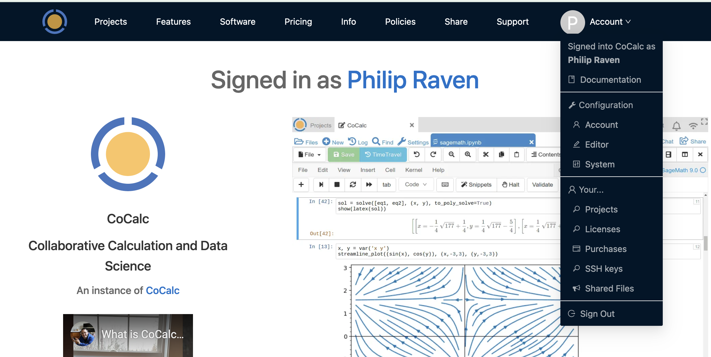

.. index:: Account Dropdown Menu
.. index:: Dropdown Menus; Account
.. _account-dropdown:

====================================
Account Dropdown Menu
====================================

.. note::

   CoCalc configuration screens are getting an upgrade. Here is a preview of the new look. The Account Dropdown Menu is the first step.

The Account Dropdown Menu appears when you click "Account" at upper right in the top navigation bar that appears just after signing in.

.. toctree::
   :maxdepth: 2

     ..

Here's a close-up view.

.. figure:: img/account-dropdown-closeup.png
     :align: center
     :width: 40%
     :alt: account dropdown menu close-up

     ..

If you select "Configuration", you'll be taken to the new screen for account configuration.

.. figure:: img/new-config-page.png
     :align: center
     :width: 80%
     :alt: new configuration page

     ..

You will see that there is a link to the :doc:`old configuration page <account/preferences>` at upper right, if you want to return to the previous arrangement.

We invite you to explore the new user interface as we develop it.
Documentation will be updated as features are added.
