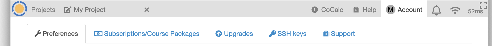
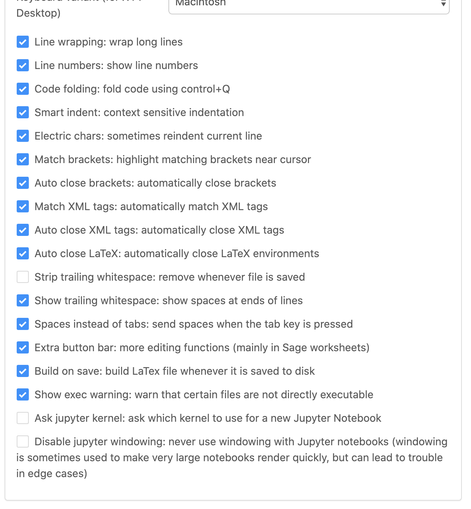
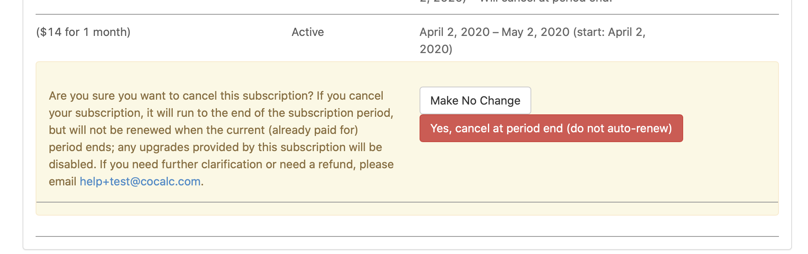

*****************
Account Tab
*****************

The Account Tab is where you manage settings, subscriptions, and resources across your projects. There are 5 tabs under under Account Tab.

     ..

.. index:: Account Tab

.. contents::
   :local:
   :depth: 1

.. index:: Account Tab; Preferences

============
Preferences
============

.. index:: Account Settings
.. _account-settings:

.. index:: Account Tab; Account settings

Account settings
----------------

.. figure:: img/account-settings/account-settings.png
     :width: 80%
     :align: center

     ..

Most of the entries under ``Account settings`` are self-explanatory. Here are a few additional notes.

.. index:: Sign out of CoCalc, Log out of CoCalc

* Your password is needed to change your email address.

* Your password is needed to create or change the API key for your account. See :doc:`CoCalc API documentation <api/index>` to learn about the API.

* The Newsletter checkbox doesn't do anything yet. We don't send out a newsletter.

* **Sign Out of CoCalc** using one of the orange "Sign Out" buttons. You will be asked to confirm your selection.

* Choosing the red ``Delete Account...`` button will cause a warning window to pop up. Confirmation is required before proceeding.

.. figure:: img/account-settings/delete-account.png
     :width: 50%
     :align: center

     *warning displayed when "Delete Account..." is clicked*

* Use one or more of the options under ``Linked accounts`` if you want to sign in with Facebook, GitHub, Google, or Twitter. You can also unlink online accounts from CoCalc in this section. To sign in with a linked account, choose the icon for Facebook, GitHub, Google, or Twitter under the blanks for Email address & Password at upper right in the sign-in screen.

Other settings
----------------

.. image:: img/account-settings/prefs-other.png
     :width: 80%
     :align: center

* Dark mode: CoCalc allows you to specify dark mode for all windows in "Other settings". See the :ref:`News update on dark mode <overall-dark-mode>` for more information.
* Confirm
* Show
* Allow
* Display
* Mask
* Hide
* Generated filenames
    .. image:: img/account-settings/prefs-other-gen-names.png
         :width: 80%
         :align: center
* Default file sort
* Number of files per page
* Standby timeout
    .. image:: img/account-settings/standby-screen.png
         :width: 80%
         :align: center

Profile
----------------

.. index:: Account Tab; Editor settings

Editor settings
----------------

.. figure:: img/account-settings/editor-settings-0-top.png
     :width: 80%
     :align: center

     *editor settings (upper part)*

     *editor settings (lower part)*

Most options under "Editor settings" are self-explanatory. Here are additional details.

.. index:: Editor settings; Jupyter classic
.. _ed-settings-jupyter:

* Enable ``Jupyter classic`` if you have a specific requirement for a Jupyter feature that isn't available under CoCalc Jupyter. With this box checked, the default for opening .ipynb files in the CoCalc interface will be Classic jupyter. See warnings regarding :ref:`jupyter-classical-vs-cocalc` notebooks before enabling this feature.

Terminal settings
-------------------

.. index:: Account Tab; subscriptions and course packages
.. _subs-course-pkgs:

==================================
Subscriptions and Course Packages
==================================

.. figure:: img/account-settings/subscr-select.png
     :width: 80%
     :align: center

     *order form displays if no subscriptions are active*

.. figure:: img/account-settings/subscr-display.png
     :width: 80%
     :align: center

     *active subscriptions, if present, are displayed*

.. index:: Account Tab; payment methods
.. _payment-methods:

Payment methods
----------------

This is where you can enter credit card information for the CoCalc account.
Credit card details (full credit card number, expiration date, CVV number) are maintained by our payment provider and are not stored on CoCalc servers or visible to the CoCalc support team.

.. index:: Account Tab; subscription list
.. _subscription-list:

Subscriptions and course packages
----------------------------------

This section lists your currently active subscriptions. The word "Active" denotes ordinary active subscriptions.
The word "Trialing" indicates a free trial or other custom subscription plan.

.. figure:: img/account/three-subs.png
     :width: 90%
     :align: center

     *list of active subscriptions*

Note that you can "stack" multiple course plans to combine the resources. In the example above, a Small Course (25 students) and a Medium Course (70 students) are combined to provide for a class of 95 students.

.. index:: Account Tab; cancel subscription
.. index:: Cancel subscription

Personal subscriptions renew automatically. Course plans do *not* renew automatically.

**To cancel a subscription**, find the subscription in the active subscription list and click ``Cancel`` at the far right.
The subscription will not be auto-renewed at the next renewal date and the expiration date will be displayed in the subscription list.

     *dialog shown after clicking "Cancel" in the previous example*

Invoices and receipts
----------------------

The "Invoices and receipts" section shows a list of CoCalc purchases made using the order process on this page.

.. figure:: img/account/three-rcpt-hidden.png
     :width: 90%
     :align: center

     *view of receipts*

.. figure:: img/account/three-rcpt-shown.png
     :width: 90%
     :align: center

     *view of receipts showing details for each item*

.. index:: Account Tab; upgrades
.. _account-upgrades:

========
Upgrades
========

All upgrades
--------------

``Upgrades that you get from your subscriptions and course packages``

Applied upgrades
-----------------

``Upgrades you have applied to projects``

.. index:: Account Tab; licenses
.. _account-licenses:

========
Licenses
========

.. index:: Account Tab; SSH keys
.. _account-ssh-keys:

========
SSH keys
========

This section assumes you have created an SSH key pair as described in :ref:`SSH Keys <ssh-keys>`.

Click the gear icon next to your name at upper right to open Account Settings.
Choose the tab "SSH Keys" and note the form for adding a key at right.
Enter a title for the key in the Title field. Specify a title that is meaningful to you for the key pair you are using, for example John's CoCalc Key.
Copy the public key into the Key field. To do this, open the file for your public key on your local computer. For example, if you are using macOS or Ubuntu, you could open a terminal and type something like the following, depending on the name of your public key file.
cat ~/.ssh/id_ed25519.pub
Use your mouse to highlight the contents of the key file, then copy and paste it into the Key area. saving the entry.

Click Add SSH Key. Your key is now saved for that account and will work for all projects for which that account has owner or collaborator status.
As with the previous section, the user@hostname string needed for the ssh command consists of the project id with hyphens removed for the user, and 'ssh.cocalc.com' for the hostname, and can be found just below the caption Use the following username@host: in the 'SSH Keys' section of project status tab.

SSH keys
---------

``SSH keys``

Add an SSH key
----------------

.. index:: Account Tab; support
.. _account-support:

========
Support
========

Support tickets
----------------

