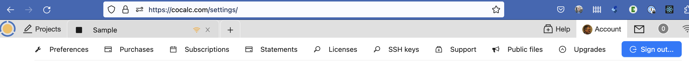

.. index:: Account Toolbar
.. index:: Toolbars; account
.. _account-toolbar:

========================
Account Toolbar
========================

Here's a tour of the Account toolbar in CoCalc.

.. contents::
   :local:
   :depth: 2

.. note::

   A different arrangement of account configuration is available if you click the CoCalc logo at upper left and then hover your cursor over "Account" at upper right. See :doc:`Account Dropdown Menu <account-dropdown>` for more information.

To open the Account toolbar, first open the :ref:`project-list`, then click "Account" at upper right. You can also open the Account toolbar by browsing to https://cocalc.com/settings/

Contents of the Account toolbar
===============================

Your account on CoCalc is everything related to your current identity.
Your identity gives you access to your :doc:`Projects <project>`, where you can either be an owner or collaborator.
The :ref:`account-settings` allow you to customize many aspects of how the user interface behaves.
It also contains the configuration for setting up
:doc:`subscriptions/purchasing course packages <upgrade-guide>` and
an overview about how your upgrades are currently distributed.

     
     actions available in the Account Toolbar

*****************************
Preferences
*****************************

* :doc:`account/preferences`

*****************************
Purchases
*****************************

* :ref:`account-purchases`

*****************************
Subscriptions
*****************************

:ref:`account-subscriptions`

*****************************
Statements
*****************************

*****************************
Licenses
*****************************

* :doc:`account/licenses`

*****************************
SSH keys
*****************************

* :doc:`account/ssh`

*****************************
Support
*****************************

* :doc:`account/support`

*****************************
Public Files
*****************************

* :doc:`account/public-files`

*****************************
Upgrades
*****************************

* :doc:`upgrades`

.. index:: Sign out of CoCalc; from Account tab
.. _sign-out:

Signing out of CoCalc
=====================

Under "Account" you will find a button to ``Sign out`` at upper right.

