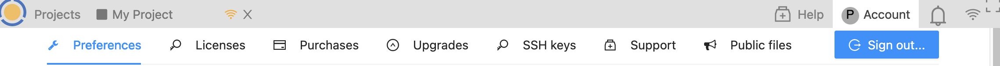

.. index:: Account Toolbar
.. index:: Toolbars; account
.. _account-toolbar:

========================
The Account Toolbar
========================

Here’s a description of the Account toolbar. It appears under the Project Toolbar when Account has been selected.

Your account on CoCalc is everything related to your current identity.
Your identity gives you access to your :doc:`Projects <project>`, where you can either be an owner or collaborator.
The :ref:`account-settings` allow you to customize many aspects of how the user interface behaves.
It also contains the configuration for setting up
:doc:`subscriptions/purchasing course packages <upgrade-guide>` and
an overview about how your upgrades are currently distributed.

.. index:: Sign out of CoCalc; from Account tab
.. _sign-out:

Under "Account" you will find a button to ``Sign out`` at upper right, and the following sections for managing your account.

.. toctree::
   :maxdepth: 2

   account/preferences
   account/licenses
   account/purchases
   account/upgrades
   account/ssh
   account/support
   account/public-files

