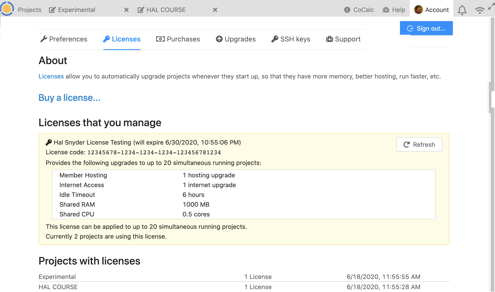
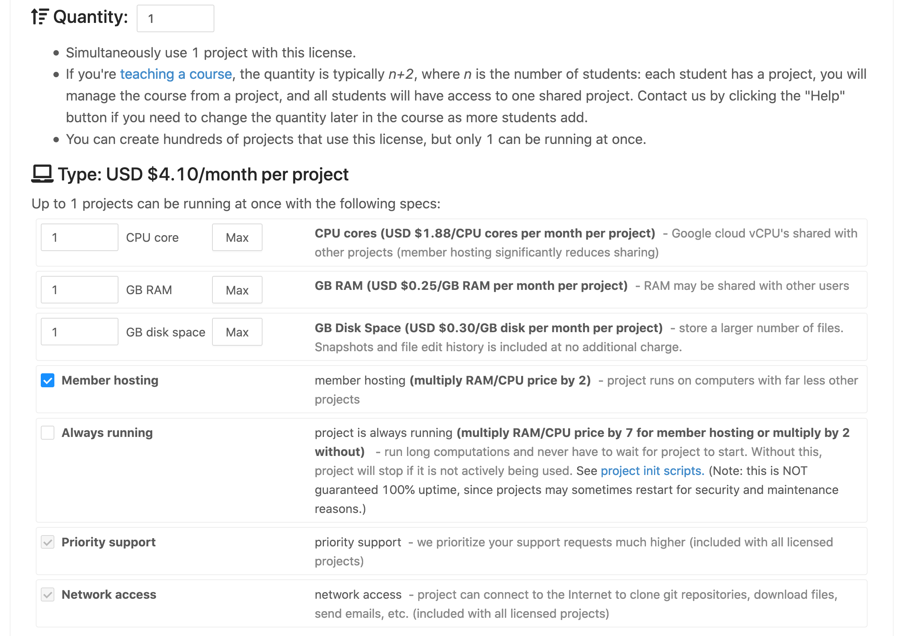
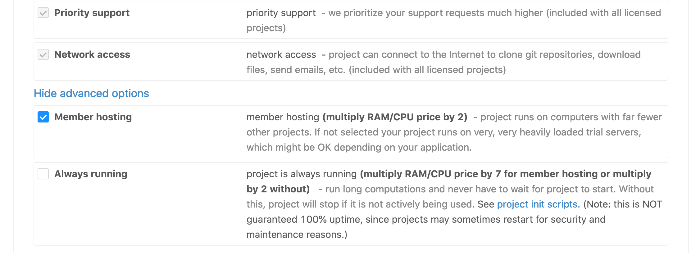

.. index:: Account Tab; licenses
.. _account-licenses:

========
Licenses
========

Under "Licenses", you can keep track of CoCalc licenses you manage or use in your projects.

     ..

.. index:: Licenses; buying

Buy a license...
========================

Clicking "Buy a license..." opens a form that lets you configure a CoCalc license, and buy it immediately online if you wish. In the dialog that unfolds, monthly costs are displayed and update as you change settings.

.. index:: Licenses; academic discount

Academic discount (if applicable)
---------------------------------

Under **Discount**, click **Academic** if applicable, to enable a 40% discount (this includes hobbyists). Otherwise, click **Business**. The license dialog will expand after you select a discount setting.

.. figure:: img/settings/buy-lic-1.png
     :width: 90%
     :align: center

     ..

.. index:: Licenses; quantity and type

Number of Projects and Type
--------------------------------------------

For **Number of Projects**, enter the number of projects or students. This will be the maximum number of concurrently running projects that can use the license. Upgrades are applied to projects as they start, and released when projects stop. In a typical course, there is one project per student, plus a project for the instructor(s) and a shared project for the entire class to collaborate in. If your course has students working in groups,  then you might provide one project for each group (plus the instructor), instead of one per student.

For **Type**, enter the quota for each project.

     ..

If you're not sure which upgrades to order, here are some suggestions:

* 1 CPU, 1 GB of RAM, and 1 GB of disk space (with Member hosting, which is selected by default) are generally enough for elementary subjects, such as learning programming syntax and introductory math courses.
* 1 CPU, 2 GB of RAM, and 1 GB of disk space (with Member hosting, which is selected by default) are often enough for intermediate-level courses.
* There is no substitute for testing the computations you plan to run at a given resource level. You could buy a license for a small number of days to try things out. For instructors preparing to teach a course, we can provide a free trial that is valid for several days; just email help@cocalc.com for more information.
* You might buy a license for a short period of time, e.g., if there is a 2-week part of a course that requires significantly more compute resources.

.. index:: Licenses; advanced options

Advanced options
---------------------------------

If you click "Show advanced options", more choices appear.

**Member hosting** is the most essential upgrade for most situations. It gets your projects off heavily-loaded, preemptible trial servers. For that reason, this option is enabled by default.

You might not select ``Member hosting`` if you plan to add a license to projects that already have Member hosting, to provide additional resources. Another reason to not select ``Member hosting`` is if you want to run a computation and need more memory or CPU, but are fine with using the spare cycles on the trial servers; combined with ``Always running``, this can be very powerful and affordable.

The **Always running** option prevents your project from being stopped for an :ref:`idle timeout <idle-timeout-quota>`. This option increases cost, but can be useful in special situations for long-running computations. This option is disabled by default. Note that "Always running" does not guarantee 100% uptime, because projects may occasionally be restarted for security and maintenance reasons.

     ..

**Dedicated CPU cores** are cloud vCPU's not shared with other projects. You can enter a fractional value, such as 0.5 for half a dedicated core.

**Dedicated RAM** is not shared with other projects.

.. index:: Licenses; period, title, cost, purchase

Period, Title, Cost, and Purchase
---------------------------------

For **Period**, specify when your license is to be active. There are discounts for licenses that will renew automatically every month or every year. Note that you can cancel renewal at any time; the license will continue to be valid through the current paid interval but will not auto-renew at the end of that interval. You can specify arbitrary start and end dates; unlike the older products, the license can start at a future date and the period does not have to be some exact number of weeks or months. Licenses start at 0:00 in your local time zone on the start date and end at 23:59 in your local time zone on the ending date.

Use any descriptive text you want for **Title** and **Description**. You can easily change these later.

**Cost** displays the total cost of the license. There is indeed a 25% discount for direct payment if you buy with a credit card using the form.

Select **Purchase** if you are ready to buy a license with a credit card immediately.

If you select **Get a quote**, CoCalc will create a help request form including the license parameters you selected. A text area will open where you can provide additional information. When you are ready, click "Please contact me", and when the help form pops up, click "Get support" to send the request. The price of the license must be at least $100 for the "Get a quote" button to be enabled.

.. figure:: img/settings/buy-lic-3.png
     :width: 90%
     :align: center

     ..

Licenses that you manage
========================

If you are a manager for one or more CoCalc licenses, you will see those licenses listed in this section. To have license managers added or removed, contact CoCalc support at help@cocalc.com. License managers must have a CoCalc account.

Projects with licenses
========================

If you are an owner or collaborator on any projects that have CoCalc licenses, those projects are listed in this section.

