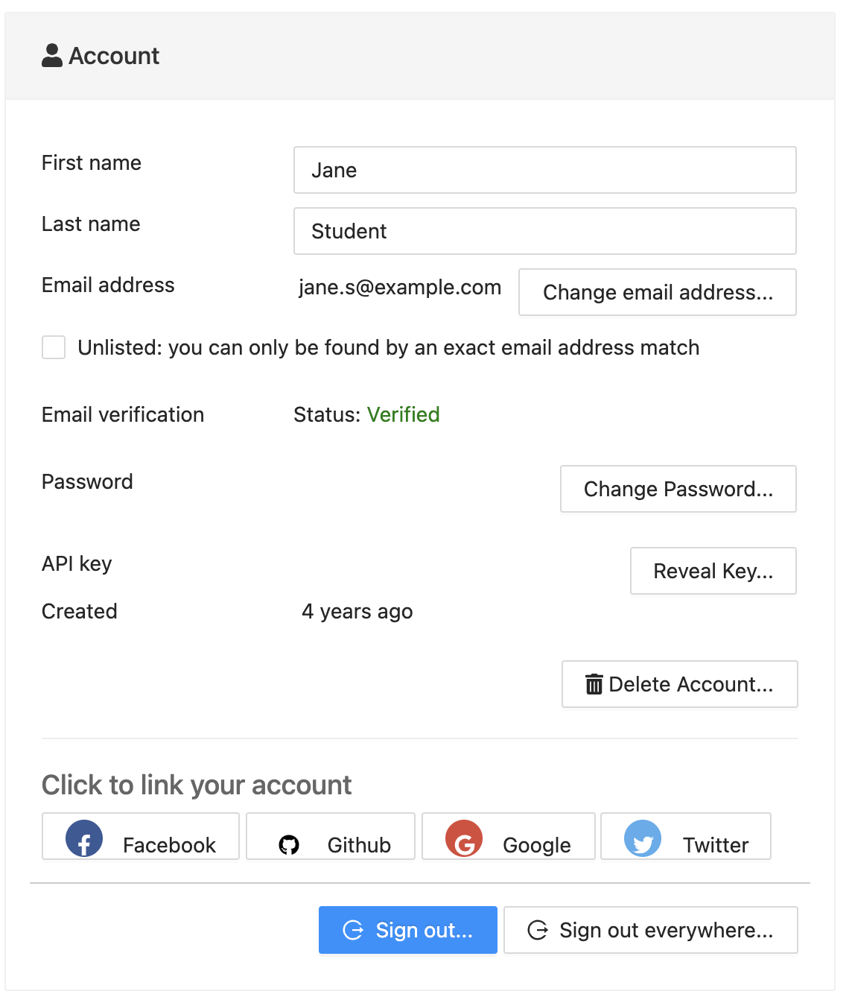
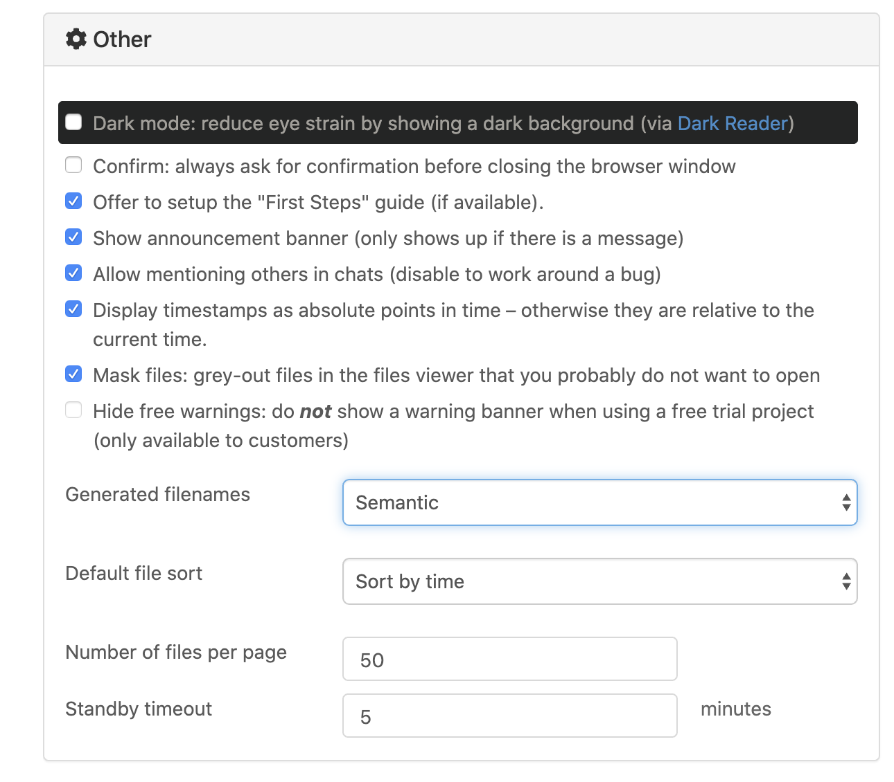
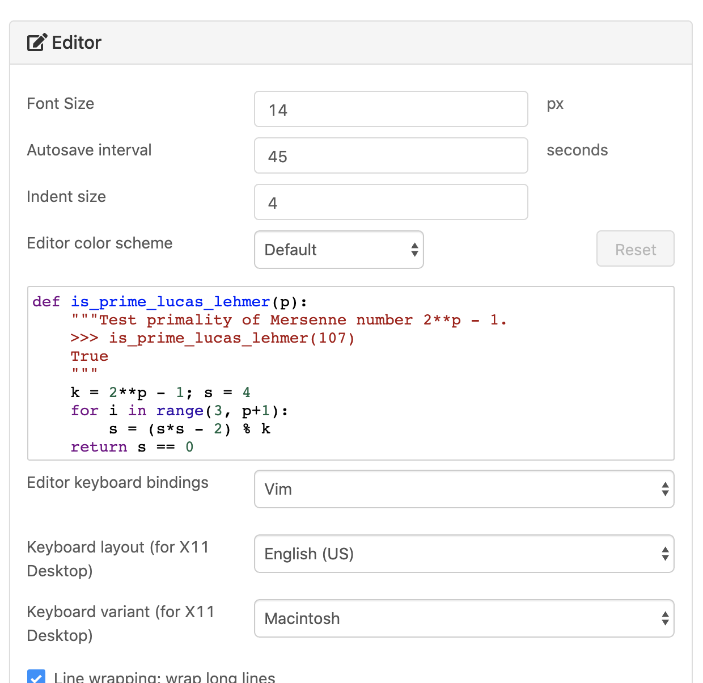

.. index:: Account Tab; Preferences

============
Preferences
============

.. index:: Account Settings
.. index:: Account Tab; Account settings

.. _account-settings:

Account settings
================

     ..

Most of the entries under ``Account settings`` are self-explanatory. Here are a few additional notes.

.. index::
   Sign out of CoCalc; from preferences
   see: Log out of CoCalc; Sign out of CoCalc

* Your password is needed to change your email address.

* Your password is needed to create or change the API key for your account. See :doc:`CoCalc API documentation <../api/index>` to learn about the API.

* The Newsletter checkbox doesn't do anything yet. We don't send out a newsletter.

* **Sign Out of CoCalc** using one of the "Sign Out" buttons. You will be asked to confirm your selection.

* Choosing the red ``Delete Account...`` button will cause a warning window to pop up. Confirmation is required before proceeding.

.. figure:: img/settings/delete-account.png
     :width: 50%
     :align: center

     *warning displayed when "Delete Account..." is clicked*

* Use one or more of the options under ``Linked accounts`` if you want to sign in with Facebook, GitHub, Google, or Twitter. You can also unlink online accounts from CoCalc in this section. To sign in with a linked account, choose the icon for Facebook, GitHub, Google, or Twitter under the blanks for Email address & Password at upper right in the sign-in screen.

.. _other-settings:

Other settings
=================

* Dark mode: CoCalc allows you to specify dark mode for all windows in "Other settings". See the :ref:`News update on dark mode <overall-dark-mode>` for more information.
* Confirm
* Show
* Allow
* Display
* Mask
* Hide
* Generated filenames
    .. image:: img/settings/prefs-other-gen-names.png
         :width: 80%
         :align: center
* Default file sort
* Number of files per page

.. index::
   Standby Timeout
   Timeout; standby

.. _standby-timeout:

* Standby timeout

If you are not active for several minutes, you may see the gray and blue CoCalc splash screen. Moving the mouse over the window or typing or clicking in the window will remove the splash screen.

.. index:: Account Tab; subscriptions and course packages
.. _subs-course-pkgs:

The time until the splash screen appears is the **standby timeout**.
We use it to conserve resources, mainly network bandwidth and browser CPU cycles. Execution of your code on the server is not paused.
You can alter the standby timeout under Account / Preferences / Other / Standby timeout, as shown above under :ref:`other-settings`.

    .. image:: img/settings/standby-screen.png
         :width: 80%
         :align: center

.. note::

  After a longer interval of inactivity, your project will be stopped. Increasing this setting requires a project upgrade. See: :ref:`idle-timeout`.

Profile
=================

.. index:: Account Tab; Editor settings

Editor settings
=================

     *editor settings (upper part)*

.. figure:: img/settings/editor-settings-1-bottom.png
     :width: 80%
     :align: center

     *editor settings (lower part)*

Most options under "Editor settings" are self-explanatory. Here are additional details.

.. index:: Editor settings; Jupyter classic
.. _ed-settings-jupyter:

* Enable ``Jupyter classic`` if you have a specific requirement for a Jupyter feature that isn't available under CoCalc Jupyter. With this box checked, the default for opening .ipynb files in the CoCalc interface will be Classic jupyter. See warnings regarding :ref:`jupyter-classical-vs-cocalc` notebooks before enabling this feature.

Terminal settings
===================

Let's you configure font and theme of your terminals.
