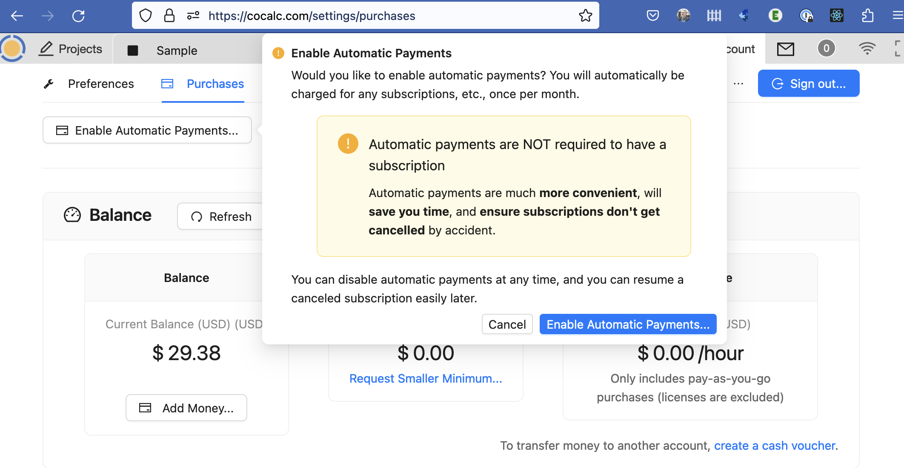
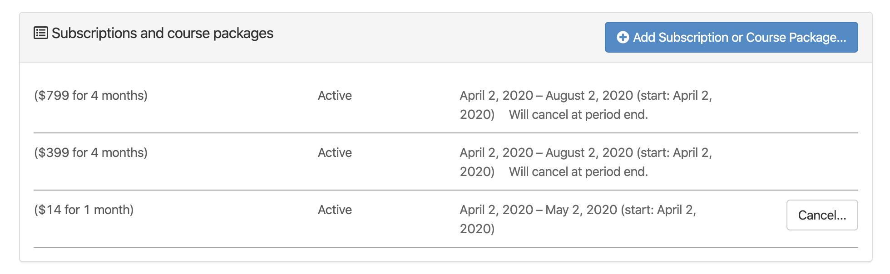
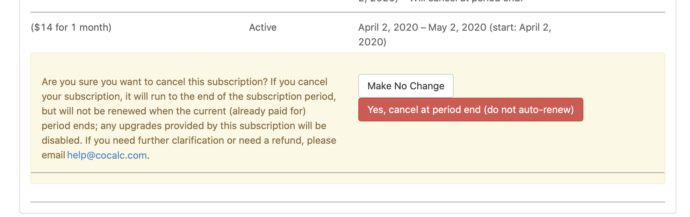

.. index:: Account Purchases
.. _account-purchases:

==================================
Purchases
==================================

.. contents::
   :local:
   :depth: 1

To view the Purchases panel, first open the :ref:`project-list`, then click "Account" at upper right, then "Purchases". You can also view the Purchases panel by browsing to https://cocalc.com/settings/purchases

Account Balance
================

.. figure:: img/purch01.png
     :width: 100%
     :align: center
     :alt: top of purchases panel

     top of purchases panel

Account balance information is displayed in the upper part of the Purchases panel.

Enable/Disable Automatic Payments
==================================

Note the "Enable Automatic Payments" button at upper left. Click it to enable, click again to disable automatic payments.

     enable auto pay

If you click "Enable Automatic Payments", you may get a pop-up screen presenting a Stripe checkout session where you can enter payment information.

Transactions, Limits, and Plots
================================

.. figure:: img/purch02.png
     :width: 100%
     :align: center
     :alt: bottom of purchases panel

     bottom of purchases panel
     
Several views of transactions for your account are available in the lower part of the Purchases panel.

.. index:: Account Tab; payment methods
.. _payment-methods:

Payment methods
====================

This is where you can enter credit card information for the CoCalc account.
Credit card details (full credit card number, expiration date, CVV number) are maintained by our payment provider and are not stored on CoCalc servers or visible to the CoCalc support team.

Update Credit Card Information
==================================

To add or remove credit cards, sign into CoCalc and use the link for `billing/cards <https://cocalc.com/billing/cards>`_.

If you have more than one card on file and want to change which card will be used for your next purchase via the `self-service order form <https://cocalc.com/store>`_, click the "Default" button. and select the desired card.

.. figure:: ../img/update-credit-cards.png
     :width: 100%
     :align: center
     :alt: choose new default credit card

     update cards at https://cocalc.com/billing/cards

.. index:: Account Tab; subscription list
.. _account-subscriptions:
.. _subscription-list:

Subscriptions
=========================

This section lists your currently active license subscriptions, personal plans, and course packages.
The word "Active" denotes ordinary active subscriptions.
The word "Trialing" indicates a free trial or other custom subscription plan.

.. note::

    If you have further questions about course packages, subscriptions, or upgrades,
    please consult the :ref:`upgrades-faq`!

     list of active subscriptions

Note that you can "stack" multiple course plans to combine the resources. In the example above, a Small Course (25 students) and a Medium Course (70 students) are combined to provide for a class of 95 students.

Personal subscriptions renew automatically. Course plans do *not* renew automatically.

.. index:: Account Tab; cancel subscription
.. index:: Cancel subscription
.. _cancel-subscription:

**To cancel a subscription**, find the subscription in the active subscription list and click ``End`` at the far right.
The subscription will not be auto-renewed at the next renewal date and the expiration date will be displayed in the subscription list.

     dialog shown after clicking "Cancel" in the previous example

Invoices and receipts
=========================

The "Invoices and receipts" section shows a list of CoCalc purchases made using the order process on this page.

.. figure:: img/account/three-rcpt-hidden.png
     :width: 90%
     :align: center
     :alt: condensed list of receipts

     view of receipts

.. figure:: img/account/three-rcpt-shown.png
     :width: 90%
     :align: center
     :alt: expanded list of receipts

     view of receipts showing details for each item

API v2 endpoint
=================

If you're interested in automating access to purchase data, see the `API v2 endpoint to get purchases <https://doc.cocalc.com/api2/get-purchases.html>`_.
