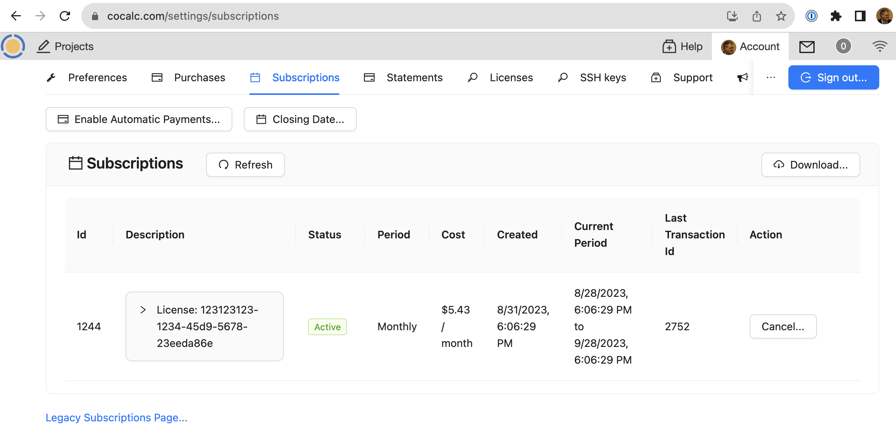

.. index:: Account Purchases
.. _account-purchases:

==================================
Purchases
==================================

.. contents::
   :local:
   :depth: 1

To view the Purchases panel, first open the :ref:`project-list`, then click "Account" at upper right, then "Purchases". You can also view the Purchases panel by browsing to https://cocalc.com/settings/purchases

CoCalc's purchasing system has been upgraded as of August, 2023. Here's the CoCalc feature announcement and discussion: `ANN: CoCalc's New Purchasing System <https://github.com/sagemathinc/cocalc/discussions/6848>`_.

Account Balance
================

.. figure:: img/purch01.png
     :width: 100%
     :align: center
     :alt: top of purchases panel

     top of purchases panel

Account balance information is displayed in the upper part of the Purchases panel.

.. _automatic-payments:

Enable/Disable Automatic Payments
==================================

Note the "Enable Automatic Payments" button at upper left. Click it to enable, click again to disable automatic payments.

.. figure:: img/enable-auto-pay.png
     :width: 100%
     :align: center
     :alt: enable auto pay pop-up

     enable auto pay

If you click "Enable Automatic Payments", you may get a pop-up screen presenting a Stripe checkout session where you can enter payment information.

Transactions, Limits, and Plots
================================

.. figure:: img/purch02.png
     :width: 100%
     :align: center
     :alt: bottom of purchases panel

     bottom of purchases panel
     
Several views of transactions for your account are available in the lower part of the Purchases panel.

.. index:: Account Tab; payment methods
.. _payment-methods:

Payment methods
====================

This is where you can enter credit card information for the CoCalc account.
Credit card details (full credit card number, expiration date, CVV number) are maintained by our payment provider and are not stored on CoCalc servers or visible to the CoCalc support team. For details, see :ref:`update-credit-card`.

.. _subscriptions-update:

Recent Updates to Subscriptions
===================================

As of August 2023, we changed CoCalc to make it more straightforward to work with subscriptions:

#. A few days before the subscription renews, we send out an email with a cancel link. This link lets a user cancel a subscription and does NOT require signing into cocalc, though there is a confirmation process.  This avoids users getting frustrated trying to reset their password, navigate the site, etc., just to cancel a subscription.  Instead it's a direct link.

#. We also provide a prorated refund when the subscription is canceled, so you can use the remaining money toward something else in cocalc, rather than being locked in for the duration of the subscription.  We think this is much more flexible than the old system.

#. It's now possible to have a subscription without having any automatic payment method on file.  Instead, when the renewal date is near, you get an email that you should add credit to your account to cover the subscription renewal.  This is valuable to people in some countries, like India, where automatic subscription renewals are heavily regulated by law.

#. After you cancel a subscription, you can resume it later, rather than having to create a new subscription.

#. You can edit what a subscription is for (e.g., increase the RAM) at any time, and you just pay the prorated difference.

.. index:: Account Tab; subscription list
.. _account-subscriptions:
.. _subscription-list:

Subscriptions (prepaid)
=========================

As noted above, the CoCalc purchasing system has been revised as of August, 2023.

To buy a license subscription with the newer system, visit the same link as before, https://cocalc.com/store/site-license.

With the prepaid system, if you don't have a payment method on file, you will be rquired to select :ref:`automatic-payments` and enter a payment method.

To view currently active subscriptions, browse to https://cocalc.com/settings/subscriptions. This link will take you to the new system:

     
       

Subscriptions (legacy page)
===========================

You can still use the legacy subscription purchasing system by clicking "Legacy Subscriptions Page..." at the bottom of the prepaid subscription view, or by visiting https://cocalc.com/store/site-license and selecting one of the subscription options there.

The legacy subscriptions section lists your currently active license subscriptions, personal plans, and course packages.
The word "Active" denotes ordinary active subscriptions.
The word "Trialing" indicates a free trial or other custom subscription plan.

.. note::

    If you have further questions about course packages, subscriptions, or upgrades,
    please consult the :ref:`upgrades-faq`!

.. figure:: img/account/three-subs.png
     :width: 90%
     :align: center
     :alt: active subscriptions displayed in purchases tab

     list of active subscriptions

Note that you can "stack" multiple course plans to combine the resources. In the example above, a Small Course (25 students) and a Medium Course (70 students) are combined to provide for a class of 95 students.

Personal subscriptions renew automatically. Course plans do *not* renew automatically.

.. index:: Account Tab; cancel subscription
.. index:: Cancel subscription
.. _cancel-subscription:

**To cancel a subscription**, find the subscription in the active subscription list and click ``End`` at the far right.
The subscription will not be auto-renewed at the next renewal date and the expiration date will be displayed in the subscription list.

.. figure:: img/account/three-subs-cancel.png
     :width: 90%
     :align: center
     :alt: warning dialog after clicking cancel on a subscription

     dialog shown after clicking "Cancel" in the previous example

Invoices and receipts
=========================

The "Invoices and receipts" section shows a list of CoCalc purchases made using the order process on this page.

.. figure:: img/account/three-rcpt-hidden.png
     :width: 90%
     :align: center
     :alt: condensed list of receipts

     view of receipts

.. figure:: img/account/three-rcpt-shown.png
     :width: 90%
     :align: center
     :alt: expanded list of receipts

     view of receipts showing details for each item

API v2 endpoint
=================

If you're interested in automating access to purchase data, see the `API v2 endpoint to get purchases <https://doc.cocalc.com/api2/get-purchases.html>`_.
