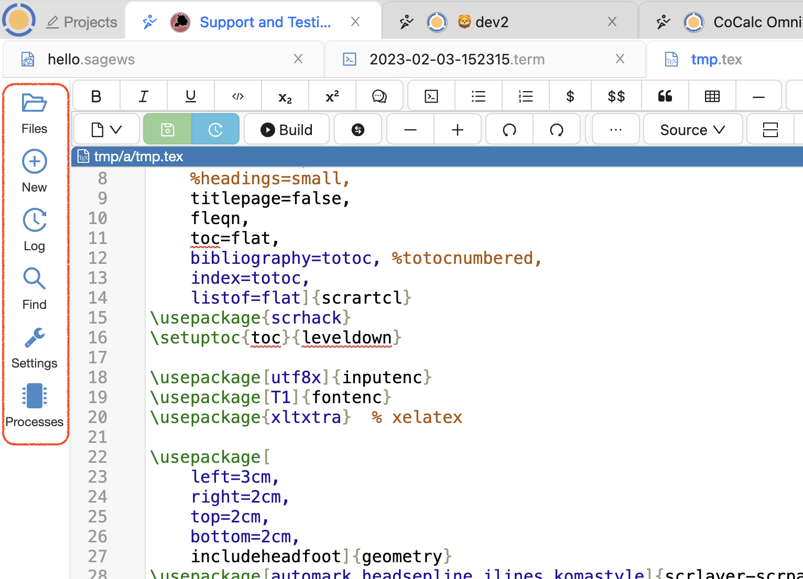

.. index:: Activity Bar

=============================
Activity Bar
=============================

Use the Activity Bar to navigate to key features in CoCalc. The arrangement is similar to the `Activity Bar in VS Code <https://code.visualstudio.com/api/ux-guidelines/activity-bar>`_ and the `Sidebar in JupyterLab <https://jupyterlab.readthedocs.io/en/stable/user/interface.html#left-and-right-sidebar>`_.

    the Activity Bar displays files, new, log, find, processes, settings

Here are the components of the Activity Bar:

* :doc:`project-home`
* :doc:`explorer`
* :doc:`plus-new`
* :doc:`project-log`
* :doc:`files-search`
* :doc:`servers`
* :doc:`processes`
* :doc:`project-settings`

Here's the CoCalc feature announcement and discussion: `ANN: Non-file tabs moved to a column on the left <https://github.com/sagemathinc/cocalc/discussions/6404>`_.