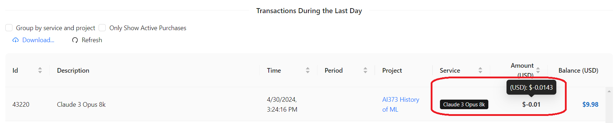
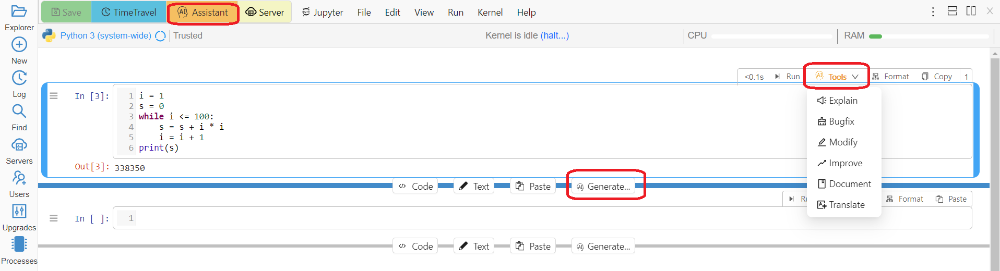
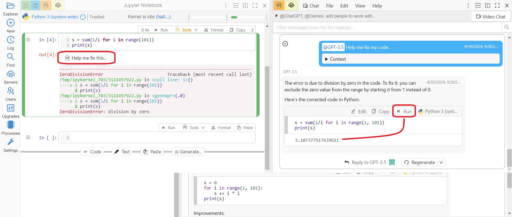
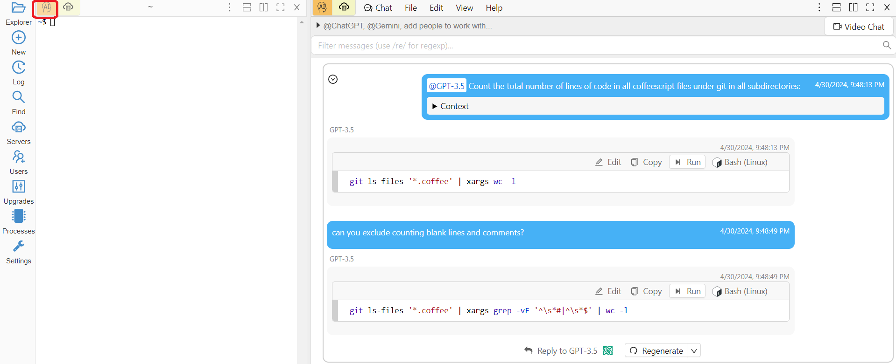
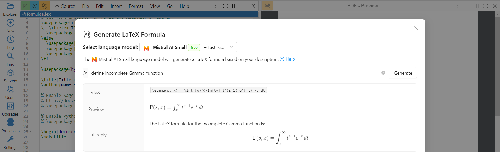
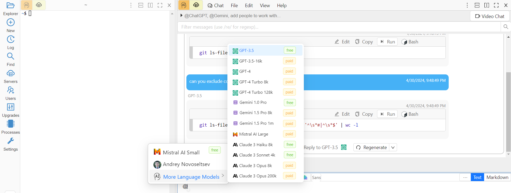
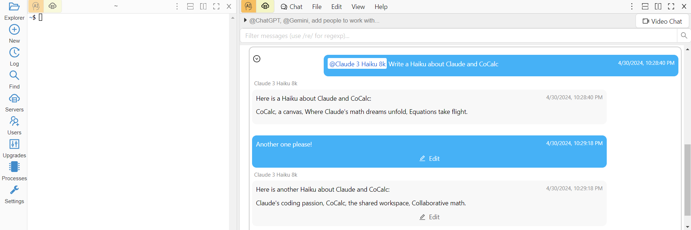

.. index:: AI

AI Assistant
============

AI Assistant with the help of Large Language Models (LLMs) can transform how you use CoCalc for learning, writing programs, and writing scientific documents. Below are some areas where CoCalc's context-sensitive AI Assistant can save you time and effort.

.. _llm-choice:

LLM Choice and Billing
----------------------

.. raw:: html

    
<iframe
        width="640" height="360"
        src="https://www.youtube.com/embed/kpzNiFTUoJs?si=AAKFeBA_IBiKxivW"
        title="YouTube video player"
        frameborder="0"
        allow="accelerometer; autoplay; clipboard-write; encrypted-media; gyroscope; picture-in-picture; web-share"
        allowfullscreen>
    </iframe>

CoCalc allows you to use a lot of different LLMs from different providers:

.. figure:: img/LLM_choice.png
  :width: 100%
  :align: center
  :alt: Choosing LLM

  Choosing LLM
      
Naturally, this choice may be overwhelming! Which one should you choose?.. The answer depends too much on what exactly you are doing as well as on your personal preferences. We do provide a short description for each model, but there is no replacement to personal experience, so try a few! It may be useful to ask different models to do exactly the same task and see which one you like most. You also can alter your choice at any time, so do not worry about making "the right one!"

Apart from the quality of answers, the models differ by speed and price. CoCalc covers the cost of the least expensive ones, so they are free for our users, but more advanced LLMs are provided for a fee based on their cost to us. A typical interaction with a paid LLM costs from a fraction of a cent to a few cents - it is impossible to know the exact amount in advance since it depends on the length of both input and output. To see your exact charges go to https://cocalc.com/settings/purchases and hover over any one to see a more precise amount than just cents:

  Charge for Using a Paid LLM
      

What Is Sent to LLMs and How Is My Data Used?
---------------------------------------------

CoCalc does **NOT** have any automatic/background communication with LLMs. Your code, requests, and documents are sent to LLMs **ONLY** when you explicitly ask for it. Our AI Assistant tries to send the appropriate piece of your work to the chosen LLM, but you have full control over it and can preview what will be sent:

.. figure:: img/AI_what_is_sent.png
  :width: 100%
  :align: center
  :alt: What Is Sent to an LLM

  What Is Sent to an LLM
      
CoCalc has commercial agreements with LLM providers, the data provided by our users are kept private and are not used for training models.

You can also spin off a fully private LLM on your very own :ref:`compute-servers`! In this video William shows how to create a GPU-backed `OpenWebUI <https://openwebui.com/>`_ server in a few minutes:

.. raw:: html

    
<iframe width="640" height="360" src="https://www.youtube.com/embed/OMN1af0LUcA?si=gRILBshmj2yE0xo2" title="YouTube video player" frameborder="0" allow="accelerometer; autoplay; clipboard-write; encrypted-media; gyroscope; picture-in-picture; web-share" allowfullscreen></iframe>

     

Jupyter Notebooks
-----------------

.. raw:: html

    
<iframe
        width="640" height="360"
        src="https://www.youtube.com/embed/e8HQqrYTHro?si=fUxYhd_TLTHCAFPE"
        title="YouTube video player"
        frameborder="0"
        allow="accelerometer; autoplay; clipboard-write; encrypted-media; gyroscope; picture-in-picture; web-share"
        allowfullscreen>
    </iframe>

    
There are a number of ways to call AI Assistant from a Jupyter notebook:

  AI Assistant from a Jupyter Notebook

You can ask it to generate new code, perhaps based on what is already in your notebook, explain or modify existing code to make it better or at least running, even translate it into a different language!

In most cases the response from AI Assistant appears in :ref:`side-chat` to avoid unwanted modifications of your document:

.. figure:: img/AI_response_in_chat.png
  :width: 100%
  :align: center
  :alt: AI Assistant Response in Chat

  AI Assistant Response in Chat

It is very easy to copy-paste generated code back to your notebook if you are happy with it, but you can also run it directly in the chat to test how it works. If you are not happy with the answer, you can regenerate the response, perhaps using a more advanced model, or you can continue the conversation in the chat:

.. figure:: img/AI_reply_to_response.png
  :width: 100%
  :align: center
  :alt: Continue Conversation with AI Assistant

  Continue Conversation with AI Assistant

Have you ever been using a Jupyter notebook and got an error message? You can now click a button and AI Assistant will try to figure out how to fix the error:

  Help Me Fix This

Linux Terminal and Shell Scripts
--------------------------------

:doc:`terminal` is extremely powerful in combination with AI Assistant, because it can help you write a script for *any command* that can be invoked from the command shell. For example:

  AI Assistant in Linux Terminal

Some other requests to inspire you:

* *replace 'x' by 'y' in all files*
* *how can I use pari/gp to compute the number of primes up to 2023*
* *I am using psql to query a table with a column called "time". I would like to make a table showing the number of entries in my table for each of the last 7 days.*

Editing Python, R, and Other Files
----------------------------------

CoCalc :doc:`frame-editor` includes AI Assistant button for programming language file types such as .py, .R, .pl, .c, and others, so you can use it in the same way as with Linux terminals!

Typeset Scientific Content with LaTeX
-------------------------------------

In addition to general help with LaTeX, including fixing errors, you can describe a formula and have AI Assistant turn it into LaTeX code. In a LaTeX editor use menu **Insert > AI Generated Formula**:

   AI Generated Formula
   
Or you can ask AI Assistant to start writing the whole document for you:

.. raw:: html

    
<iframe
        width="640" height="360"
        src="https://www.youtube.com/embed/zV-6R3fpiYE?si=V5gxjp4d4_Y_Lgrd"
        title="YouTube video player"
        frameborder="0"
        allow="accelerometer; autoplay; clipboard-write; encrypted-media; gyroscope; picture-in-picture; web-share"
        allowfullscreen>
    </iframe>

.. _LLM_chat:

LLMs in Chat Rooms and Side Chat
--------------------------------

Using AI Assistant buttons has the advantage of automatically linking appropriate context, but you can also directly call any LLM in a :doc:`chat room <chat>` or in the :ref:`side chat <side-chat>` next to an open file, you can do an :ref:`@-mention <chat-at-mentions>` and enter your question there:

   @-mention of LLMs

After getting a response, you can continue the conversation:

   Claude's CoCalc Haiku

