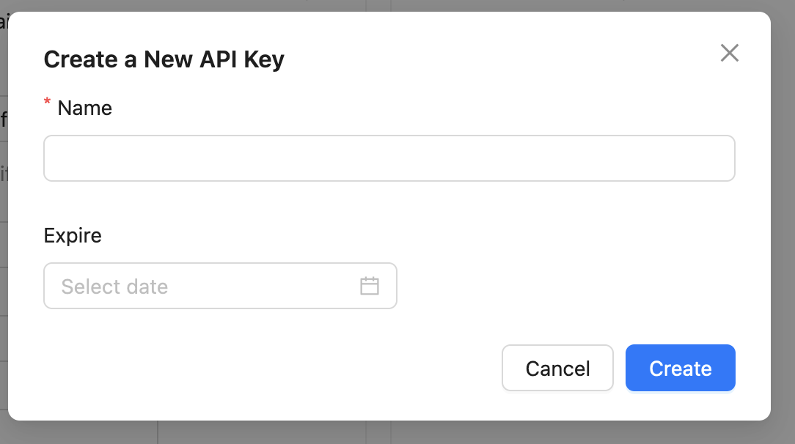
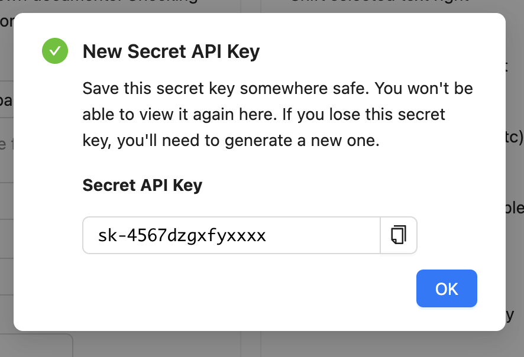

========
API Keys
========

A valid API key is required on all API requests.

.. contents::
   :local:
   :depth: 1
   
Here's the CoCalc feature announcement and discussion: `ANN: api keys rewrite <https://github.com/sagemathinc/cocalc/discussions/6738>`_.

Account API Keys
================

To obtain an account-wide key manually, browse to
`CoCalc account settings <https://cocalc.com/settings/account>`_.

In the Account Preferences pane that opens, scroll down to the "API Keys" dialog at bottom left:

.. figure:: img/account-api-key.png
     :width: 70%
     :align: center
     :alt: API Key dialog
     
       

Click "Add API key..." In the pop-up that opens, you can create a key and set an expiration date (recommended):

     
       

Immediately save the secret key that is displayed somewhere safe. You won't be able to view it again. **If you lose this key, you'll need to generate a new one.**

     
       

Project API Keys
================

You can also make project specific api keys in any project's settings. If you only need to use the API to access one project, these are safer.

To create a project-specific API key, open the project in CoCalc and scroll down to the "API Keys" dialog at bottom right. The steps to create and save a key are exactly the same as displayed above for account API keys.

.. index:: API; get_api_key

Create an API Key With Web Client
=================================

It is also possible to obtain an API key using a javascript-enabled automated web client.
This option is useful for applications that embed CoCalc
in a custom environment, for example `juno.sh <https://juno.sh>`_\ ,
the iOS application for Jupyter notebooks.
Visiting the link :samp:`https://cocalc.com/app?get_api_key=myapp`,
where "myapp" is an identifier for your application,
returns a modified sign-in page with the banner
"CoCalc API Key Access for Myapp".
The web client must
sign in with credentials for the account in question.
Response headers from a successful sign-in will include a url of the form
:samp:`https://authenticated/?api_key=sk_abcdefQWERTY090900000000`.
The client should intercept this response and capture the string
after the equals sign as the API key.

Your API key carries access privileges, just like your login and password.
**Keep it secret.**
Do not share your API key with others or post it in publicly accessible forums.

