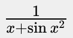
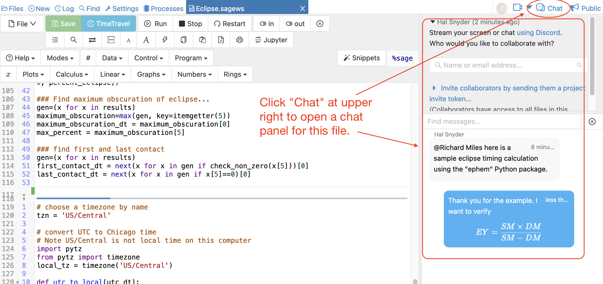

.. index:: Chat; chat rooms
.. _chatroom:

======================
Chatrooms
======================

CoCalc supports chatrooms for direct communication between collaborators
to enhance real-time collaboration on files.

.. image:: img/chatroom.png
    :align: center
    :width: 95%
    :alt: two-person chat showing typeset integral

Features
======================

* **Notifications**: if there is any chat activity, the bell-icon at the top right will light up red and wiggle.
  Click on that bell to see where the activity is.
  You can click on the specific entry to open the file or chat,
  or click on the "Mark all read" button to clear the alert.
* **Markdown**: Use `Markdown Syntax`_ to highlight ``**certain words**``, insert URL links, etc.
* **Formulas**: You can write `LaTeX formulas`_ between `$` signs, e.g. ``$\frac{1}{x + \sin{x}^2}$`` renders as |FORMULA|.
* **@Mention**: you can ping a certain collaborator via email in message,
  by starting a new word with the ``@`` symbol. A list of names appears and you can select her or him.
  Be aware, that in order to actually send an email, we need to know a working email address
  of the recipient.
* **Search**: use the search box at the top left to filter messages.
* **Emoticons**: a small set of characters are translated to unicode emoticons.
  E.g. type in ``:-)`` to express that you're happy!
* **Editing**: you can edit any message by double-clicking on it; a message specific "history" appears.
* **Video chat**: the button named "Video Chat" opens up a 3rd party service,
  which establishes an audio and video connection for more in-depth discussions.
* **Insert images**: you can either upload and reference any files to be shown in a chat message,
  or drag'n'drop onto the input box to upload a picture. The file will be uploaded into a hidden directory with the name ``.chat-images`` and some appropriate HTML code will be inserted into the chat box.

.. _Markdown Syntax: https://www.markdownguide.org/cheat-sheet/
.. _LaTeX formulas: https://en.wikibooks.org/wiki/LaTeX/Mathematics

Chatroom
====================

To start a new chat:

1. Open up the "Files" tab in a project;
2. (Maybe) switch to a specific directory, but any directory works;
3. Click the ``+ Add`` button and select the "Chatroom" filetype.

.. index:: Side chat
.. index:: Chat; side chat
.. _side-chat:

Side Chat
====================

At the top right in the Files toolbar for any open file, there is a chat icon: |comment-icon|.
This opens up a chatroom which is *specific to that file*.
This is commonly used to discuss the content of the given worksheet or notebook,
e.g. :ref:`students asking teachers/TAs <teaching-chatrooms>`.

