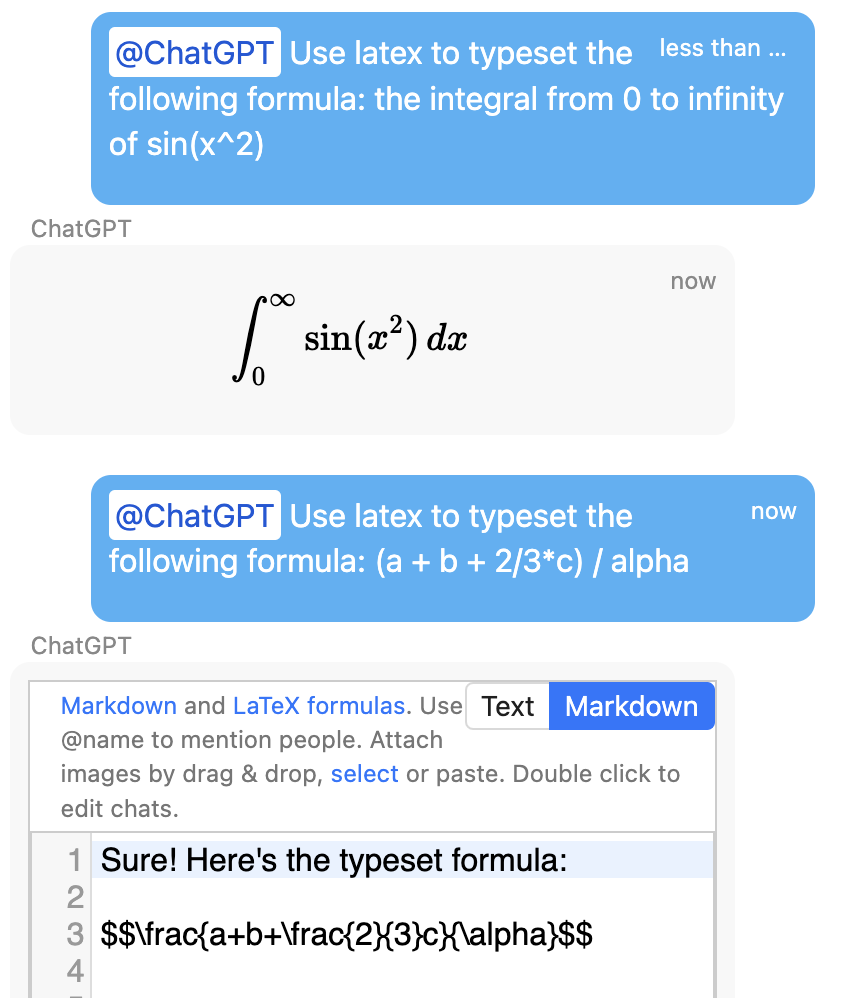

.. index:: ChatGPT

=====================
ChatGPT
=====================

ChatGPT can transform how you use CoCalc for learning, writing programs, and writing scientific documents. Here are some areas where ChatGPT offers a shortcut to getting results:

.. contents::
   :local:
   :depth: 2

You can read all CoCalc ChatGPT announcements to date and join the discussion at the links shown:

#. `ChatGPT integration via any chatroom in cocalc <https://github.com/sagemathinc/cocalc/discussions/6543>`_.

#. `Cocalc chatrooms now support reply message threads, and chatgpt now has "long memory" of the entire thread it was involved in <https://github.com/sagemathinc/cocalc/discussions/6567>`_.

#. `CoCalc Jupyter notebooks now have a new "Explain" button in Jupyter notebooks <https://github.com/sagemathinc/cocalc/discussions/6583>`_.

#. `New button to help you fix errors in Jupyter notebooks <https://github.com/sagemathinc/cocalc/discussions/6584>`_.

#. `ChatGPT integration with the Linux Terminal <https://github.com/sagemathinc/cocalc/discussions/6594>`_.

####################################
Jupyter Notebooks
####################################

@@@@@@@@@@@@@@@@@@@@@@@@@@@@@@@@@@@@
Coding Suggestions
@@@@@@@@@@@@@@@@@@@@@@@@@@@@@@@@@@@@

blah

@@@@@@@@@@@@@@@@@@@@@@@@@@@@@@@@@@@@
Explaining Error Messages
@@@@@@@@@@@@@@@@@@@@@@@@@@@@@@@@@@@@

zotz

####################################
Writing Code
####################################

scribble

@@@@@@@@@@@@@@@@@@@@@@@@@@@@@@@@@@@@
python
@@@@@@@@@@@@@@@@@@@@@@@@@@@@@@@@@@@@

foo

@@@@@@@@@@@@@@@@@@@@@@@@@@@@@@@@@@@@
R
@@@@@@@@@@@@@@@@@@@@@@@@@@@@@@@@@@@@

foo

@@@@@@@@@@@@@@@@@@@@@@@@@@@@@@@@@@@@
sagemath
@@@@@@@@@@@@@@@@@@@@@@@@@@@@@@@@@@@@

sagesagesage

####################################
Linux Terminal
####################################

@@@@@@@@@@@@@@@@@@@@@@@@@@@@@@@@@@@@
learn the bash shell
@@@@@@@@@@@@@@@@@@@@@@@@@@@@@@@@@@@@

@@@@@@@@@@@@@@@@@@@@@@@@@@@@@@@@@@@@
help writing SQL queries
@@@@@@@@@@@@@@@@@@@@@@@@@@@@@@@@@@@@

####################################
Scientific Documents
####################################

@@@@@@@@@@@@@@@@@@@@@@@@@@@@@@@@@@@@@@@@@@
typeset scientific content with LaTeX
@@@@@@@@@@@@@@@@@@@@@@@@@@@@@@@@@@@@@@@@@@

\\{infty}

@@@@@@@@@@@@@@@@@@@@@@@@@@@@@@@@@@@@
suggest wording for explanations
@@@@@@@@@@@@@@@@@@@@@@@@@@@@@@@@@@@@

####################################
ChatGPT Box at top of feature pages
####################################

To use ChatGPT help in feature headings (landing pages) and support requests, locate the help box and click the chatbot icon on the right. Once you open the chat interface, you can type in your questions and the ChatGPT model will provide you with contextualized answers.

Examples:

* Visit the `CoCalc features list <https://cocalc.com/features>`_ or click any of the features listed, and you will see the help box for help near the top of the screen.

* If you're on the R landing page and ask how to do something, it assumes you're using CoCalc and R and gives help related to that.

.. figure:: img/ch-r.png
   :width: 90%
   :align: center
   :alt: custom help with R

   ChatGPT help with R

* If you're on the sagemath landing page and ask how to do something, it assumes you're using CoCalc and sagemath.

.. figure:: img/ch-1.png
   :width: 90%
   :align: center
   :alt: custom help with sagemath

   ChatGPT help with sagemath

* You don't even have to be signed in to use CoCalc's ChatGPT  help.

   ChatGPT help at sign-in page

* You can describe a formula in English and have ChatGPT turn it into a latex formula.

   ChatGPT help with latex formulas

####################################
ChatGPT in Chat Rooms and Side Chat
####################################

In a :doc:`chat room <chat>` or in the :ref:`side chat <side-chat>` next to an open file, you can do an :ref:`@-mention <chat-at-mentions>` of ChatGPT and enter your question there.

.. figure:: img/ch-5.png
   :width: 70%
   :align: center
   :alt: @-mention help with latex

   @-mention help with latex

