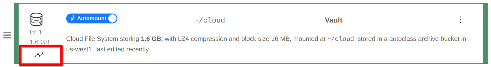
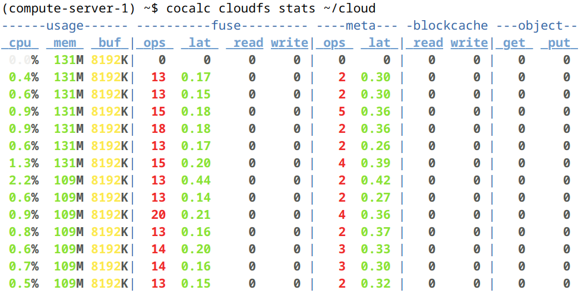
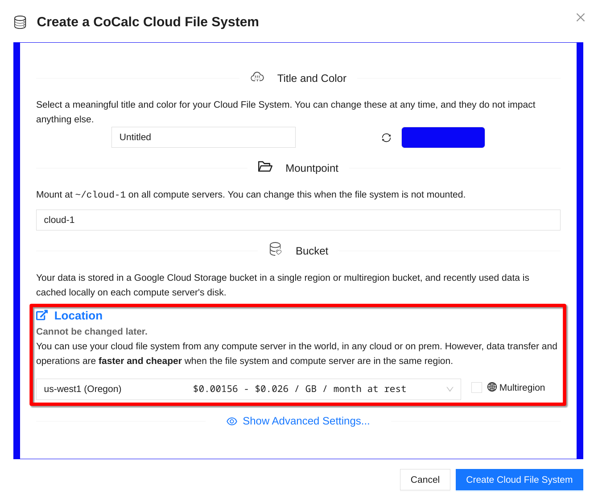
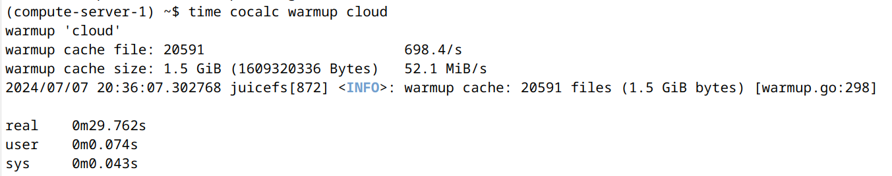

.. index:: Cloud File System
.. _cloud_file_system:

Cloud File System
=================

A CoCalc Cloud File System is "the third way" to store and access your data on :doc:`compute_server`, in addition to the home directory of your project and :ref:`Fast Local Directories <compute-server-filesystem>`. It combines a lot of advantages into a single package:

* **Fully POSIX Compliant:**
  A Cloud File System is a fully POSIX compliant distributed file system built using `JuiceFS <https://juicefs.com/>`_, `KeyDB <https://docs.keydb.dev/>`_ and `Google Cloud Storage <https://cloud.google.com/storage>`_. If you don't know what this means and aren't interested in technical details, the bottom line is that it behaves as a "normal file system" and you can do anything you want with it. Store just one file, clone a big git repository, even compile software on it! This file system works and is reasonably fast *for a networked file system*.

* **Independent:**
  A Cloud File System is independent of any compute server and can be moved from one project to another.

* **Shared:**
  By default a Cloud File System is automounted to all compute servers in the project, no matter where they are located. You can both read and write to it from multiple locations (POSIX lock is supported, but behavior will be undefined if you write to the same file simultaneously without a lock).

* **Unlimited:**
  There is no concept of overall size or free space for a Cloud File System. You can write to it as much as you want, and only the used size will change.

* **Resilient:**
  You can even make a Multiregion Cloud File System to make it accessible if one of Google's data centers goes down, and also increase speed across a continent.

* **Cost-efficient:**
  Long-term archival cost for a Cloud File System is staggeringly low.

This may sound too good to be true and make you wonder - what's the catch?  Well, one is that the billing is... complicated.

.. _cloud_filesystem_billing:

Billing
-------

The cost of a Cloud File System is perfectly sensible and can be much lower than local disks on cloud VMs, including our :doc:`compute_server`. However the cost structure may take a while to understand and it may be hard to predict the *exact* cost for your use case in advance, unlike the cost of a regular disk. Don't worry - we are not trying to hide it and, in fact, we do provide a real time estimate! The exact charge is derived from the underlying `Google Cloud Storage <https://cloud.google.com/storage>`_ pricing. We will charge your account a few days *after usage* when exact billing data becomes available to us.

**EXAMPLE: "Regular Local Disk"** Suppose you have about 200 GB of data, you expect to generate about 100 GB of checkpoints and auxiliary files, and hope to end up with about 50 GB of output. The software disk image you are going to use is about 25 GB, so adding everything together and rounding up you estimate that a 400 GB disk should work. If the cost of the disk space is $0.10 per GB per month, you know that you need to budget $40/month for the duration of your project. If it is going to last 2 years, you need $960 to pay for the disk.

Now suppose you want to use a Cloud File System in the same example, how much money do you need to allocate for it? Unfortunately, there is no easy formula. You need to cover

* **Storage:** Let's say you are considering a Cloud File System with $0.026/GB/month starting storage cost. Then once you have your data in the system, it will cost you $5.20/month, which is obviously much better than $40/month. You do NOT pay for the checkpoints that you have not created yet. This $5.20/month cost will also automatically decrease substantially over time if some data is not touched, if you use the default *Autoclass* bucket storage class.

* **Write operations:** These depend on the number of files you have. If they are about 1 MB each and you have 200,000 of them, you can expect about $1.30 for the initial upload.

* **Read operations:** These depend on the number of times you need to "re-read" your files. A Cloud File System is efficiently cached on a local disk. If you recreate your server every day (i.e. your cache is empty every morning) and have to access *all* data, the cost of reading 200,000 files may be about $0.13/day or $4/month if you don't take weekends off.

* **Network transfer:** This obviously depends on the amount of data you transfer and relative location of your Cloud File System and your Compute Server. If they are in the same region, there is no network transfer fee in either direction! Otherwise it can be as high as $0.30/GB, i.e. $60 to read the entire data set once!

* **Other fees:** These depend on your particular access pattern and chosen parameters. For example, with *Autoclass* you'll pay about $0.65/month for 200,000 files. If you choose a different bucket storage class, it may affect the cost of read operations and there may be early deletion charges.

So, what is the bottom line here? If you avoid network transfer fees and read 200GB once per day, the monthly cost should be about $10. With checkpoints and the output it may end up close to $20/month. And do you still need a 400GB local disk on your Compute Server? Yes, to be able to cache all the files, assuming that you need to access them frequently. However, there is no need to keep the disk of your compute server when you are not actively using it.  You can also easily switch between different 400GB local cache disk types with different performance parameters.  Will it help you to save some money? Perhaps, but if you are actually working with these data frequently, the amount is likely to be insignificant compared to the cost of computational resources. The advantage of using a Cloud File System in this case is its convenience, not cost savings.

If, on the other hand, you expect to store terabytes of data that you need accessible "when the need arises" and in day-to-day work you read only a fraction of the data, you are likely to be pleased with the cost as well as convenience!

**EXAMPLE: Large Long-Term Archive** Suppose you run a computationally expensive simulation every month based on data from public sources, i.e. you do NOT need to store input data yourself. However, the simulation results, about 1 TB each time, have to be archived because it takes a lot of time (and money) to recreate them. Most of these results are stored "just in case", only a small portion is actually accessed. What will be an approximate cost here? Let's assume that your files are big in which case they will be broken into 16MB chunks behind the scene. Then you need to cover about 65,000 write operations, $0.50, and each month there will be $0.20 charge for using Autoclass. The storage fee for the first month will be  $0.026 x 1000 = $26. If you don't access these data after writing, however, the storage fee for the second and third months will be $13/month. Then $5.20/month for the rest of the year. After one year it drops to $1.56/month!

Billing Estimate
----------------

If you have concerns about potential Cloud File System cost for your use case, try it on a smaller sample if possible and keep an eye on our real time billing estimates. To access these, click the graph icon:

    Access Billing Estimates

.. figure:: img/cfs_estimate_plots.png
    :width: 90%
    :align: center
    :alt: Billing Estimates

    Billing Estimates

You can also monitor Cloud File System activity in the terminal using ``cocalc cloudfs stats`` command:

    Using ``cocalc cloudfs stats``

Location Choice
---------------

Creating a Cloud File System is very easy and most of its basic parameters you can change later on. However, it is impossible to change its location and this choice affects not only the storage cost (which you can see in the selector), but also the usage cost, i.e. the network transfer and read/write operations (which we cannot estimate in advance). Therefore, you need to pay attention to where your Cloud File Systems **and** Compute Servers are located:

    Choosing Location

Local Disk Size
---------------

A Cloud File System is efficiently cached using a local disk, which is essential for speed as well as cost: it helps to avoid excessive charges for read operation and network traffic. Try to have a disk big enough to fit all the data that you are likely to read in one session.

.. hint::

    The price of a bigger disk may not be a big concern since you can deprovision it when not in use. This is especially the case if you need to process some new data on a weekly or monthly basis.  On Google Cloud, disk bandwidth and IOPS are also proportionate to the disk size, so you might want to use a larger disk to increase speed.

Number of Files
---------------

Since there are per-operation charges for a Cloud File System, if you always use a lot of small files together you may consider storing them in an archive and only unpacking them locally. It may also increase downloading speed, although it is pretty efficient anyway. As an alternative, you can also use ``cocalc warmup`` command in a terminal:

    Using ``cocalc warmup``

.. note::

    Under the hood, a Cloud File System keeps all file metadata in RAM for efficient syncing. This works great up to a few million files, but if you need to work with many millions, you have to pay attention to RAM usage (storing 3 million files uses about 1 GB RAM), consider using archives for grouping files together, or contact us to develop an alternative solution!  