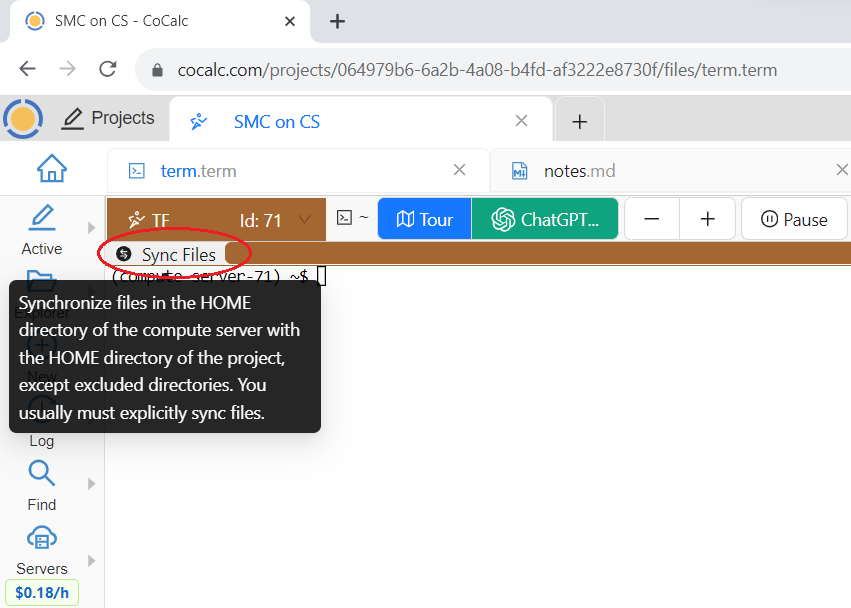
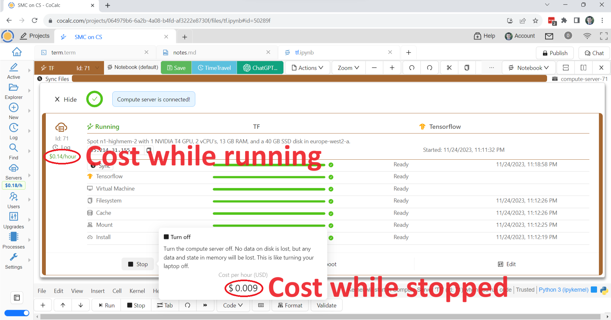

.. index:: Compute Servers

==========================
Compute Servers
==========================

.. contents::
   :local:
   :depth: 2
   
A compute server in CoCalc is a remote computer, whose resources (GPUs, CPUs, RAM, disks) you can utilize via CoCalc collaborative interface in Jupyter notebooks and terminals. It is a way to open up possibilities for enhanced computing resources, extending far beyond the bounds of local machines.

To create a compute server, you select the software image, hardware and (optional) GPU, and can then start running any Jupyter notebook or Linux terminal on this server for an on-demand fee, charged by the second when the server is in use.

The GPU support is extensive, offering variants including A100 80GB, A100 40GB, L4, and T4 GPUs with finely configured software stacks. These stack images include SageMath, Google Colab, Julia, PyTorch, Tensorflow and CUDA Toolkit, accommodating a versatile range of uses. The compute servers come at highly competitive pricing, particularly for spot instances.

----------------------------
Creating a Compute Server
----------------------------

Navigate to the project where you intend to use a compute server. Click on the "Servers" button on the left side of the screen and select "Create Compute Server":

.. figure:: img/compute_server_creating.png
    :width: 90%
    :align: center
    :alt: Creating a Compute Server

    Creating a Compute Server

You will be prompted to select the desired software image and optionally a GPU. A GPU is selected by default but you can disable it if you don't need one.

If you are going to write code using CUDA libraries, choose the "Cuda Toolkit" image. If you want to accelerate PyTorch computations with a GPU, choose the "PyTorch" image. If you want to use SageMath, choose the "SageMath" image. Note that image selection does depend on the presence of a GPU.

Adjust the hardware parameters according to your needs. Take some time to look over the options! Note that you will be able to edit CPU and RAM when the machine if off, so if you don't quite know what you need - make a guess! If it turns out that you need something more or less powerful, you can easily make an adjustment. The disk size can be increased even when the machine is running.

Start your compute server!

------------------------------
Using a Compute Server
------------------------------

If you want to use the Linux command line, e.g., compilers, etc., create a terminal file (one ending in .term) and using the upper-left menu, select your compute server:

.. figure:: img/compute_server_terminal.png
    :width: 60%
    :align: center
    :alt: Connecting a Compute Server to a Terminal

    Connecting a Compute Server to a Terminal

If you chose the "CUDA Toolkit", then the "nvcc" command will be available for compiling .cu code.

If you need to edit the files during your computations on the compute server, remember to click the "Sync" button at the top left of the terminal for the files to get copied to your compute server:

    Sync Button for a Compute Server

If you chose the "PyTorch" image or similar, create a Jupyter notebook and move it to the compute server via the upper-left menu in the same way. You can then select a Jupyter kernel that's available on the compute server, and your Jupyter notebook will run there:

.. figure:: img/compute_server_select_kernel.png
    :width: 90%
    :align: center
    :alt: Picking a Jupyter Kernel on a Compute Server

    Picking a Jupyter Kernel on a Compute Server

----------------------------
Billing for a Compute Server
----------------------------

Compute servers are billed by the second when they are running. When they are stopped, you pay only for the disk space. In this example the running cost is $0.14/hour while the disk cost is less than a penny, notice the extra zero in $0.009/hour:

    Compute Server Cost

In "Deprovisioned" state there is no charge at all, but you do lose data that were not synced to your CoCalc project.