.. index:: Compute Servers
.. _compute-servers:

Compute Servers
===============

.. contents::
   :local:
   :depth: 2
   
CoCalc's Most Unique Offering
-----------------------------

A compute server in CoCalc brings you closer to your dreams using an extremely powerful and flexible combination of

* **Reliable hardware resources - ranging from minimal to MASSIVE!**
   - From 1/4 to over 400 CPU cores on a single node plus cluster support
   - From 1 to over 10,000 GB RAM
   - From 10 to over 1,000,000 GB disk
   - From a single T4 (or no GPU at all) **to 8x H100**, with tons of options in between, including access to L4 and L40, RTX-A4/5/6000, and A100 with 40 GB or 80 GB of RAM
   
* **Access to multiple clouds - in a unified way that does not hide their superpowers!**
   - Running out of disk space? Increase it seamlessly on the fly!
   - Can deal with occasional interruptions? Benefit from Google discounts on spot instances!
   - Need sustainable GPUs and free network? Pick Hyperstack!
   - Have a powerful laptop or a cluster? Turn it into a cloud!
   
* **Finely pre-configured software images - don't waste your time!**
   - SageMath, Anaconda, Google Colab, Julia, PyTorch, Tensorflow, Open WebUI, etc.
   - Most things work right out of the box
   - Install anything as root, use Docker and Kubernetes
   - Launch JupyterLab or VS Code with just one click
   
* **CoCalc's renowned interface - honed from years of experience and feedback!**
   - Code files are synchronized with your CoCalc project's file system
   - Real-Time Collaboration and AI Assistant with a plethora of LLMs
   - User friendly version control Time Travel (or your beloved git)

* **CoCalc's dedicated team - support you can rely on!**
   - Benefit from our expertise, **focus on YOUR work**
   - Enjoy a personable approach, schedule a video chat with us anytime
   - Request custom images and features

* **Transparent billing - no surprises!**
   - See competitive prices while configuring your server
   - Pay by the second when resources are in use
   - Study a detailed list of all transactions
   - Get daily statements by email
   

.. _colab_example:

Examples of Compute Server Uses
-------------------------------

You may find something useful, at least some inspiration, in our growing `collection of tutorials <https://github.com/sagemathinc/cocalc-howto/blob/main/README.md>`_ that showcase compute servers. You can simply read them or follow along in video format. Here CoCalc's CEO and Founder William Stein explains how to run the Google Colab environment on compute servers and use either Tensorflow or PyTorch:

.. raw:: html

    
<iframe width="640" height="360" src="https://www.youtube.com/embed/kcxyShH3wYE?si=rGZEWZgs6XbOF38u" title="YouTube video player" frameborder="0" allow="accelerometer; autoplay; clipboard-write; encrypted-media; gyroscope; picture-in-picture; web-share" allowfullscreen></iframe>

     

Do I Still Need a License?
--------------------------

That is a great question! We do not force our users to get a regular license for working with compute servers, but since the CoCalc project is still used for :ref:`file syncing <compute-server-filesystem>` and tracking compute server status, you will have smoother experience if your project has member hosting and sufficient RAM. In most cases the `basic license <https://cocalc.com/store/site-license?user=academic&period=monthly&run_limit=1&cpu=1&ram=2&disk=3&uptime=short&member=true>`_ with 2 GB RAM, 1 vCPU core, and 3 GB disk will work great!

Creating a Compute Server
----------------------------

There are multiple ways to create a compute server, one of them is to click the **Server** button:

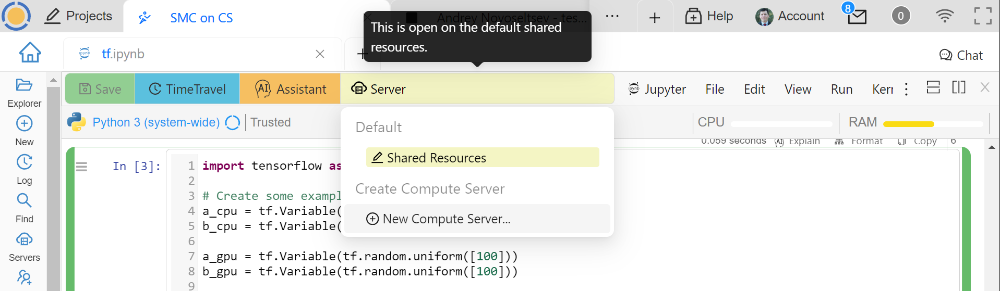

    Creating a Compute Server

The first settings allow you to give your server a name, pick a colour to easily distinguish where your are working, and :ref:`choose the cloud provider <choosing_a_cloud>` used for your server:

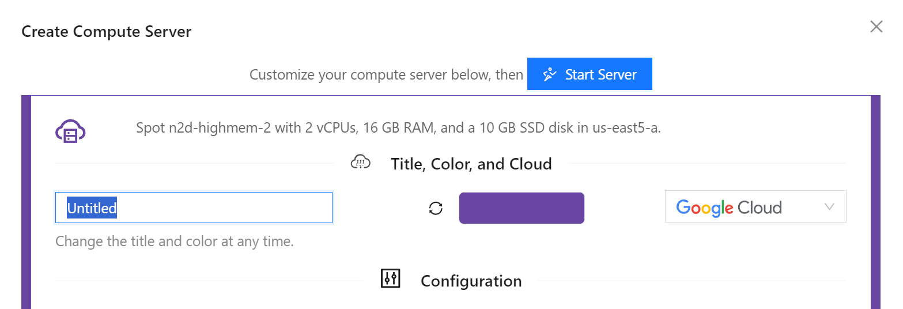

    Creating a Compute Server

.. hint::

    You can actually be your own "cloud provider" by picking **On Prem** hosting! You can use not only your own physical hardware, but also virtual machines from providers we are not currently integrated with. This is one of the ways we support :ref:`on-premises`. 
    
**Configuration** parameters vary depending on your hosting choice, but typically you can select the desired software image and hardware configuration including GPU(s).

If you are going to write code using CUDA libraries, choose the "Cuda Toolkit" image. If you want to accelerate PyTorch computations with a GPU, choose the "PyTorch" image. If you want to use SageMath, choose the "SageMath" image. Note that image selection does depend on the presence of a GPU.

Adjust the hardware parameters according to your needs. Take some time to look over the options! You will be able to edit CPU and RAM when the machine is off (if it also has a GPU, currently it will have to be deprovisioned), so if you don't quite know what you need - make a guess! If it turns out that you need something more or less powerful, you can easily make an adjustment. For example, in this video William uses a machine with 60 CPU cores and 240 GB of RAM to build SageMath from source in under 18 minutes:

.. raw:: html

    
<iframe width="640" height="360" src="https://www.youtube.com/embed/b8e8qq-KWbA?si=Y9N6ZtcVKo3fD9Fn" title="YouTube video player" frameborder="0" allow="accelerometer; autoplay; clipboard-write; encrypted-media; gyroscope; picture-in-picture; web-share" allowfullscreen></iframe>

After the build is done, William changes the machine type to have only 2 CPU cores and 8 GB of RAM - such a machine is very cheap to run even 24/7! The disk size can be increased even when the machine is running. Unfortunately, you currently can't move the machine from one region or zone to another unless it is deprovisioned, and the prices do depend on the region - this will change in the future.

Start your compute server!

Using a Compute Server
------------------------------

Your freshly created compute server does *not* replace your CoCalc project, but rather complements it. This is why you have to explicitly indicate that you want to run your terminal or Jupyter notebook on a particular compute server, and you can have multiple compute servers running at the same time!

.. hint::

    You can get close to a feeling of working "just on a compute server" if you switch to it in the file **Explorer** - you will be able to see its local files and all files that you open will run on the same compute server by default. See :ref:`compute-server-filesystem` below.

To run a Jupyter notebook on a compute server, click the **Server** button and select the one you want to use:

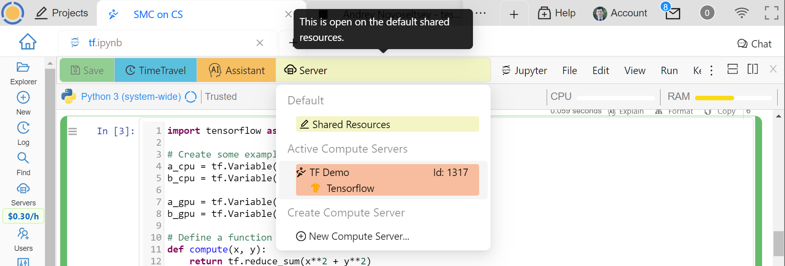

    Connecting a Compute Server to a Notebook

You will get a confirmation dialog, reminding you that the current kernel will be stopped and a new one will have to be started on the compute server:

.. figure:: img/compute_server_confirmation.png
    :width: 90%
    :align: center
    :alt: Confirming the Choice of a Compute Server

    Confirming the Choice of a Compute Server

It is possible that the type of kernel used in your notebook is not available on the compute server (and vice versa). In this case you will need to choose another one:

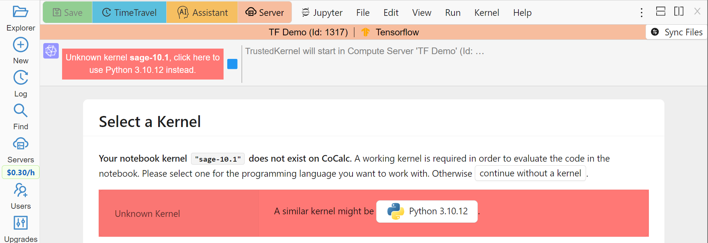

    Picking a Kernel on a Compute Server

The server bar appearing above the notebook allows you to quickly see where the notebook is running and shows the name you have given to this server, its unique ID, and the image used. Click on this bar to see more details about the server:

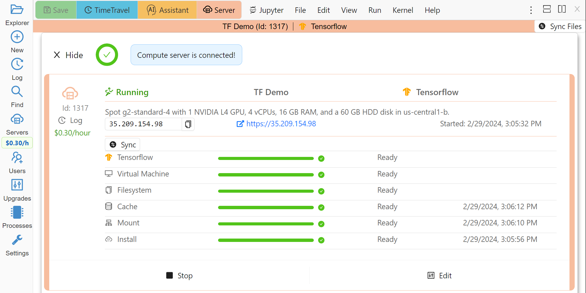

    Compute Server Status

In order to use the Linux command line, e.g., compilers, etc., create a terminal file (one ending in .term) and connect it to a compute server in the same way. If you chose the "CUDA Toolkit" image, then the ``nvcc`` command will be available for compiling ``.cu`` code. See `this tutorial <https://github.com/sagemathinc/cocalc-howto/blob/main/cuda.md>`_ for details.

.. _compute_server_applications:

JupyterLab, VS Code, X11 Desktop
--------------------------------

You can easily start your own instance of JupyterLab or VS Code on your computer server, as well as start using X11 Graphical Desktop. Simply click the dot menu in the compute server panel, make a choice, and follow instructions:

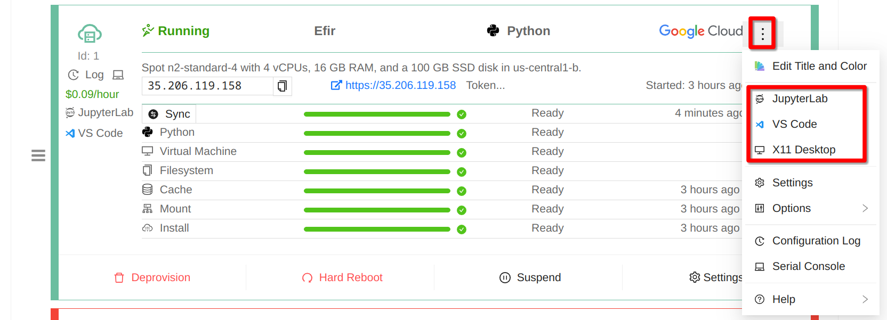

    Compute Server Applications
    
Since you will be able to use these applications via direct connection to your compute server, you may enjoy lower latency than through the regular CoCalc interface, which may be especially noticeable for :ref:`X11 Desktops <X11>`. Of course, for this you have to create your compute server in a region geographically close to you. You are also free to install any system software you wish, and this is actually necessary for most of the software pre-installed in your Home Base.

Becoming root and Port Forwarding
---------------------------------

You cannot become ``root`` or use ``sudo`` inside of a CoCalc project. If you try to, you will get a message like

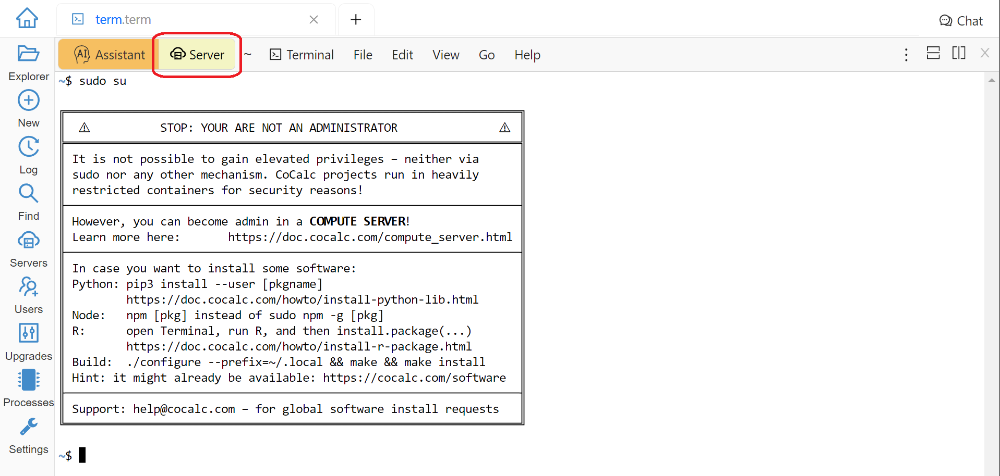

    Error Message Using sudo

On a compute server it is fully possible, just make sure that your terminal is running on a compute server as explained above:

.. figure:: img/compute_server_sudo.png
    :width: 90%
    :align: center
    :alt: Using sudo on a Compute Server

    Using sudo on a Compute Server

.. warning::
    Since you can do anything as ``root``, you may accidentally lose access to your compute server and your data. If this happens and you do need to regain access to data, contact support at help@cocalc.com
    
When you become ``root`` as above, you are still inside of a Docker container that is closely integrated with CoCalc. If this creates problems for your use case, you can escape from it and become ``root`` on the actual virtual machine that represents your compute server. To do this, :ref:`add SSH keys to your account <account-ssh>` (or project). Then use SSH to connect as ``root`` to ``localhost``:

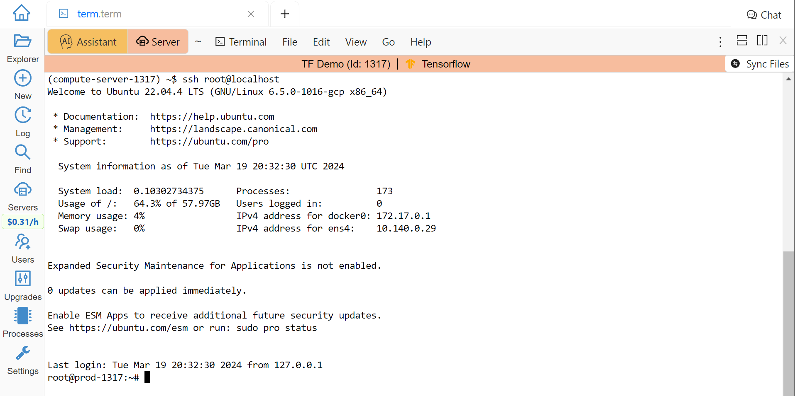

    Escape from the Compute Server Container

Alternatively, you can use the external IP address of your compute server to connect to it from *any other machine*, bypassing CoCalc. This address is on the top of information about the server:

.. figure:: img/compute_server_direct_connect.png
    :width: 90%
    :align: center
    :alt: Compute Server IP Address

    Compute Server IP Address

The same address can be used to gain access to services. If any software on your compute server instructs you to "go to ``http://localhost:8123``", execute ::

    ssh -L 8123:localhost:8123 root@[server address]

on your *local* computer and go to ``http://localhost:8123`` in your *local* browser.

Billing for a Compute Server
----------------------------

A compute server is billed by the second and the price depends on its state:

- **Running** - the server is ready to perform your tasks, you pay for all of its resources and this is the price shown when creating a server
- **Suspended** - this is an analog of closing your laptop lid, you pay for the disk space and storing RAM state, but not for CPUs (compute servers with GPUs cannot be suspended)
- **Off** - this is an analog of shutting down your laptop, you pay only for the disk space and local data is available to you when you start the server again
- **Deprovisioned** - this is like writing down the model number of your laptop on paper, it costs nothing and when you start the server it will have the same characteristics, but all data that was not synced to your CoCalc project is gone.

.. warning::

    Please note that *there is* still a charge in the **Off** state! Namely the cost of the disk. Typically it is much less than the cost while **Running**, but it depends on your precise configuration.
    
.. hint::

    If you do not store local data on your server and do not customize the software environment, use the **Deprovisioned** state. You can make it the default using **Ephemeral Disk** setting in the server configuration.

In the example below the running cost is $0.30/hour while the disk cost is less than a penny! Notice the extra zero in $0.004 that appears when you hover over the **Stop** button (hovering over the cost per hour will also show the cost per month):

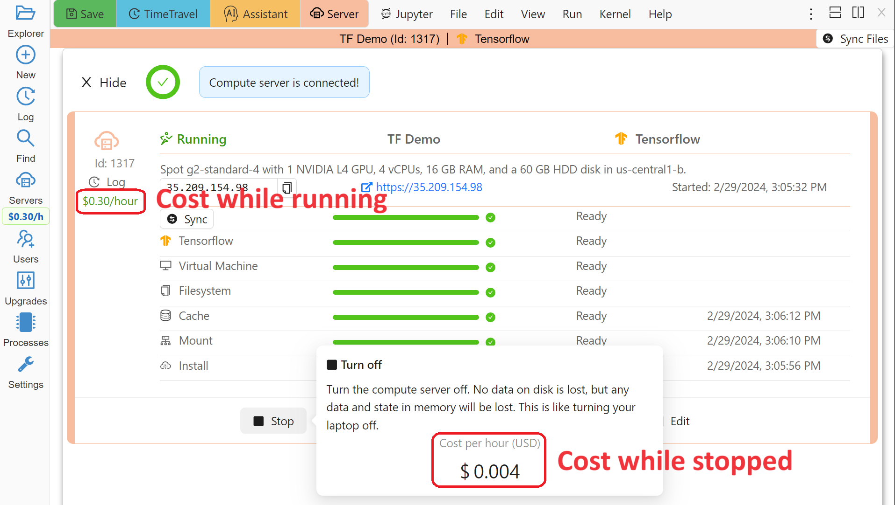

    Compute Server Cost

.. _compute-server-filesystem:

Compute Server Filesystem
-------------------------

In order to smoothly and successfully use a compute server, it is essential to understand how its filesystem interacts with your CoCalc project.

For the most part, all files in your CoCalc project conveniently appear in your home folder on the compute server and you can use them in a regular way. File changes inside of your CoCalc project and on your compute server can be synced both ways. This works great for Jupyter notebooks, for example. However, this convenience is still bound by laws of physics and because of network transfers involved it is much slower than modern local disks. You are also limited by your CoCalc disk quota.

If you need to read or write massive amounts of data, e.g. for data science or machine learning, or the programs you are running operate with a lot of files, e.g. ``git status`` with a large repository, you do need to use :doc:`cloud_file_system` or Fast Local Directories on your compute server. These directories are configured in the compute server settings when you create or edit one:

.. figure:: img/compute_server_fast_data.png
    :width: 80%
    :align: center
    :alt: Fast Local Directories

    Fast Local Directories
    
As intended, these directories are *NOT* visible in your CoCalc project:

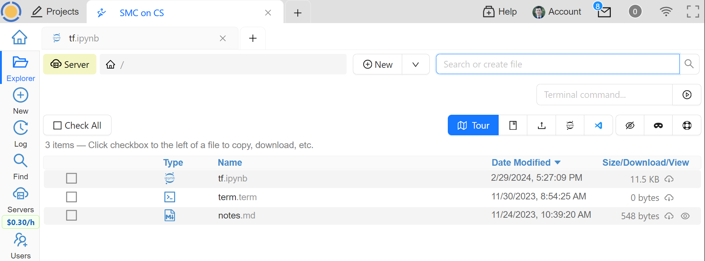

    File Explorer on Project
    
In order to see them, to open files in them, or to open even synced files on the compute server without extra steps, connect your file explorer to the compute server in the same way as with notebooks and terminals, using the **Server** button. Now the Fast Local Directories are visible (you can certainly have more than one):

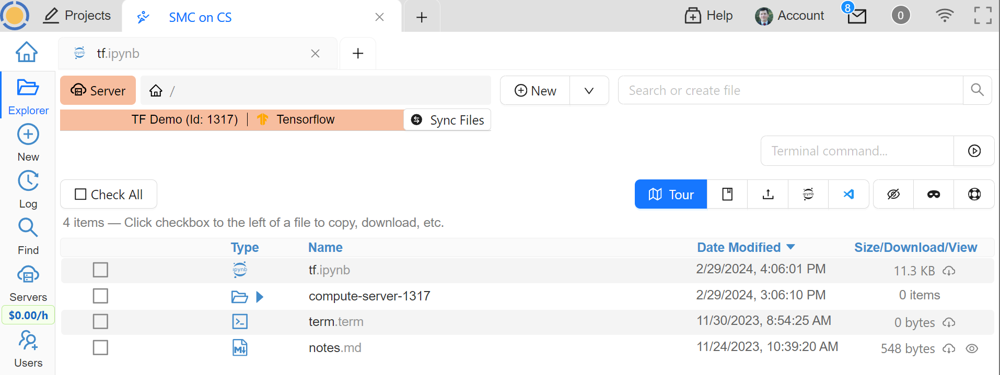

    File Explorer on Compute Server
    

When you edit files via CoCalc graphical interface, they are usually synced between the project and the compute server automatically. However, if you are using ``vim`` or some other tool in a terminal, or just want the files to be synced immediately, you may need to click the **Sync Files** button:

.. figure:: img/compute_server_sync_files.png
    :width: 80%
    :align: center
    :alt: Sync Files Button for a Compute Server

    Sync Files Button for a Compute Server

Compute Server VPN
------------------

In addition to Internet access using standard tools, your compute servers *in the same project* can communicate with each other over encrypted VPN. You can refer to your servers either using ``compute-server-nnnn`` names or, if you have configured a subdomain ``https://server_name.cocalc.cloud``, using ``server_name``. Here is quick example of a terminal session on a compute server::

    (compute-server-1268) ~$ more /etc/hosts
    ...
    ### COCALC VPN -- EVERYTHING BELOW IS AUTOGENERATED -- DO NOT EDIT
    10.11.12.242 compute-server-1268
    10.202.0.87 internal-1268
    34.162.173.49 external-1268
    10.11.211.165 compute-server-4300
    10.11.211.165 fire
    10.0.3.110 internal-4300
    149.36.0.137 external-4300
    (compute-server-1268) ~$ sudo apt install -y iputils-ping
    ...
    (compute-server-1268) ~$ ping compute-server-4300
    PING compute-server-4300 (10.11.211.165) 56(84) bytes of data.
    64 bytes from compute-server-4300 (10.11.211.165): icmp_seq=1 ttl=64 time=231 ms
    64 bytes from compute-server-4300 (10.11.211.165): icmp_seq=2 ttl=64 time=114 ms
    ...
    (compute-server-1268) ~$ ping fire               
    PING fire (10.11.211.165) 56(84) bytes of data.
    64 bytes from compute-server-4300 (10.11.211.165): icmp_seq=1 ttl=64 time=114 ms
    64 bytes from compute-server-4300 (10.11.211.165): icmp_seq=2 ttl=64 time=114 ms
    ...

All traffic is fully encrypted and all ports are open, so you have complete freedom in configuring services that run over this VPN. IP addresses of the form ``10.11.x.x`` remain fixed for the lifetime of the compute server.

Current limitations (that may be removed in the future):

- the CoCalc project itself is *not* on this VPN
- you can connect from any to any server, mixing different clouds and on prem, *except* two on prem servers
- when you create a new server or configure a domain name for an existing one, you may need to *wait a few seconds* before the new name will become resolvable

.. _choosing_a_cloud:

Choosing a Cloud
------------------

It is impossible to choose "the best cloud" for compute servers overall, which is why CoCalc integrates with many of them! For each particular use case one may be more or less preferable - sometimes it may be obvious, sometimes it requires experimentation, and sometimes the difference is inconsequential. The purpose of this section is to highlight some points to consider when choosing a cloud, hopefully it will make this task easier for you.

Cost
....

This may be the most obvious criterion, but while we strive to be as transparent as possible with the cost of running a compute server, do keep in mind also that:

- there is a cost for the disk space when the server is off;
- there may be some charge for network traffic, typically it is small compared to compute resources, but it does depend on your use case;
- it may be more cost effective to use a configuration that is more expensive *per hour* if it allows you to complete your computations faster, thus paying for fewer hours.

Availability
............

This one may be less obvious than the cost, but it is even more important - the price of a compute server does not matter if you cannot start it! In most cases once you managed to start a compute server, you can continue using it until you explicitly turn it off. However, there is no guarantee that you will be able to start the same machine again in a few days - other users may utilize all resources.

Geographic Location
...................

Your organization may impose strict requirements on where your data are stored and processed. Other factors to consider:

- latency for interactive work: a server close to you may be best if you directly use web services started on it, while ``us-east1-d`` may be optimal to use CoCalc editors;
- some "remote" regions may have attractive cost and/or availability;
- network speed and cost, if you expect a lot of traffic.

Special Considerations
......................

You may want to use a data centre satisfying particular requirements on sustainability, security, etc. We try to expose as much information about our cloud providers as possible to help our users to make an informed choice.

Let's take a look now at some of the unique benefits of our cloud providers!

Google
......

- Vast selection of varied configurations!
- For computationally intensive tasks, do take a look at higher end machines. We had customers with very strict requirements on interconnect network between cluster nodes, but it turned out that Google had single nodes with enough vCPUs, eliminating the need for a cluster setup!
- Spot instances offer up to 10x lower prices, if your work can deal with potential interruptions!

Hyperstack
..........

- Apart from cost and speed, Hyperstack prioritizes sustainability of their data centres. They are 100% powered by hydro-electricity and are located in Canada and Norway to benefit from lower ambient temperature for air cooling.
- You can see how many GPUs are available on Hyperstack at any given time and estimate your chances of being able to get what you need in the future.

On Prem
.......

- You are in full control of the machine you are using.
- At the moment On Prem compute servers are free, the intended cost when their development is finished is about 1/3 of a similar spot instance on Google. If you *already own* sufficient compute resources, this may be the most cost-effective option to benefit from the cloud and collaboration as well!

.. _teaching_with_compute_servers:

Teaching with Compute Servers
----------------------------------

Compute servers are a great option to let your students or workshop participants use GPUs or powerful compute resources! Some important points to consider ahead of the course start:

- What configuration do you need for your students?

- How will you communicate it to them so that they don't miss important settings? (We do plan to support sharing server configuration directly, but it is not implemented yet.)

- Who will pay for running compute servers? The cost will be deducted directly from student accounts, but you can provide them with :ref:`credit-vouchers` if you wish, paying for those yourself.

- If you do use vouchers, you will need to figure out a suitable amount and, perhaps, develop a policy for those who run out of credit. For example, students may forget to turn off their servers when they are done working. It is also theoretically possible for them to configure a much more powerful machine than needed/instructed.

- Note that students can not spend more than they have in their account, so the worst case scenario is: they "burn" their allotment because of some mistake, put the same amount of money again, and hopefully behave in a more responsible manner the second time.

- For smaller courses it may be feasible for the instructor to create a server in each student project and allow collaborators (which includes students) to control it, i.e. they will be able to start and stop it:

  .. figure:: img/allow_collaborator_control.png
        :width: 80%
        :align: center
        :alt: Allow Collaborator Control

        Allow Collaborator Control

  In this case usage bills to the instructor account without any need for vouchers. Since the students can't edit the configuration of such a server, the worst case for an improper use is leaving the server running all the time.

