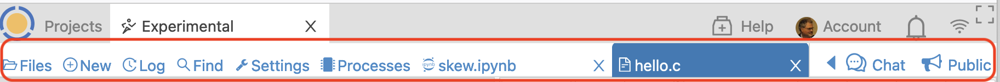
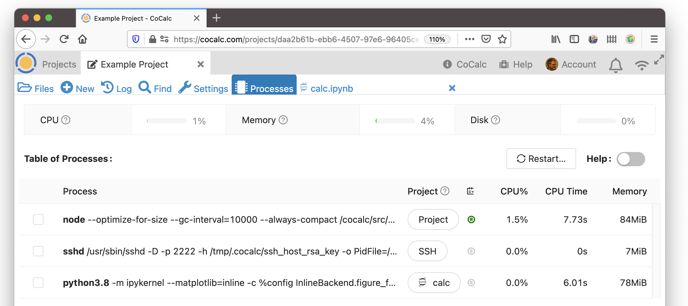

.. index:: Files Toolbar
.. index:: Toolbars; files
.. _files-toolbar:

========================
Files Toolbar
========================

Here's a tour of the **Files Toolbar**. It appears under the Project Toolbar when a project has been selected.

.. toctree::
   :maxdepth: 2

     the files toolbar is just below the project toolbar

Use the Files Toolbar to work with files in the selected project.
When you open a file, the name of the file appears in the Files Toolbar.
When you select a file in the Toolbar, its contents are displayed in the browser.

From left to right:

.. _ft-files:

|folder-open| Files
===================

If you don't have a file open, clicking here will show you a list of files in the project's home directory. If you are working on a file, clicking **Files** will show a list of files in the directory containing the currently selected file. You can enter search characters to filter the file list for filenames containing the search text.

.. _ft-new:

|plus-circle| New
=================

click to create or upload new files. **New** also lets you
  browse the `CoCalc Library <http://blog.sagemath.com/cocalc/2018/03/06/cocalc-library.html>`_, which contains code examples and entire books about various toolsets
  and science topics, ready to copy into your project.

.. _ft-history:

|history| Project Log
=====================

The **Project Activity Log** shows recent activity in your project:
  logins, files opened and uploaded, etc. If you click on a filename in the log, it will open
  that file. This is often the quickest way to resume work on a file that was recently closed.

.. _ft-search:

|search| Find
=============

Search  for files containing the specified text in the directory that contains
  the currently selected file, or the project home directory if no file is selected. There are options
  to for searching subdirectories, case sensitive search, including hidden files, and restricting search
  to files in a git repository.

.. _ft-settings:

|wrench| Project Settings
==========================

See :doc:`project-settings`.

.. _ft-info:

|microchip| Processes
=====================

This panel offers a consolidated view of real-time activity within the current project. Use the Help toggle above the Memory column for details about this extremely useful panel. You can view use of CPU, memory, and disk space. There is a list of running processes, showing resource use by each and allowing you to terminate non-essential processes.

.. note::

    The "Memory" column in the Table of Processes can help you track down out-of-memory problems.

.. _ft-open-files:

Open Files
==========

To the right of the Processes icon, a button appears for each file you have open. There are several ways to open a file in CoCalc:

* Select the name of the file in :doc:`../project-files` list.

* Select the filename in an entry in the :ref:`Project Activity Log <ft-history>`.

* Use the `open` command to open the file :ref:`from a terminal <terminal-file-open>`.

.. _ft-comment:

|comment-icon| Side Chat for files
====================================

If a file is selected, you can click here to start text or video chat. Collaborators on the project will get a notification when chat is opened or updated.

.. _ft-share:

|lock-icon| private / public status
===================================

If a file is selected, this button allows you to share it, or stop sharing. Files shared publicly can be viewed by people without a CoCalc login. You can see a list of all your shared files under :doc:`account/public-files`.

.. |folder-open|
     image:: https://github.com/encharm/Font-Awesome-SVG-PNG/raw/master/black/png/128/folder-open-o.png
     :width: 16px
     :alt: files folder open icon
.. |plus-circle|
     image:: https://github.com/encharm/Font-Awesome-SVG-PNG/raw/master/black/png/128/plus-circle.png
     :width: 16px
     :alt: new file plus circle icon
.. |history|
     image:: https://github.com/encharm/Font-Awesome-SVG-PNG/raw/master/black/png/128/history.png
     :width: 16px
     :alt: log history icon
.. |search|
     image:: https://github.com/encharm/Font-Awesome-SVG-PNG/raw/master/black/png/128/search.png
     :width: 16px
     :alt: search magnifying glass icon
.. |wrench|
     image:: https://github.com/encharm/Font-Awesome-SVG-PNG/raw/master/black/png/128/wrench.png
     :width: 16px
     :alt: settings wrench icon

.. |comment-icon|
     image:: img/antd-icons/comment-icon.png
     :width: 24px
     :alt: To open chat, click comment icon.
.. |microchip|
     image:: https://github.com/encharm/Font-Awesome-SVG-PNG/raw/master/black/png/128/microchip.png
     :width: 16px
     :alt: processes microchip icon