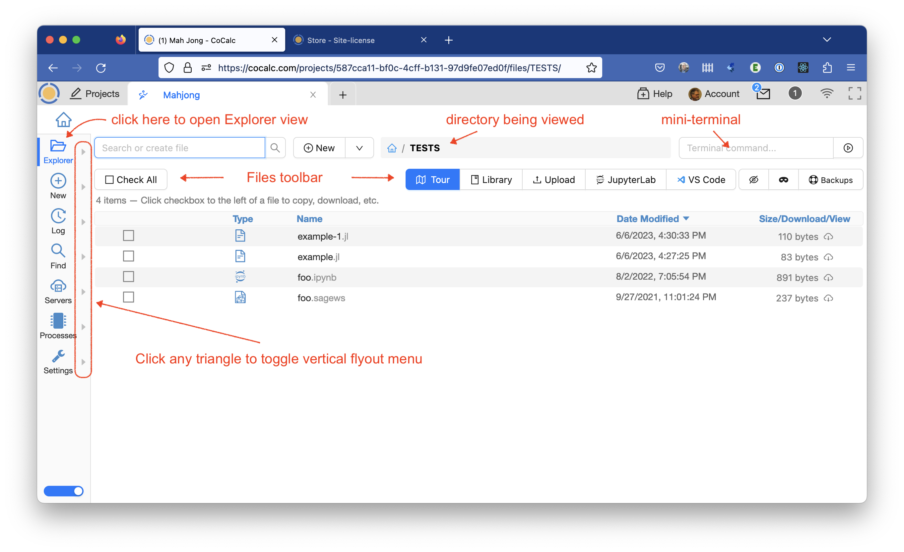
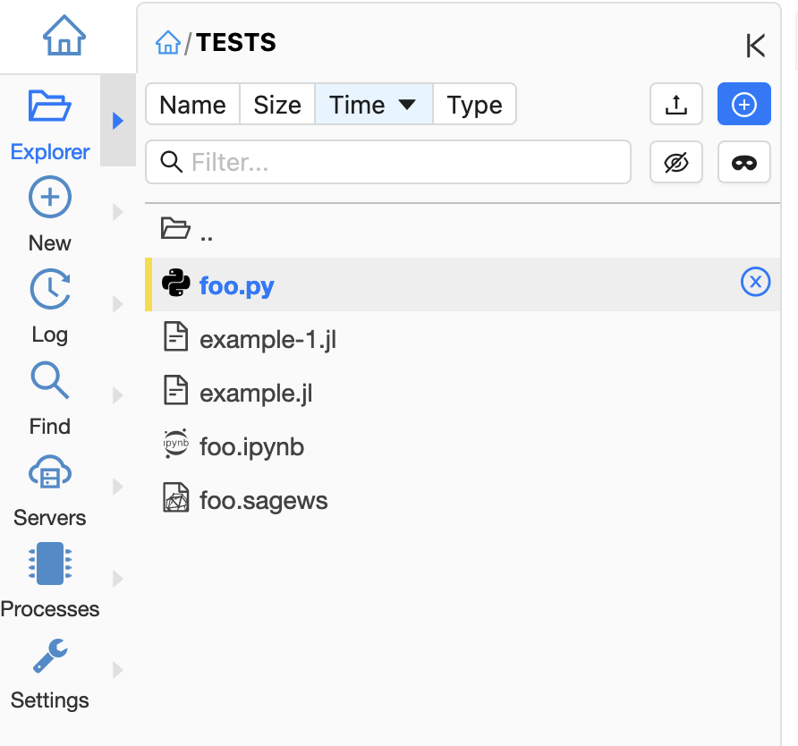
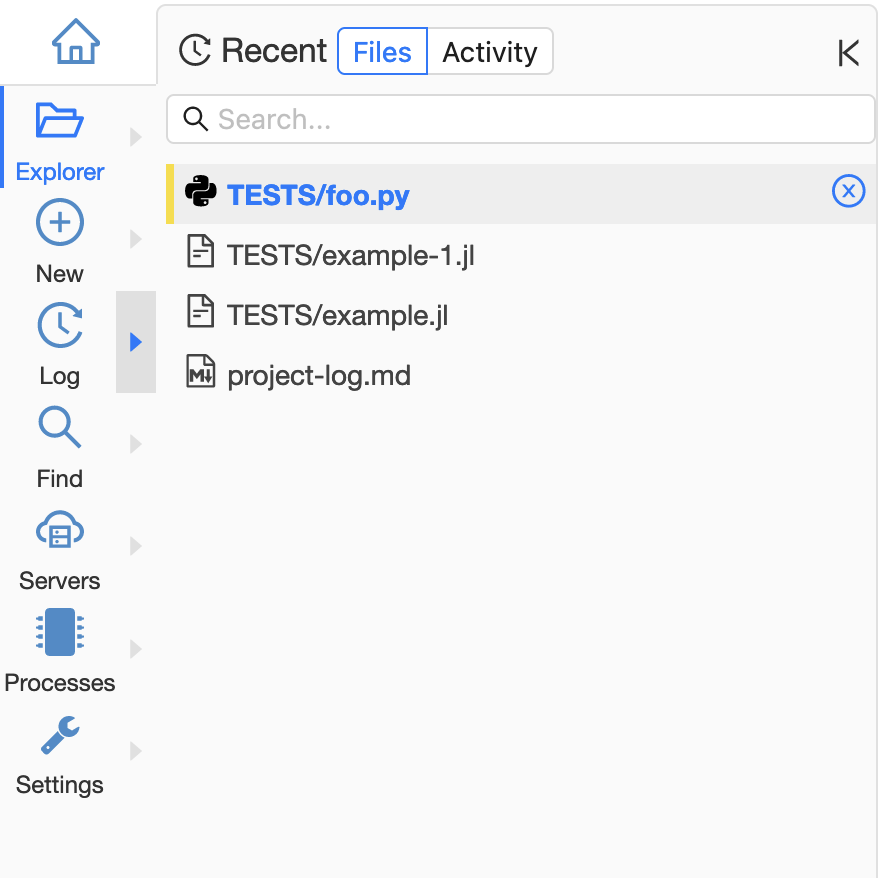
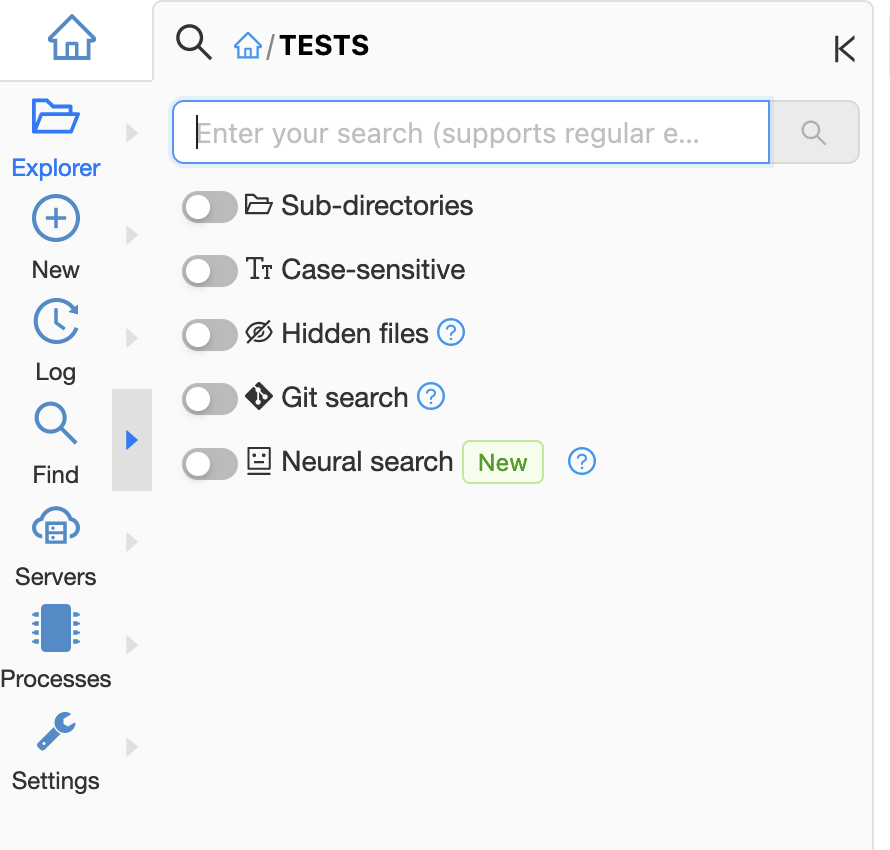
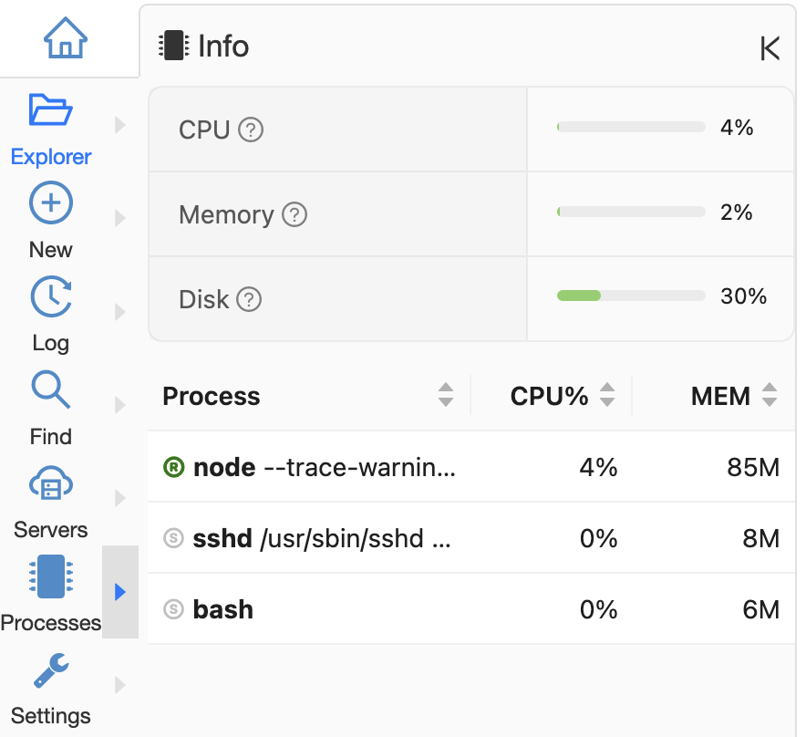
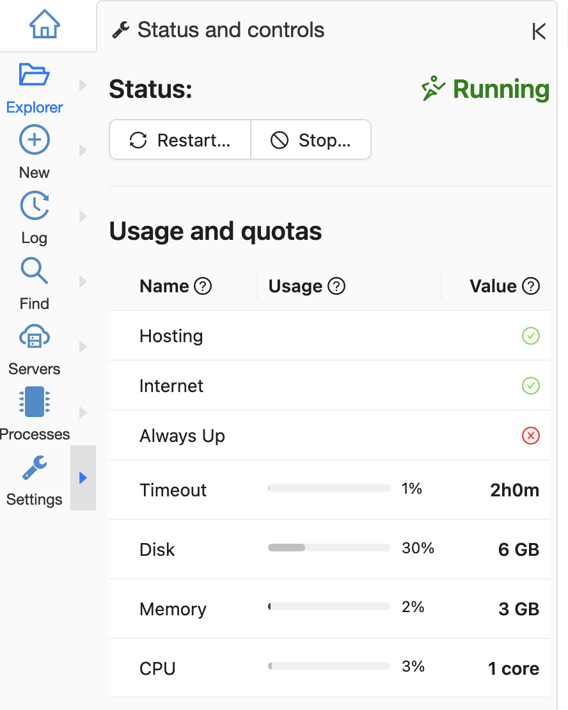

.. index:: Flyout Menus

===============
Flyout Menus
===============

.. contents::
   :local:
   :depth: 1

After a project is opened, triangular icons for The Flyouts Menus appear to the right of the Activity Bar.

    File Explorer, displaying flyout icons to right of Activity Bar

Additional information:

* CoCalc feature announcement and discussion: `ANN: Flyout Panels for Projects <https://github.com/sagemathinc/cocalc/discussions/6736>`_.
* `CoCalc News <https://cocalc.com/news>`_ article introducing flyouts: `Flyout Panels for Projects <https://cocalc.com/news/13>`_.
* `CoCalc News <https://cocalc.com/news>`_ article with updates: `Update on Flyouts <https://cocalc.com/news/17>`_.

Below are screenshots illustrating each flyout menu:

###########################
Explorer
###########################

    Explorer flyout menu

###########################
New File
###########################

.. figure:: img/flyouts/new-flyout.png
    :width: 60%
    :align: center
    :alt: new file flyout

    New File flyout menu (partial view)

###########################
Project Log
###########################

    Project Log flyout menu

###########################
Find Files
###########################

    Find Files flyout menu

###########################
Processes
###########################

    Processes flyout menu

###########################
Settings
###########################

    Settings flyout menu

