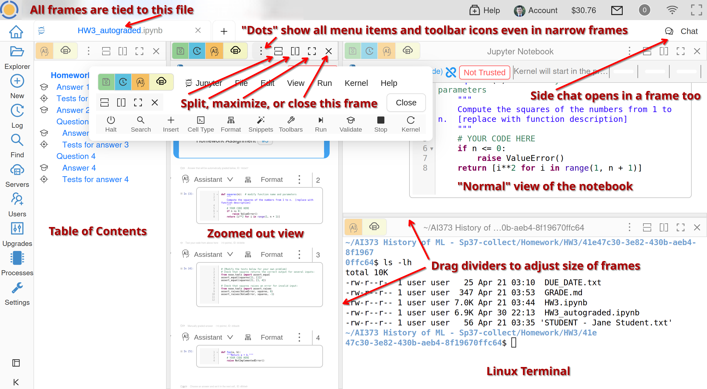
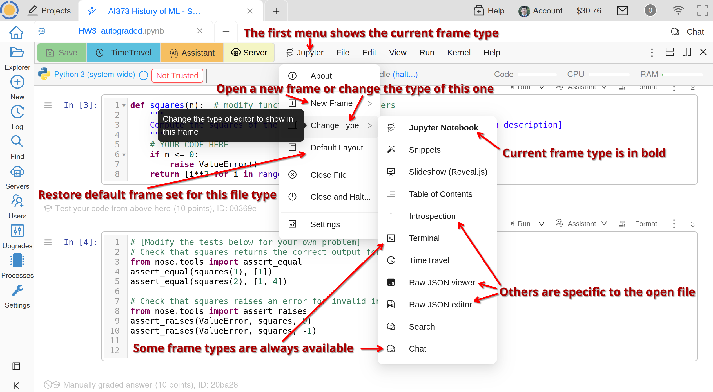

.. index:: Frame Editor

.. _frame-editor:

============
Frame Editor
============

.. contents::
     :local:
     :depth: 2

Frame Management
----------------

When you open a file in CoCalc, you usually end up with one or more **Frames**. The default layout depends on the file type, but you are free to alter it to suit your needs. For example, you may want to open a terminal next to your source code in ``*.py`` or ``*.c`` files, or a Table of Contents next to your Jupyter Notebook, or just have two views for the same file, potentially with different zoom level. Some files may also have a source code view and a rendered one, e.g. CSV, HTML, or :doc:`markdown`.

For example, you can create a layout like this:

    
    Multiple Frames Management

When you split a frame into two, they are of the same type as the initial one, but you can change either of them to any type supported for the current file:

    
    Changing Frame Type
    

.. index:: Frame Editor; multiple cursors
.. index:: Text; frame editor
.. index:: Frame Editor; text files

Multiple Cursors
----------------

Not only you can have multiple users editing the same file simultaneously, bu you can also get multiple cursors for yourself while editing any file in the frame editor. Use **Ctrl+Click** (**Cmd+Click** on Mac) to put multiple cursors in arbitrary places one at a time or **Alt+Drag** to get cursors on consecutive lines.

If you switch to Sublime keybindings in **Account > Preferences > Editor settings**, you can select text and then use **Ctrl+D** (**Cmd+D** on Mac) to multi-select the next occurrence of the same text.

.. _frame-editor-search:

Search and Replace
------------------

You can search for a string of text in your file by pressing **Ctrl+F** (or **Cmd+F** on a Mac) and entering the string you want to search for in the input box that appears at the top. If you want to search for a regular expression rather than simple text, surround the regular expression with slashes. For example, to search for a pound sign and a space at the start of a line, enter ``/^# /``.

Other commands relating to search and replace:

* **Ctrl+F / Cmd+F** - Start searching
* **Ctrl+G / Cmd+G** - Find next
* **Shift+Ctrl+G / Shift+Cmd+G** - Find previous
* **Shift+Ctrl+F / Cmd+Option+F** - Replace
* **Shift+Ctrl+R / Shift+Cmd+Option+F** - Replace all

.. note::

    CoCalc's frame editor search is implemented using the `CodeMirror search function <https://codemirror.net/demo/search.html#>`_.