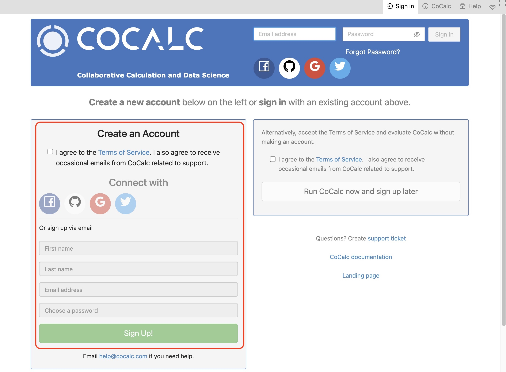

=====================
Getting Started
=====================

.. contents::
   :local:
   :depth: 2

Your First CoCalc Session
=========================

Creating an Account
-------------------

On your first visit to CoCalc.com, you will see the welcome screen.
Click either **Sign In** button:

.. image:: img/getting-started/first-home-page.jpg
     :width: 90%
     :alt: Main landing page for CoCalc

At the next screen, complete the "Create an Account" dialog: Agree to the Terms of Service. Then, choose a sign-in method. In addition to signing up with your email address,
you have the option of signing using your credentials for
Facebook, Github, Google, or Twitter.

In the image below, sign up via email is highlighted:

.. image:: img/getting-started/start-create2-a.png
     :width: 50%
     :alt: Create an Account dialog

Signing in
----------

Once you have signed in for the first time,
sign-in in will be automatic if you are using
the same browser and computer.
All you will
generally need to do is point your browser
to https://cocalc.com.

You will need to sign in again if you
    * connect from a different browser or computer
    * clear your browser cookies.
    * sign out

Creating a Project
------------------

Now that you are signed in, create your first project.
Click in the **Project title** area and enter a project name, for example
"My Project", and then click **Create Project**.

.. image:: img/getting-started/proj-1-a.png
     :width: 90%
     :alt: Create Project dialog

After the project is created, you will see it appear in your
list of projects. Click on the project name to open the project:

.. image:: img/getting-started/proj-2-a.png
     :width: 90%
     :alt: New project appears in project list

Creating a File
---------------

Once you have opened a project, you are ready to create a file.

If your project isn't upgraded, you will get a red banner warning that your
project is running on a trial server. Ignore the warning for now and keep going.

Click **(+) New** and enter **example** where it says,
**Name your file...**.
and click **Jupyter notebook** to select the file type.
Clicking a button for the type of file causes
the file extension is added automatically.

.. image:: img/getting-started/file-1-a.png
     :width: 90%

Running a Jupyter Notebook
--------------------------

We're going to run a simple Python program, so let's change
the kernel from **SageMath (stable)** to **Python 3 (Anaconda 5)**.
In the image, arrow 1 points to the place where the current kernel is displayed,
while arrows 2 and 3 indicate how to select the new Jupyter kernel.

.. image:: img/getting-started/file-6-a.png
     :width: 90%

Now enter a line of python code in the first cell of the notebook:

.. image:: img/getting-started/file-7.png
     :width: 90%

And click Run or press Shift-Enter to run the code.

.. image:: img/getting-started/file-8-a.png
     :width: 90%

Toolbars
=========

You have used CoCalc's two main toolbars a bit during your first session. Learn more about them at these locations in this online guide:

* :doc:`project-toolbar`

* :doc:`files-toolbar`

.. _cocalc-session:

Your CoCalc Session
===================

.. index:: Member Hosting;compute session

CoCalc will keep track of projects you have open and files that are open within those projects.
When you return, you will see the same open projects and files.
In addition, if you have a program running and disconnect, it will keep running, with a few
exceptions: the program will stop if any of the following occurs:

* your project is on a trial server (i.e. does not have Member Hosting upgrade applied) and the server is restarted

* you do not edit a file for more than the idle time specified in **Project Settings**

* the program crashes or runs out of memory

Signing Out
-----------

You :ref:`sign out <sign-out>` by using **Account** → **Preferences** → **Sign Out...**

Next Steps
==========

Continue your tour of CoCalc with these topics:

* :doc:`jupyter`
* :doc:`latex`
* :doc:`sagews`
* :doc:`terminal`
* :doc:`frame-editor`

Subscribe to CoCalc and upgrade your projects here:

* :doc:`upgrade-guide`

Additional Resources
--------------------

.. index:: Help; wiki

In addition the :doc:`Index <genindex>` in this User Manual, if you have specific questions you can check the CoCalc Wiki. Most of the CoCalc Wiki content has been moved into this User Manual.

* CoCalc Wiki `search <https://github.com/sagemathinc/cocalc/search?utf8=%E2%9C%93&q=&type=Wikis>`_
* CoCalc Wiki `index page <https://github.com/sagemathinc/cocalc/wiki/Home>`

.. index:: Help; Discord
.. index:: Discord server for CoCalc

If you would like to chat with other CoCalc users, visit our Discord server: https://discord.gg/nEHs2GK

.. index:: Help; CoCalc Google group
.. index:: Google group for CoCalc

There is also a Google discussion group for CoCalc. You can view it online or use it as a mailing list: https://groups.google.com/forum/#!forum/cocalc

Statements
----------

.. index:: GDPR

CoCalc GDPR Compliance Statement: https://github.com/sagemathinc/cocalc/wiki/GDPR

.. index:: Accessibility

CoCalc Accessibility Statement: https://github.com/sagemathinc/cocalc/wiki/AccessibilityStatement

.. index:: VPAT

CoCalc Voluntary Product Accessibility Template (VPAT): https://cocalc.com/policies/accessibility

