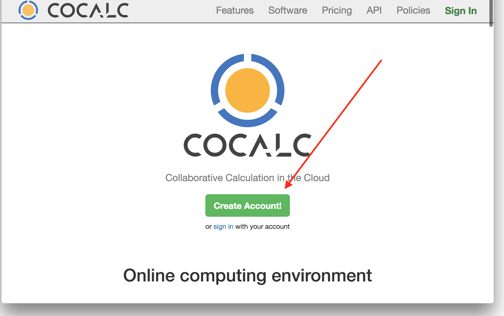
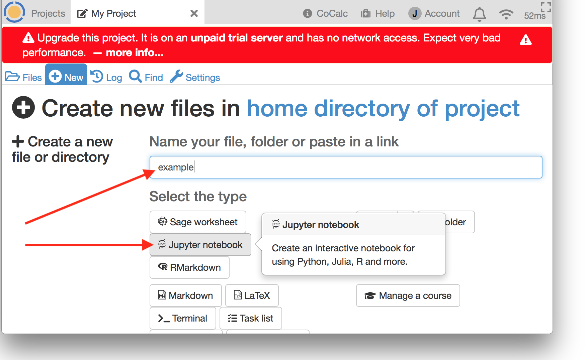
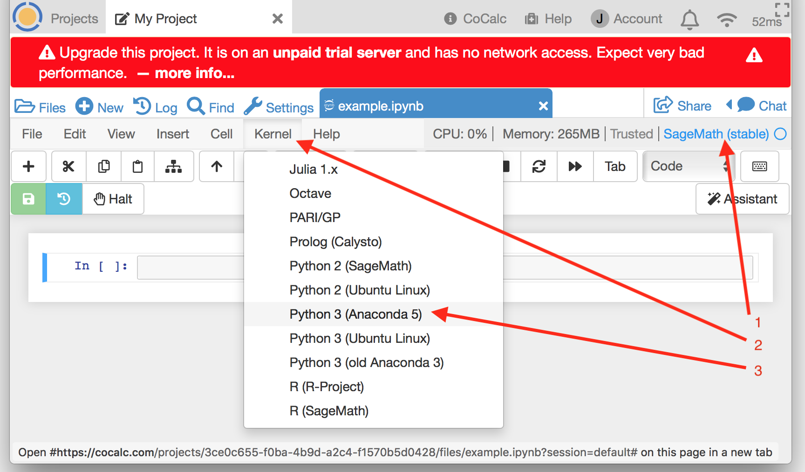
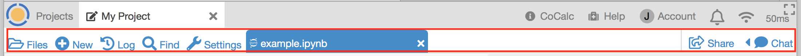

=====================
Getting Started
=====================

A guide for your first CoCalc session.

.. contents::
   :local:
   :depth: 2

Creating an Account
-------------------

On your first visit to CoCalc.com, you will see the welcome screen.
Click **Create Account!**:

Agree to the **Terms of Service**:

.. image:: img/getting-started/start-create-a.png
     :width: 90%

Choose a sign-in method. In addition to signing up with your email address,
you have the option of signing using your credentials for
Facebook, Github, Google, or Twitter.
In the image below, sign up via email is highlighted:

.. image:: img/getting-started/start-create2-a.png
     :width: 50%

Signing in
----------

Once you have signed in for the first time,
sign-in in will be automatic if you are using
the same browser and computer.
All you will
generally need to do is point your browser
to https://cocalc.com.

You will need to sign in again if you
    * connect from a different browser or computer
    * clear your browser cookies.
    * sign out

Creating a Project
------------------

Now that you are signed in, create your first project.
Click in the **Project title** area and enter a project name, for example
"My Project", and then click **Create Project**.

.. image:: img/getting-started/proj-1-a.png
     :width: 90%

After the project is created, you will see it appear in your
list of projects. Click on the project name to open the project:

.. image:: img/getting-started/proj-2-a.png
     :width: 90%

Creating a File
---------------

Once you have opened a project, you are ready to create a file.

If your project isn't upgraded, you will get a red banner warning that your
project is running on a trial server. Ignore the warning for now and keep going.

Click **(+) New** and enter **example** where it says,
**Name your file...**.
and click **Jupyter notebook** to select the file type.
Clicking a button for the type of file causes
the file extension is added automatically.

Running a Jupyter Notebook
--------------------------

We're going to run a simple Python program, so let's change
the kernel from **SageMath (stable)** to **Python 3 (Anaconda 5)**.
In the image, arrow 1 points to the place where the current kernel is displayed,
while arrows 2 and 3 indicate how to select the new Jupyter kernel.

Now enter a line of python code in the first cell of the notebook:

.. image:: img/getting-started/file-7.png
     :width: 90%
     
And click Run or press Shift-Enter to run the code.

.. image:: img/getting-started/file-8-a.png
     :width: 90%

The Project Toolbar
-------------------

Here's quick tour of the topmost toolbar in CoCalc, the **Project Toolbar**.

.. image:: img/getting-started/toolbars-projects-a.png
     :width: 90%

Going from left to right:

    * |cocalc-logo| **Projects button** - click here to create a new project and see a list of your existing projects.
      Any text you type into the **Search for Projects** field will be used to select which projects
      are displayed. Any project with matching text in Title or Description will appear in the filtered list.
      If you have any hidden or deleted projects, a checkbox will appear to allow you to show those.
    * Open projects - a button will appear for each project you have open.
    * |info-circle| **CoCalc** - Information about CoCalc. Includes links to tutorials, examples, lists of available languages, libraries, and packages, and real-time stats for the platform.
    * |medkit| **Help** - **Use this button if you have any questions about CoCalc.** If you have a question while you have a file open in CoCalc, clicking **Help** will automatically include a link to the file in your request, allowing our support team to understand the issue better. If you are getting a result that you don't expect, it helps to include steps for us to reproduce the problem.
    * **Account** - Click here to update your profile, sign out, order subscriptions, view your upgrades, add SSH keys, and check on support tickets.
    * |bell| **Notifications** - A count is displayed over the bell if there are chat updates or file edits in projects you own or collaborate on.
    * |wifi| **Connection Status**. The number to the right of the icon is the round-trip time for data between your computer and CoCalc.
    * |expand| **Fullscreen Mode** - Clicking here will toggle fullscreen mode, in which the project and file toolbars are shown or hidden.

The Files Toolbar
-----------------

The **Files Toolbar** is next, appears below the Project Toolbar when you have a project open.
Use it to work with files in the currently open project.
When you open a file, its name appears in the Files Toolbar.
When you select a file in the toolbar, its contents are displayed in the browser.

From left to right:

    * |folder-open| **Files** - If you don't have a file open, clicking here will show you a list of files
      in the project's home directory. If you are working on a file, clicking **Files** will show a list of
      files in the directory containing the currently selected file. You can enter search characters to
      filter the file list for filenames containing the search text.
    * |plus-circle| **New** - click to create or upload new files. **New** also lets you
      browse the `CoCalc Library <http://blog.sagemath.com/cocalc/2018/03/06/cocalc-library.html>`_, which contains code examples and entire books about various toolsets
      and science topics, ready to copy into your project.
    * |history| **Log** - The **Project Activity Log** shows recent activity in your project:
      logins, files opened and uploaded, etc. If you click on a filename in the log, it will open
      that file. This is often the quickest way to resume work on a file that was recently closed.
    * |search| **Find** - Search  for files containing the specified text in the directory that contains
      the currently selected file, or the project home directory if no file is selected. There are options
      to for searching subdirectories, case sensitive search, including hidden files, and restricting search
      to files in a git repository.
    * |wrench| **Settings** - This tab is where you can set a description for your project, add or remove
      upgrades, hide or delete the project, add a project-specific `SSH Key <http://blog.sagemath.com/cocalc/2017/09/08/using-ssh-with-cocalc.html>`_, view and add collaborators, stop and restart the project and the Sage worksheet server,
      and launch the Plain Jupyter and JupyterLab servers.
      *Hint: Adding hashtags to the description can make it easy to find a subject with the Project button if you have a large number of projects.*
    * Open Files - a button will appear for each file you have open.
    * |share-square| **Share** - If a file is selected, this button allows you to share it. Files shared publicly
      can be viewed by people without a CoCalc login.
    * |comment| **Chat** - If a file is selected, you can click here to start text or video chat.
      Collaborators on the project will get a notification when chat is opened or updated.

Your CoCalc Session
-------------------

CoCalc will keep track of projects you have open and files that are open within those projects.
When you return, you will see the same open projects and files.
In addition, if you have a program running and disconnect, it will keep running, with a few
exceptions: the program will stop if any of the following occurs:

    * your project is on a trial server (i.e. does not have Member Hosting upgrade applied) and the
      server is restarted
    * you do not edit a file for more than the idle time specified in **Project Settings**
    * the program crashes or runs out of memory

Signing Out
-----------

You sign out by using **Account** → **Preferences** → **Sign Out...**

Next steps
----------

.. toctree::
   :maxdepth: 1
   :caption: To continue your tour of CoCalc, here are some topics to explore:

   jupyter
   latex
   sagews
   terminal
   frame-editor

.. toctree::
   :maxdepth: 1
   :caption: To subscribe to CoCalc and upgrade your projects, see this topic:

   upgrade-guide

.. |cocalc-logo| image:: img/getting-started/cocalc-logo.svg
    :height: 20px
.. |info-circle| image:: https://github.com/encharm/Font-Awesome-SVG-PNG/raw/master/black/png/16/info-circle.png
.. |medkit| image:: https://github.com/encharm/Font-Awesome-SVG-PNG/raw/master/black/png/16/medkit.png
.. |bell| image:: https://github.com/encharm/Font-Awesome-SVG-PNG/raw/master/black/png/16/bell-o.png
.. |wifi| image:: https://github.com/encharm/Font-Awesome-SVG-PNG/raw/master/black/png/16/wifi.png
.. |expand| image:: img/getting-started/expand.png
    :height: 20px
.. |folder-open| image:: https://github.com/encharm/Font-Awesome-SVG-PNG/raw/master/black/png/16/folder-open-o.png
.. |plus-circle| image:: https://github.com/encharm/Font-Awesome-SVG-PNG/raw/master/black/png/16/plus-circle.png
.. |history| image:: https://github.com/encharm/Font-Awesome-SVG-PNG/raw/master/black/png/16/history.png
.. |search| image:: https://github.com/encharm/Font-Awesome-SVG-PNG/raw/master/black/png/16/search.png
.. |wrench| image:: https://github.com/encharm/Font-Awesome-SVG-PNG/raw/master/black/png/16/wrench.png
.. |share-square| image:: https://github.com/encharm/Font-Awesome-SVG-PNG/raw/master/black/png/16/share-square-o.png
.. |comment| image:: https://github.com/encharm/Font-Awesome-SVG-PNG/raw/master/black/png/16/comment-o.png
