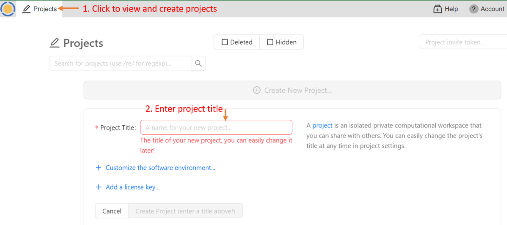

=====================
Getting Started
=====================

.. contents::
   :local:
   :depth: 2

Your First CoCalc Session
=========================

Creating an Account
-------------------

On your first visit to CoCalc.com, you will see the welcome screen.
Click either **Sign Up** button:

.. image:: img/getting-started/welcome-sign-up.png
     :width: 100%
     :alt: CoCalc welcome page with Sign Up buttons circled in red

At the next screen, check the box to agree to the Terms of Service.

.. image:: img/getting-started/sign-up-1.png
     :width: 100%
     :alt: checkbox and button for agreeing to terms of service

Choose a sign-in method. In addition to signing up with your email address, you have the option of signing up using your credentials for Facebook, Github, Google, or Twitter.

.. image:: img/getting-started/sign-up-2.png
     :width: 100%
     :alt: Sign up using email or linked account with Facebook, Github, Google, or Twitter.

.. note::

    If you don't want to agree to terms of service at this time, you can click "Try CoCalc without creating an account".

Resuming a Session
------------------

If you closed your browser tab while signed in, you can probably resume your browser session without signing in again the next time you visit https://cocalc.com. Click your name at the top of the "Signed in as" screen or click "View your CoCalc Projects" at the bottom.

.. image:: img/getting-started/view-projects.png
     :width: 100%
     :alt: Resume a session by clicking name at top or view projects at bottom

Signing in Again
-----------------

Once you have signed in for the first time,
sign-in in will be automatic if you are using
the same browser and computer.
All you will
generally need to do is point your browser
to https://cocalc.com and click either "Sign In" button.

.. image:: img/getting-started/2021-11-welcome-sign-in.png
     :width: 100%
     :alt: CoCalc welcome page with Sign In buttons circled in red

You will need to sign in again if you
    * connect from a different browser or computer
    * clear your browser cookies.
    * sign out

Creating a Project
------------------

Now that you are signed in, you can create your first project. Click the Project button at upper left, and then enter a title for your project.

Creating a File
---------------

Once you have opened a project, you are ready to create a file.

If your project isn't upgraded, you will get a red banner warning that your
project is running on a trial server. Ignore the warning for now and keep going.

Click **(+) New** and enter **example** where it says,
**Name your file...**.
Select **Jupyter notebook** to set the file type.
Clicking a button for the type of file causes
the file extension to be added automatically.

Running a Jupyter Notebook
--------------------------

Select the "Python 3 (system-wide)" kernel.

.. image:: img/getting-started/select-kernel.png
     :width: 90%
     :alt: select python 3 system-wide kernel

Now enter a line of python code in the first cell of the notebook::

    print("hello")

And click Run or press Shift-Enter to run the code.

.. image:: img/getting-started/run-first-cell.png
     :width: 90%
     :alt: run a cell to print "hello"

Toolbars
=========

You have used CoCalc's two main toolbars a bit during your first session. Learn more about them at these locations in this online guide:

* :doc:`top-toolbar`

* :doc:`activity-bar`

.. _cocalc-session:

Your CoCalc Session
===================

.. index:: Member Hosting;compute session

CoCalc will keep track of projects you have open and files that are open within those projects.
When you return, you will see the same open projects and files.
In addition, if you have a program running and disconnect, it will keep running, with a few
exceptions: the program will stop if any of the following occurs:

* your project is on a trial server (i.e. does not have Member Hosting upgrade applied) and the server is restarted

* you do not edit a file for more than the idle time specified in **Project Settings**

* the program crashes or runs out of memory

Signing Out
-----------

You :ref:`sign out <sign-out>` by using **Account** → **Preferences** → **Sign Out...**

Next Steps
==========

Continue your tour of CoCalc with these topics:

* :doc:`jupyter`
* :doc:`latex`
* :doc:`sagews`
* :doc:`terminal`
* :doc:`frame-editor`

Subscribe to CoCalc and upgrade your projects here:

* :doc:`upgrade-guide`

Additional Resources
--------------------

.. index:: Help; wiki

In addition the :doc:`Index <genindex>` in this User Manual, if you have specific questions you can check the CoCalc Wiki. Most of the CoCalc Wiki content has been moved into this User Manual.

* CoCalc Wiki `search <https://github.com/sagemathinc/cocalc/search?utf8=%E2%9C%93&q=&type=Wikis>`_
* CoCalc Wiki `index page <https://github.com/sagemathinc/cocalc/wiki/Home>`

.. index:: Help; Discord
.. index:: Discord server for CoCalc

If you would like to chat with other CoCalc users, visit our Discord server: https://discord.gg/nEHs2GK

.. index:: Help; CoCalc Google group
.. index:: Google group for CoCalc

There is also a Google discussion group for CoCalc. You can view it online or use it as a mailing list: https://groups.google.com/forum/#!forum/cocalc

Statements
----------

.. index:: GDPR

CoCalc GDPR Compliance Statement: https://github.com/sagemathinc/cocalc/wiki/GDPR

.. index:: Accessibility

CoCalc Accessibility Statement: https://github.com/sagemathinc/cocalc/wiki/AccessibilityStatement

.. index:: VPAT

CoCalc Voluntary Product Accessibility Template (VPAT): https://cocalc.com/policies/accessibility

