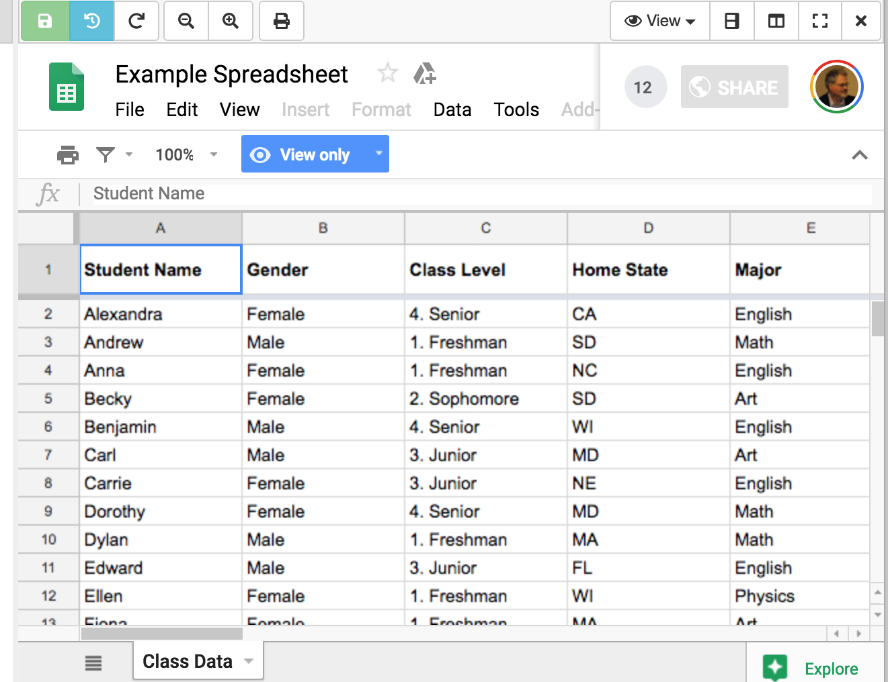
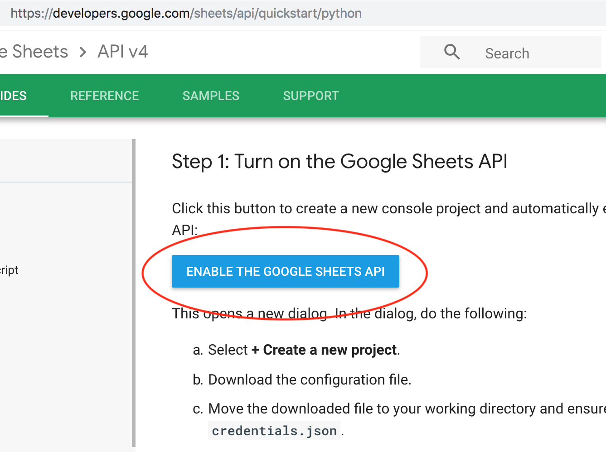
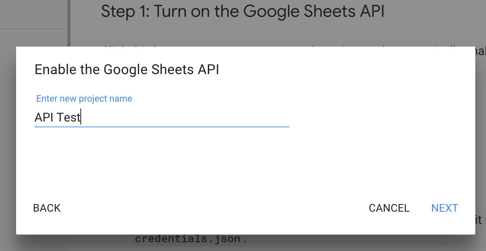
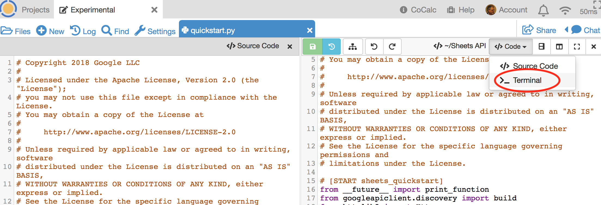
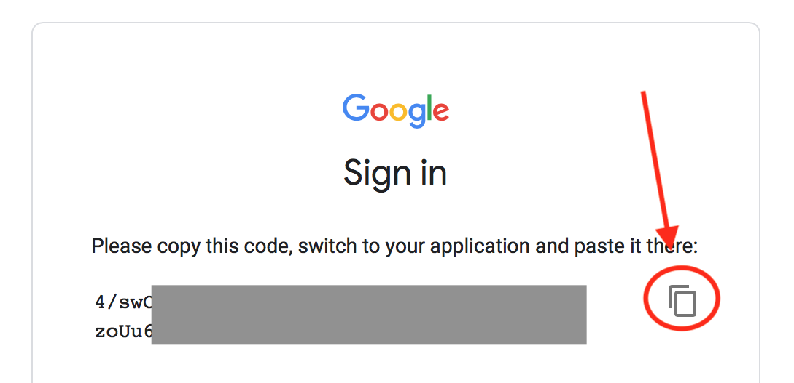

======================
Google Sheets API Demo
======================

This example illustrates:

- writing Python code with frame editor and terminal in :ref:`split view <terminal-editor-panel>`
- run-through of Google Sheets API `Python Quickstart`_
- `OAuth2 authentication`_ from a CoCalc project

.. contents::
   :local:
   :depth: 2


What the program does
---------------------

This example runs a short program to read two columns from a spreadsheet in Google Sheets and write them to the user's terminal.

You don't need to open the sample data in Google Sheets to run the program, but if you're curious, you can view it at `Example Spreadsheet`_.



The python program is provided by Google and runs under Python 2 and Python 3.

Get credentials file
--------------------

To get started, you will need a Google account. You will have one already if you use Gmail or Google Drive. If not, browse to `drive.google.com`_ and follow the steps to create an account.

Now that you have a Google account, browse to the `Python Quickstart`_ page at Google and click ``ENABLE THE GOOGLE SHEETS API``:



In the pop-up dialog, select ``+ Create a new project``:

.. image:: img/examples/create-project.png
     :width: 50%

Give the project a name:



Click DOWNLOAD CLIENT CONFIGURATION to copy file `credentials.json` to your computer.

.. image:: img/examples/download-config.png
     :width: 50%

Upload Python script and credentials to CoCalc
----------------------------------------------

Log into your CoCalc account. Make a new folder called `Sheets API` or such.

You can create a folder by typing its name in the Files search box, appending a slash, and pressing Enter:

.. image:: img/examples/create-folder.png
     :width: 50%

Click ``(+) New`` (upper left) or ``Upload`` (upper right)to upload the `credentials.json` file from your computer into the new folder.

Also upload python source from the GitHub repository for the Google sample program to the same CoCalc folder. The quickstart page has a link to the repo. We want the raw
link to file quickstart.py: 
https://raw.githubusercontent.com/gsuitedevs/python-samples/master/sheets/quickstart/quickstart.py

Paste the above link into the ``(+) New`` dialog in the CoCalc Files screen:

.. image:: img/examples/upload-py.png
     :width: 50%

Open the .py file.
Split the view vertically.
Note that the two panes can be scrolled separately.



Change the second pane to a command line terminal and do ``ls`` to list files in the folder:

.. image:: img/examples/split-ls.png
     :width: 50%

First run: OAuth2 authentication
--------------------------------

In the terminal file, run the following command. Note the command line option so that OAuth2 does not open a browser inside CoCalc.

```
python quickstart.py --noauth_local_webserver
```

The program will print a message saying **Go to the following link...**:

.. image:: img/examples/go-to-link.png
     :width: 50%

Copy that link from the terminal output. Open a new browser tab and paste it in, and visit that link. If you have more than one Google account, choose the same account you used when creating your `credentials.json` file.
Log into your Google account. You will see a ``Sign in`` confirmation message with a code to be copied:



Click the icon to copy the code to your clipboard. Then paste it into the CoCalc terminal session that is waiting for it and hit Enter.
After a few seconds, you will see the selected columns of sample data:

.. image:: img/examples/verify.png
     :width: 40%

Second and later runs
---------------------

In the terminal pane, again type ``ls`` and see that there is now a `token.json` file in your folder. That token saves your authorization. Subsequent runs of the program won't need the OAuth2 detour through an external browser window. Run the Python script again. This time, you don't need the added command line switch:

```
python quickstart.py
```

.. image:: img/examples/second-run.png
     :width: 50%

Python 3 compatibility
----------------------

The script provided by Google is compatible with current versions of both Python 2 and Python 3. 
The default ``python`` command in the CoCalc terminal runs Python 2.
Use ``python3`` at the command line to run quickstart.py with Python 3 compatible versions of the imported modules.

.. _Python Quickstart: https://developers.google.com/sheets/api/quickstart/python
.. _OAuth2 authentication: https://developers.google.com/identity/protocols/OAuth2
.. _Example Spreadsheet: https://docs.google.com/spreadsheets/d/1BxiMVs0XRA5nFMdKvBdBZjgmUUqptlbs74OgvE2upms/edit#gid=0
.. _drive.google.com: https://drive.google.com/
