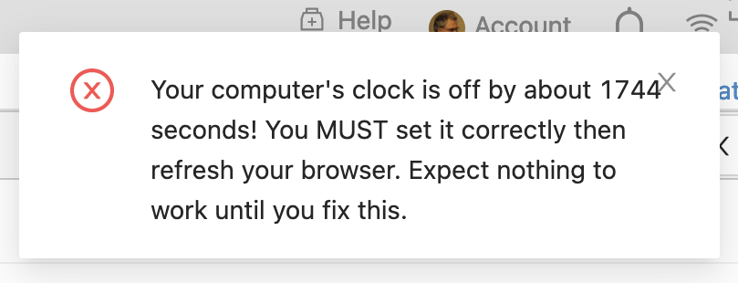

.. index:: Clock is off

.. _clock-is-off:

==============================
CoCalc says your clock is off
==============================

While using CoCalc, you may see a warning message pop up saying your clock is off:

     ..

If you get that warning, here are some things to try:

* Check system time on your computer and make sure it matches correct time for your timezone.
* If you recently moved to a different timezone, check whether you have set your computer's clock manually rather than automatically detecting your current timezone. Try setting your computer to automatically connect to a time server.
* Restart your web browser.
* Try a different web browser.
* Reboot your computer.
* If none of the above helps, visit this link: http://browserspy.dk/date.php and take a screenshot of all the "Date and Time Information" output. The bottom line of the report, "Difference between server and PC time", should report a difference of 0 seconds. Email the screenshot to help@cocalc.com along with the following information:

    * your computer's operating system name and version
    * browser name and version
    * city where you are connecting from

