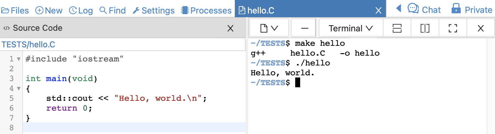

.. index:: C++

.. _c++:

=======================================
C++ Programming
=======================================

You can create C++ programs in the :doc:`../frame-editor`.

Create a file by clicking "(+) New", then typing in a filename ending in `.C` (or `.cpp`), for example `hello.C`. You'll get syntax highlighting, indentation, code folding, etc.

You can then open a :doc:`Linux terminal <../terminal>` by either splitting your .C edit session and selecting Terminal at upper right in one of the frames of the split (see below), or starting a new .term file.

To compile the program, type `make` in the terminal, followed by the name of your file without the suffix, or explicitly use the `g++` command as shown. Then run the program by typing the file name preceded by a period and a slash, without the suffix on the command line::

    # compile
    make hello
    # OR
    g++ -o hello hello.C

    # run the compiled program
    ./hello
    ... program output appears here ...

.. note::

    If the file name contains spaces, the version of the command with "make" won't work. And you will need to enclose the file name in single or double quotes, or put a \\ before every space in the filename. If you are going to work with the command line, things are easier if you do not put spaces in file names.

For further study, see `isocpp.org: Get Started! <https://isocpp.org/get-started>`_
