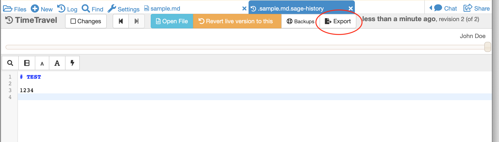

.. index:: Export TimeTravel
.. _export_timetravel:

=============================
Export TimeTravel History
=============================

It may be useful to get the history of all edits to a given file shown in :doc:`TimeTravel <../time-travel>`.
One example might be a project in which students collaborate, where individual contributions to a team effort need to be documented.

There are three ways to export :doc:`TimeTravel <../time-travel>` information.

.. contents::
   :local:
   :depth: 1

Export button in TimeTravel
===========================

Click the Export button with :doc:`TimeTravel <../time-travel>` open.

     about to export TimeTravel data

A JSON file is saved with timestamp, author, and patch length of each change.

.. figure:: img/tt-exported-json.png
     :width: 100%
     :align: center

     the resulting JSON file

.. index:: Project API
.. index:: API; project

The project API
===================

Use the :doc:`project API <../api/index>`.

The following code snippet gives an example::

    import sys
    sys.path.append("/cocalc/src/smc_pyutil/smc_pyutil/")
    import api
    v = api.get_syncdoc_history('a.ipynb', patches=False)

Replace 'a.ipynb' by the name of a file in the same project that you're running this from.

When you run the code, v will have the complete TimeTravel history as a Python dictionary.

If patches=True you also get the actual patches, not just their lengths.

The hub API
============

Use the hub API, which uses the `get_syncdoc_history` endpoint. (Details to follow.)

About exported TimeTravel data
=================================

Each entry in the JSON file corresponds to one change, or patch, to the file. The field `patch_length` is the number of characters of the actual patch, which is
not currently in the export.

If the project API is used to export TimeTravel, contents of the patches as well as the patch length can be retrieved by setting ``patches=True`` in the api call.

.. figure:: img/tt-export-api.png
     :width: 100%
     :align: center

     TimeTravel export with project API, showing patch contents

In some cases, changes are attributed to the project, rather than to an individual user.
For example, if you type the following into a compute cell in a Jupyter notebook::

    2+2

then what *you* contributed to the patch stream is the string "2+2".
When you request to evaluate the project then inserts the output "4" into the patch stream.

The project will also output information about cpu usage, memory usage, etc., periodically into the notebook, which is again attributed to the project.

If you directly change a file on disk, the project will notice and load the changed file, and that change is also attributed to the project.

