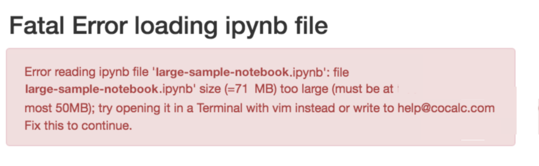

.. index:: File too large
.. _file-too-large:

================================================
File Too Large
================================================

Here are suggestions for what to do if you get a file-too-large error when :ref:`opening a file <ft-open-files>` in CoCalc.

.. index:: File too large; Jupyter notebook

Jupyter Notebook
^^^^^^^^^^^^^^^^^^^^^^^^^^^^^^^^^^^^^^^^^^^^^^^

You may see the following warning when opening a Jupyter notebook:

     Jupyter notebook *file too large* error

A possible cause for a file-too-large error with a Jupyter notebook is creating an image file from a plot that exceeds the size limit. Here are some suggestions:

1. If you are using a CoCalc Jupyter notebook (which we generally recommend), it may be possible to open the notebook with :ref:`the classical jupyter server or JupyterLab <jupyter-server-alternatives>`. Once you have the file open, you can modify the code to produce a smaller plot. Then you can go back to using the CoCalc notebook.

2. You could revert the notebook to an earlier version, before the large plot was created. Click the :ref:`Backups button <project-snapshot>` in the file listing and copy over an earlier version, then modify your code to produce a smaller plot.

3. The default image file format for plots with the "R (R Project)" Jupyter kernel is SVG. For large plots, smaller files may be produced if the format is set to PNG, because SVG plots (the default) grow in size proportionally to the data they are supposed to show, wherease PNG plots are rasterized, so file size does not have the same proportionality relationship to amount of data. To set image output format in an R Jupyter notebook to PNG, run the following in a compute cell before creating the plot::

    options(jupyter.plot_mimetypes = c('text/plain', 'image/png'))

.. index:: File too large; CSV file

CSV File
^^^^^^^^^^^^^^^^^^^^^^^^^^^^^^^^^^^^^^^^^^^^^^^

Attempting to open a CSV file over 5 MB in size results in the following error:

.. figure:: img/big-file.png
     :width: 60%
     :align: center

     CSV *file too large* error

In this case you can view the file with command-line tools like ``less``, or the `vim` editor, or view the file using `libreoffice`_ or the ``localc`` application in an  :ref:`x11 <x11_installed_applications>` terminal.

.. _libreoffice: https://www.libreoffice.org
