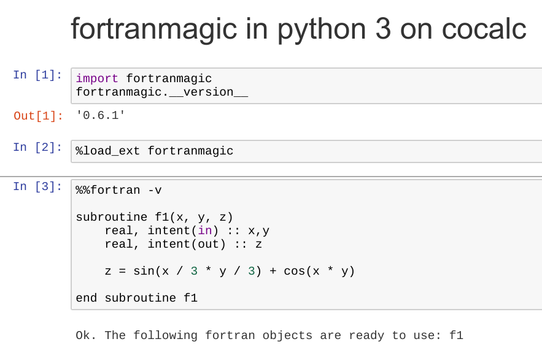

.. index:: Fortran

Fortran Programming
=========================

Command-line
-------------------------

CoCalc supports various ways to run `Fortran code <https://en.wikipedia.org/wiki/Fortran>`_.
They're provided by GNU ``gfortran`` (``f95``) in the :doc:`../terminal`.
You can also view an ``.f90`` file next to a terminal, 
by splitting the editor window and switching to a Terminal in a :doc:`../frame-editor`.

Read more in the `GFortran doc page <https://gcc.gnu.org/fortran/>`_.

Jupyter Notebook
-------------------------

A more convenient way to explore Fortran is to mix it with Python by using the ``f2py`` wrapper.

In a Jupyter Notebook running Python 3, there is also the `fortranmagic <https://github.com/mgaitan/fortran_magic>`_ extension available.

1. ``%load_ext fortranmagic``
2. Write a function in a cell like that::

    %%fortran -v

    subroutine f1(x, y, z)
        real, intent(in) :: x,y
        real, intent(out) :: z

        z = sin(x / 3 * y / 3) + cos(x * y)

    end subroutine f1

3. Use that new function ``f1`` in Python, e.g. ``f1(2.2, -1)`` gives ``-0.8305184841156006``.

Here is an `example worksheet <https://share.cocalc.com/share/b9bacd7b-6cee-402c-88ed-9d74b07f29a1/fortranmagic.ipynb?viewer=share>`_:

1. Defining the function ``f1``

2. Using it in a plot:

.. image:: img/fortranmagic-2.png
    :width: 75%
