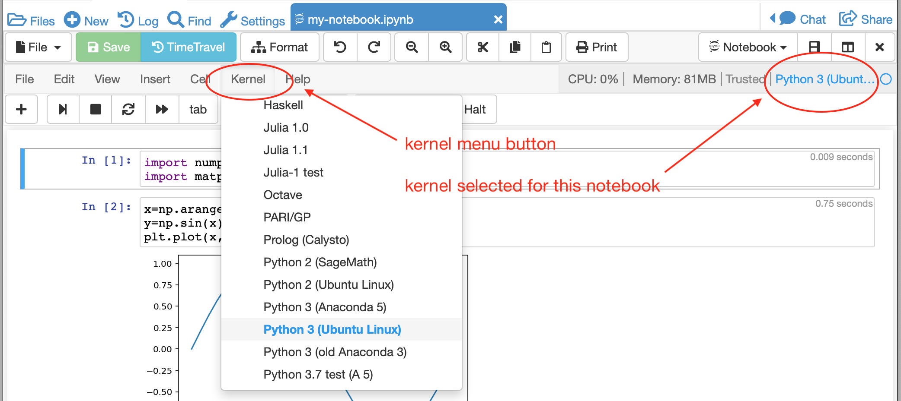

.. index:: Jupyter Notebooks; kernel selection
.. index:: Kernel (Jupyter)
.. _jupyter-change-kernel:

================================
Jupyter Kernel Selection
================================

:doc:`Jupyter notebooks <../jupyter>` support more than a single programming language.
The element which instantiates a session and runs the code of a cell is called the **kernel**.

The currently active kernel's display name is visible at the top right of the working area.
In most cases it also shows a logo, which helps identify it.

When you start a new notebook, the default kernel will generally be whatever kernel you last explicitly selected.
You can override this by creating your own :ref:`default notebook template <default-template>`.

.. note::

    Kernels of *existing* notebooks are only identified by their name.
    The actual meaning of it can change between environments,
    because kernels with the same name could be configured differently.
    There is no common scheme.

    Therefore, after uploading any of your notebooks to CoCalc,
    you have to double-check which kernel it uses.

CoCalc's Jupyter Notebook
=============================

To select the kernel in a CoCalc Jupyter notebook, click the "Kernel" button (usually in the middle toolbar, depending on your configuration).
In the menu that opens, scroll down past interrupt and restart commands to see the choices for available kernels.

.. _jupyter-kernel-menu:

     selecting the kernel with the kernel menu

.. _jupyter-change-kernel-lg:

You can view an expanded kernel selection dialog after opening a jupyter notebook by clicking the kernel at upper right.

.. figure:: img/jupyter-select-kernel-lg.png
     :width: 100%
     :align: center

     expanded kernel selection after clicking selected kernel at upper right

You can also create a custom kernel if needed. See :doc:`custom-jupyter-kernel`.

Jupyter Classic
=========================

Here is a sequence of steps depicted about how to change the Kernel in a notebook.
The current selection is "SageMath", and it is about to be change to "Python 3 (Ubuntu Linux)".

.. figure:: img/jupyter-classic-change-kernel.png
     :width: 100%
     :align: center

     selecting the kernel in a Classical Jupyter notebook

Jupyter Lab
======================

When creating a new notebook in JupyterLab, the Launcher displays icons for the available kernels.

.. figure:: img/jlab-launcher.png
    :width: 60%
    :align: center

    kernel choices when creating a notebook with JupyterLab

Once you have opened a notebook in JupyterLab, you can change the kernel using the "kernel" button in the top row.

.. figure:: img/jlab-change-kernel.png
    :width: 90%
    :align: center

    changing kernel of existing notebook with JupyterLab

