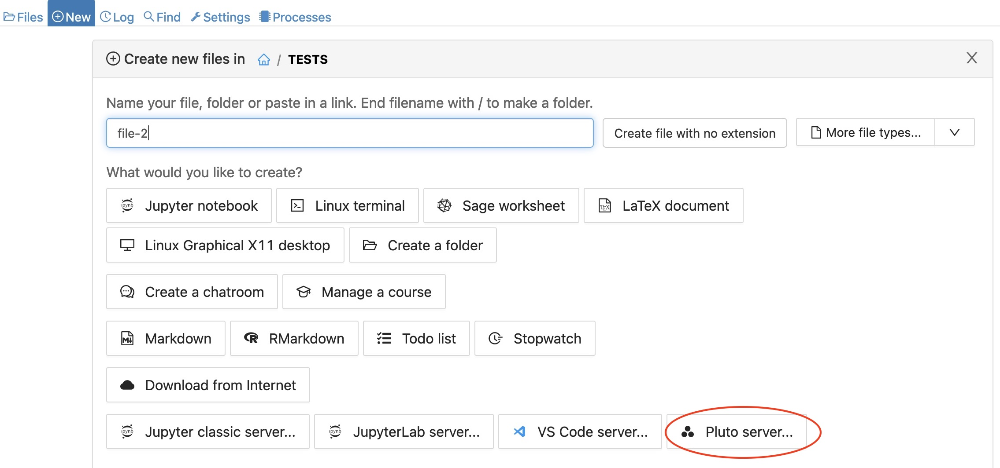

.. index:: Pluto notebooks
.. index:: Julia; pluto notebooks

.. _howto-pluto:

=========================
Pluto Notebooks for Julia
=========================

Here are instructions for running a Pluto notebook on CoCalc.

***********************
Launch a Pluto Notebook
***********************

1. Click :doc:`../plus-new` to open the new file dialog.

2. Click "Pluto server...".

3. Click "Julia Pluto.jl Server" in the panel that opens.

.. image:: img/pluto-2.jpg
     :width: 80%
     :align: center
     :alt: Link to open Pluto server in a new browser tab

4. A new browser tab will open for the Pluto server. If you get a gateway timeout the first time, hit refresh to give the notebook more time to launch.

.. image:: img/pluto-launch.png
     :width: 80%
     :align: center
     :alt: Pluto welcome screen in new browser tab

**********
References
**********

* Read more about Pluto at the `Pluto github repo <https://github.com/fonsp/Pluto.jl>`_.

* Github issue discussing `Pluto on CoCalc <https://github.com/fonsp/Pluto.jl/discussions/1084#discussioncomment-620582>`_.

* Discussion of ongoing support for Pluto in CoCalc `Support Pluto notebooks #5270 <https://github.com/sagemathinc/cocalc/issues/5270>`_.

