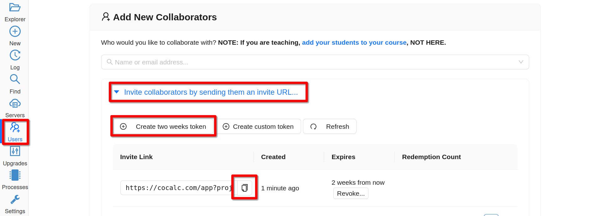

.. index:: Project Invitation Tokens
.. _project-invitation:

=============================
Invite via Links
=============================

Have you ever given a talk online and wanted to have everybody in
the audience easily add themselves as collaborators on a CoCalc
project, e.g. to watch you do some live coding or to chat in a
chatroom with math typesetting? Now you can. See below for creating
a link you can send to your audience that will invite them into
the project of your choice.

Creating Project Invitation Token or Link
=========================================

On **Users** tab click **Invite collaborators by sending them an invite URL...** then **Create two weeks token** (or custom one):

     Creating a Project Invite Link

Then click the clipboard icon to copy the link.
The link expires after 2 weeks. Click **Revoke** and accept the confirmation dialog to make the link expire immediately, so that it cannot be used anymore.

.. index:: Projects; invitation tokens
.. _project-invitation-token:

Using a Project Invitation Link
==================================

Anyone who clicks on the project invitation link will be added to the project as a collaborator. Persons who do not have an account will be signed in as anonymous users. They have the option of creating an account or continuing anonymously.

No Limits
=========

* There is no limit on how many times a token can be used.

* Anonymous users are NOT automatically removed from the project.

* There is no limit on what users can see in the project. If you share an invitation link, be sure there is no private information in the project!

There's some discussion about the implementation of invitation tokens and possible enhancements under the CoCalc GitHub issue: `Have a special url for projects... #885 <https://github.com/sagemathinc/cocalc/issues/885>`_.