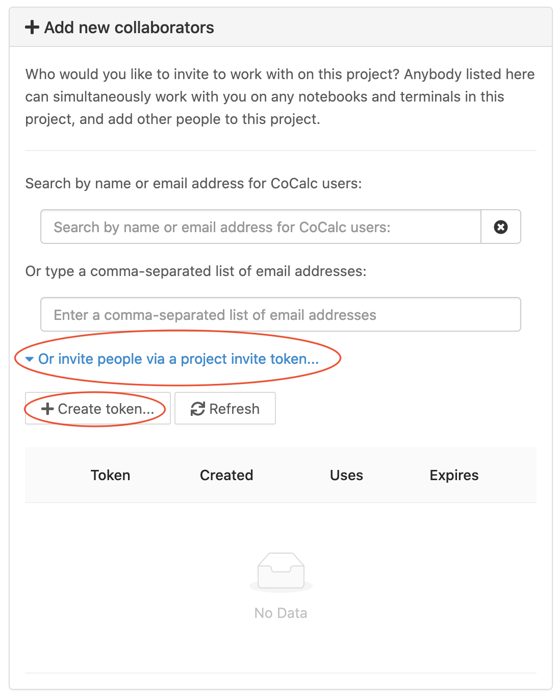

.. index:: Project Invitation Tokens
.. _project-invitation:

=============================
Project Invitation Tokens
=============================

Have you ever given a talk online and wanted to have everybody in
the audience easily add themselves as collaborators on a CoCalc
project, e.g. to watch you do some live coding or to chat in a
chatroom with math typesetting? Now you can. See below for creating
a link you can send to your audience that will invite them into
the project of your choice.

Creating Project Invitation Token or Link
=========================================

In Project Settings, at the bottom of the section for "+ Add new collaborators", there is a link "Or invite people via a project invite token...". Click this and a dialog opens:

     Creating a project invitation token

Click "Create token..." and then "Yes, create token" in the confirmation dialog that opens. You see that a new token has been created, and added to the list of tokens already created, if any.
Click the clipboard icon to copy the token.

.. figure:: img/invite-token-05.png
     :width: 60%
     :align: center

     Copying a project invitation token

The link expires after 2 weeks. Click the "Expire" button and accept the confirmation dialog to make the token expire immediately, so that it cannot be used anymore.

For a complete URL that includes the token, click the "+" to the left of the token and you will see a link. Click the clipboard icon to the right of the link to copy it.

.. figure:: img/invite-token-1.png
     :width: 60%
     :align: center

     Creating a project invitation link

.. index:: Projects; invitation tokens
.. _project-invitation-token:

Using a Project Invitation Token
==================================

Your audience can use the invitation token by opening the Projects list in CoCalc and pasting the token into the upper right in the area for "Project invite token".
They will be added as collaborators and the project will be opened for them.

.. figure:: img/enter-token.png
     :width: 30%
     :align: center

     Enter an invitation token in the Projects list

Using a Project Invitation Link
==================================

Anyone who clicks on the project invitation link will be added to the project as a collaborator. Persons who do not have an account will be signed in as anonymous users. They have the option of creating an account or continuing anonymously.

No Limits
=========

* There is no limit on how many times a token can be used.

* Anonymous users are NOT automatically removed from the project.

* There is no limit on what users can see in the project. If you share an invitation link, be sure there is no private information in the project!

There's some discussion about the implementation of invitation tokens and possible enhancements under the CoCalc GitHub issue: `Have a special url for projects... #885 <https://github.com/sagemathinc/cocalc/issues/885>`_.