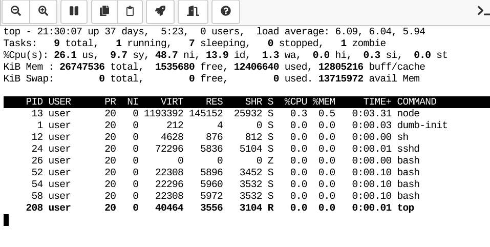

.. index:: Manage Processes

==============================
Manage Running Processes
==============================

.. index:: htop
.. _htop:

See all Processes
============================

Type exactly the following in a :doc:`../terminal` (+New → Terminal) to see all processes running in a project::

    htop

The header informs you about overall utilization of the node,
each row (you can scroll via your cursor keys) lists a process and use your F5 key
to toggle between a tree or a sorted list.
The column ``RES`` tells you the residual memory usage (what's really being used, more or less),
and the ``CPU%`` column the computational use of one CPU core.
The ``TIME+`` column tells you the aboslute time that process has used the CPU.

Select one or more processes via the space key of your keyboard.
Via the F9 key you can terminate or kill a process, etc.

If supported, mouse-clicks should also work.

See `htop manpage <http://linux.die.net/man/1/htop>`_ for more information
or click the letter ``h`` for help after starting it up;  and ``q`` for quit.

.. image:: img/htop.png
    :width: 75%
    :align: center

.. index:: smem
.. _smem:

See Memory Usage
============================

Type exactly the following in a :doc:`../terminal` (+New → Terminal)::

    smem -tk

It lists all processes and the bottom line shows the total sum.
The last ``RSS`` column is probably the most interesting one, for more consult ``man smem``.   The total used memory is also listed under "Project usage and quotas" in :doc:`../project-settings` (based on Linux' cgroup management).

Even more utilities …
=======================

Besides ``htop`` and ``smem``, there are many more system utilities installed.
Given a project runs in a `Docker <https://docker.com>`_ environment, you only see a limited view of all what's going on, but it might still be interesting for you.

top
-------

The "classic" version ``htop``, similar layout.
Press key ``h`` for help after starting it; and ``q`` for quit.

glances
----------

`Glances <https://nicolargo.github.io/glances/>`_ is a modern Python-based monitoring utility.
Start it the following way if you're using a white terminal background and want to enable a tree-view of your processes::

     glances --theme-white --tree

Again, ``q`` for quit and ``h`` for help.

You can see more command-line switches via ``glances --help``.

.. image:: img/glances.png
    :width: 75%
    :align: center

ps aux
-----------

An all-time classic is ``ps aux``. Run ``man ps`` to learn more about that utility.

::

    $ ps aux
    USER         PID %CPU %MEM    VSZ   RSS TTY      STAT START   TIME COMMAND
    user           1  0.0  0.0    212     4 ?        Ss   21:29   0:00 /cocalc/bin/dumb-init -- sh -c env -i /cocalc/init/init.sh $COCALC_PROJECT_ID
    user          12  0.0  0.0   4628   876 ?        Ss   21:29   0:00 sh -c env -i /cocalc/init/init.sh $COCALC_PROJECT_ID
    user          13  1.4  0.4 1324640 115924 ?      Rl   21:29   0:06 node /cocalc/src/smc-project/local_hub.js --tcp_port 6000 --raw_port 6001 --k
    user          24  0.0  0.0  72296  5836 ?        S    21:29   0:00 /usr/sbin/sshd -D -p 2222 -h /tmp/.cocalc/ssh_host_rsa_key -o PidFile=/tmp/.c
    user          26  0.0  0.0      0     0 ?        Z    21:29   0:00 [bash] <defunct>
    user          52  0.0  0.0  22308  5896 pts/0    Ss+  21:29   0:00 /bin/bash
    user          54  0.0  0.0  22296  5960 pts/1    Ss   21:29   0:00 /bin/bash
    user          58  0.0  0.0  22308  5972 pts/2    Ss+  21:29   0:00 /bin/bash
    user         631  0.0  0.0  36148  3212 pts/1    R+   21:37   0:00 ps aux

