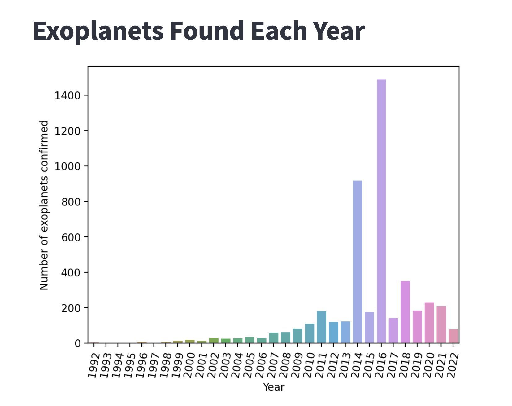

.. index:: Streamlit

.. highlight:: python

============================
Streamlit
============================

`Streamlit <https://streamlit.io/>`_ is an open-source, python-based dashboard application for displaying data with minimal coding effort. See the References below for more information.

Additional notes:

* Your project must have network access for Streamlit to work.
* The streamlit package must be in your computing environment.
* Streamlit supports displaying markdown and latex text formats.

##############################
streamlit package availability
##############################

In a linux terminal, run::

    which streamlit

If you get an empty response and not a path to an executable file, you will need to install the Python package. To do this, in the linux terminal run the command::

    pip install --user streamlit

############################
Configuration: baseUrlPath
############################

To run Streamlit in a CoCalc project, you need to configure `baseUrlPath`. Here are two ways to do this.

**Environment variable.**

In the Linux terminal you will use to run Streamlit, set shell environment variable as follows::

    STREAMLIT_SERVER_BASE_URL_PATH="/${COCALC_PROJECT_ID}/port/8501/"

**Configuration file.**

First, find out your project ID. You can find this by copying the UUID portion of the project URL (the string of hex digits that looks like this "81fe3614-d0e4-11ec-a63f-cff0a68d0c91"), or by running `echo $COCALC_PROJECT_ID` in a Linux terminal.

Create file "~/.streamlit/config.toml" if it does not exist in your project already. Include the following in the *server* section of this file::

    [server]
    baseUrlPath = "/<your project id>/port/8501/"

############################
Streamlit "Hello world"
############################

Start the Streamlit welcome page by doing this. Be sure you have `baseUrlPath` set using one of the methods above::

    streamlit hello
    
Then open a new browser tab to the following link::

    https://cocalc.com/<your project id>/port/8501/

If you get an "Email:" prompt, you can ignore it. Just hit <Enter> when you see it.

############################
Streamlit Python script
############################

Create a Streamlit python script. Here is an example. Be sure you have `baseUrlPath` set using one of the methods above::

    # file st-hello.py
    import streamlit as st
    st.write("""
    # My first app
    hello *world*!
    """)

Run this command from a linux terminal, making sure ::

    streamlit run st-hello.py

Then open a new browser tab to the following link::

    https://cocalc.com/<your project id>/port/8501/

If you make a change to file "st-hello.py", you don't have to restart the linux script. Simply refresh the browser tab showing the Streamlit display.

############################
Streamlit Example
############################

Here is an example of a streamlit python script to display exoplanet counts:

.. code-block:: python

    # file exoplanets-per-year.py
    
    # run this from a cocalc terminal with
    #   streamlit run exoplanets-per-year.py
    # make sure you have baseUrlPath set as in
    #   https://doc.cocalc.com/howto/streamlit.html
    # after launching streamlit, point your browser at
    #   https://cocalc.com/<project-id>/port/8501/
    
    import streamlit as st
    import pandas as pd
    import seaborn as sns
    import matplotlib
    from matplotlib.figure import Figure
    
    st.markdown('# Exoplanets Found Each Year')
    
    # csv file is generated here:
    # https://cocalc.com/drxyzzy/experimental/exoplanets
    
    df = pd.read_csv("exo.csv")
    fig = Figure()
    ax = fig.subplots()
    g = sns.barplot(x=df['year'],
                y=df['count'],  ax=ax)
    #g.set_yscale("log")
    ax.set_xlabel('Year')
    ax.set_ylabel('Number of exoplanets confirmed')
    ax.set_xticklabels(ax.get_xticklabels(),rotation = 80)
    st.pyplot(fig)

############################
References
############################

* Docs at streamlit website: `Streamlit documentation <https://docs.streamlit.io/>`_

* Introductory article by Stephen Kilcommins: `Streamlit — Everything You Need To Know <https://medium.datadriveninvestor.com/streamlit-everything-you-need-to-know-665eb90fcf4a#a7fe>`_

