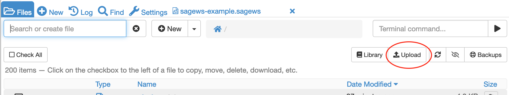

.. index:: Upload Files
.. _upload-files:

======================
Upload Files
======================

**NEW: The file size limit on drag-and-drop upload has been increased to 5 GB.** It was previously 256 MB.

There several ways to upload a file from an external source to a CoCalc project.

.. contents::
   :local:
   :depth: 1

Upload Button in Files Tab
===========================

In the :doc:`Files tab <../project-files>`, there is a button for upload at upper right.

     upload button in Files tab

Drag and drop
===========================

This method is convenient if you can select the file to be uploaded with a mouse or other pointing device and drag it into a CoCalc browser tab.

.. note::

    We allow any size file in CoCalc,
    but the drag and drop file interface has a **5 GB limit** on the size of the file
    that can be transferred.
    The other upload methods described below do not have this limit.
    There is however an overall file size limit for each project, see :doc:`../upgrade-guide`.

* In the :doc:`(+) New tab <../plus-new>`, click |plus-circle| **Create**, then scroll down to the box that says "Drop files to upload" and drag and drop there.

or

* You can drag and drop right onto the Files listing. You have to drop the file onto some existing files in the :doc:`Files listing <../project-files>` (not below them).

Fetch from the Internet
============================

.. note::

    Internet access must be enabled for your project for these methods to work.

* Open the :doc:`(+) New tab <../plus-new>`, then paste a link where the filename would go and press return. This uses ``wget`` behind the scenes.

or

* Type ``wget [url]`` or ``curl -LO [url]`` in a terminal (.term file) or the mini-terminal (in :doc:`Files tab <../project-files>`).

SSH File Transfer
=====================

This method uses the SSH protocol via ``scp`` or ``rsync`` from your computer's operating system.

To get started, you need to create an SSH key pair, consisting of a public key and a private key, on your computer.
Then install the public key in either your CoCalc account or a CoCalc project: :ref:`Setup SSH keys <ssh-keys>`.

Then use one of the options below in a command-line terminal on your computer to copy the file into your project. Exact command syntax may vary depending on your computer's operating system.

For more information on setting up and using SSH with CoCalc, see `this tutorial <http://blog.sagemath.com/cocalc/2017/09/08/using-ssh-with-cocalc.html>`_.

* Use ``scp fromfile project:tofile`` from a command shell on your local computer.

or

* Use ``rsync -aVH fromfile project:tofile`` from a command shell on your local computer.

.. note::

    Replace ``project:tofile`` with the SSH remote address mentioned in the project settings and the target directory.
    E.g. to upload a file ``image.png`` into the home directory of your project, you would run::

        scp image.png 8da110d44cd242ec916118a52f745337@ssh.cocalc.com:~

    or

    ::

        rsync image.png 8da110d44cd242ec916118a52f745337@ssh.cocalc.com:~

Hints for dealing with large files
=======================================

Here 'large' can mean anything from a few tens of megabytes to several gigabytes, whatever value at which uploads become a problem. The threshold may depend on local factors such as speed and quality of your internet connection.

* As noted above, there is a hard limit of 5 GB for the drag and drop interface. Use fetch or SSH methods above for larger files.

* Make sure your project has room for the files. Check in project Settings (wrench icon) → Project usage and quotas → Disk space.

* Avoid transferring large files if you can. Compress files before uploading, or divide into chunks.

Uploading from Google Drive
==================================

Extra steps may be needed if you're uploading a file from Google Drive.

#. Like the other "fetch" methods above, internet access must be enabled for your project.

#. `Share the file on Google Drive <https://support.google.com/docs/answer/2494822?co=GENIE.Platform%3DDesktop&hl=en>`_ so CoCalc can access it.

#. This `stackoverflow posting <https://stackoverflow.com/a/39225039>`_ explains that two GET requests are needed, and includes a Python script to make the requests.

.. |plus-circle|
    image:: https://raw.githubusercontent.com/encharm/Font-Awesome-SVG-PNG/master/black/png/128/plus-circle.png
    :width: 16px