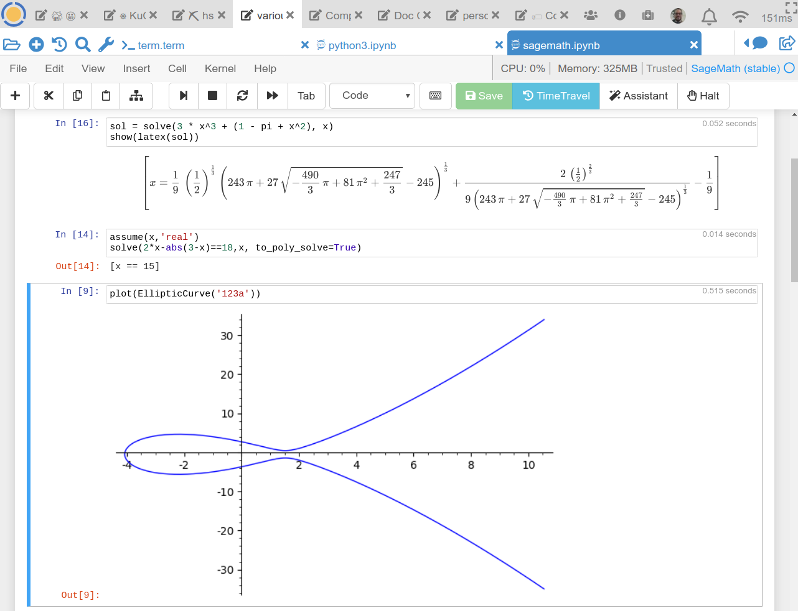

=============
CoCalc
=============

Hello, and welcome to `CoCalc`_!
CoCalc is a virtual online workspace for calculations, research, collaboration and authoring documents.
Your web-browser is all you need to escape the confined space of your own desktop and move to the cloud.
This guide explains all features of CoCalc in depth and how you can use them productively.

The main building block for working on CoCalc are :doc:`Projects <project>`.
Create one or more projects in order to partition your work into separate *workspaces*.
Each project consists of files, which are only accessible to you and your
:ref:`collaborators <add-collaborators>`.

Certain types of files in a project allow you to accomplish a specific tasks.
They open up in their associated online editors and you start to work interactively in CoCalc's environment.
For example, a file ending in ``*.sagews`` is for working with [SageMath]_ in a :doc:`sagews`,
an ``*.ipynb`` file starts a :doc:`Jupyter Notebook <jupyter>` and ``*.tex`` files open up an editor for :doc:`LaTeX documents <latex>`.

     *A SageMath Jupyter Notebook in a CoCalc project*

First, go through the :doc:`getting-started` guide to create your account, your first project, and a worksheet.
Next, check out more specific guides for  :doc:`Jupyter Notebooks <jupyter>`, :doc:`Sage Worksheets <sagews>`, and :doc:`LaTeX documents <latex>`.
Beyond these, you can also work in a full :doc:`Linux Terminal <terminal>`,
run some :doc:`graphical applications <x11>` in a virtual desktop, or edit plain-text files. 
For the latter, look how the :doc:`frame-editor` helps you working with such files,
and even makes it possible for you to :doc:`code in C, Python, or other languages <howto/software-development>`.

Beyond that, being online and in the cloud opens up opportunities to share files and collaborate.
To coordinate with others, you can communicate in a chat-room or on the side of a file.
This is especially useful :doc:`in the context of teaching <teaching-interactions>` to help students.
Check out our :doc:`Instructor Guide <teaching-instructors>` for more details about conducting a course on CoCalc.

You can also :doc:`share your work publicly on the internet <share>`,
access the entire :doc:`history of modifications for specific files <time-travel>`,
:doc:`and <api/index>`
:ref:`much <latex-knitr>`
:doc:`more <howto/gsl>`.

Last but not least, the company "SageMath, Inc." behind CoCalc *needs your support* to keep the service running and continuously improve it.
Initially, you start with a :doc:`Trial Project <trial>` with certain restrictions – most notably your project runs with lower hosting quality and has no access to the internet to download data from other servers. You can :ref:`upgrade your projects <upgrade-guide>` at any point later.

.. _CoCalc: https://cocalc.com/
.. _Markdown: https://www.markdowntutorial.com/