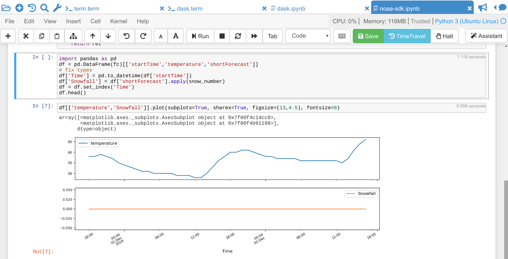
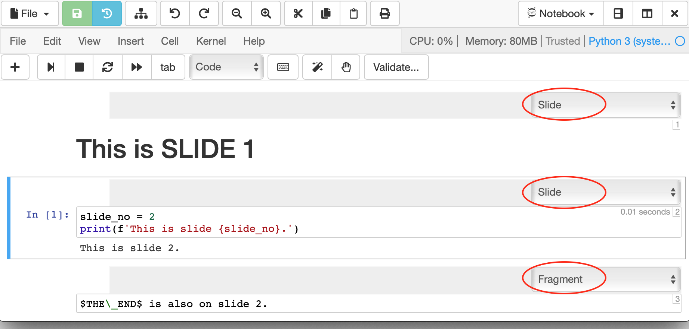
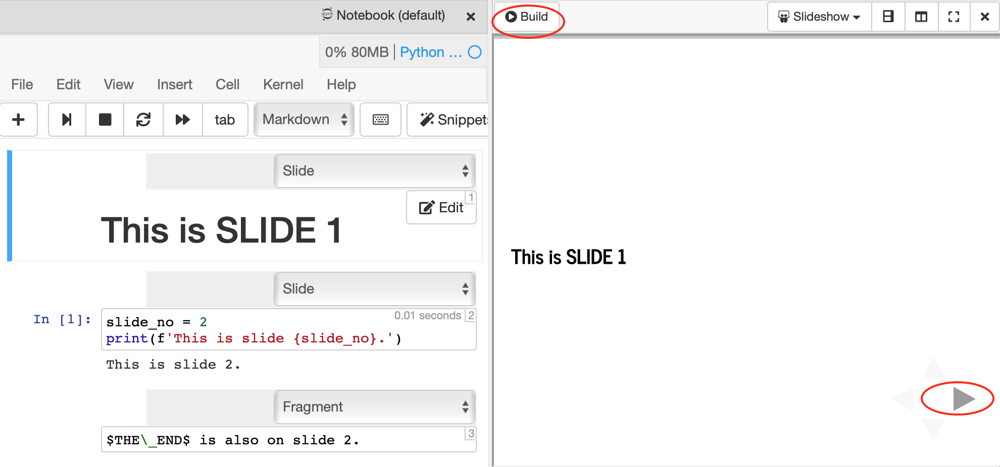

.. index:: Jupyter Notebooks
.. _jupyter-notebook:

=================
Jupyter Notebooks
=================

CoCalc offers several options for hosting running `Jupyter Notebooks`_ online.

.. contents::
   :local:
   :depth: 2

##########################
What's a Jupyter Notebook?
##########################

A Jupyter notebook is a specific filetype with the ending ``.ipynb``, which records an interactive session with a **Kernel**.
It made up of *cells*, which can either store one or more lines of code or formatted text.
When you *run* a cell – which evaluates the piece of code in the cell via the active kernel session – you can see its output after the calculation is done.
This combination of communicating back and forth with a kernel and adding descriptive text makes this form of document very attractive.

.. _jupyter-kernels:

##########################
Jupyter Kernels
##########################

You can choose the programming language and environment by selecting a Jupyter kernel for the notebook.
Popular choices are `Python3`_, `SageMath`_, and `R`_. There many others. Our page on :doc:`howto/jupyter-kernel-selection` shows how to set the kernel.

.. note::

    Make sure and double-check that you're working with :doc:`a suitable kernel <howto/jupyter-kernel-selection>` for your calculations!

.. _cocalc-jupyter-features:

##########################################
CoCalc Jupyter Notebook Basic Features
##########################################

By default, a Jupyter notebook on CoCalc has all CoCalc's core features, including real-time collaboration, side chat, and TimeTravel.
Read more in our `blogpost <http://blog.sagemath.com/jupyter/2017/05/05/jupyter-rewrite-for-smc.html>`_. The basic user interface looks like the following:

Above the main area is a menu bar and a button row:

* The **menu bar** contains all commands, and in particular the **Kernel** menu is for changing it if necessary.
* The **button row** gives you a one-click access to *Run* the current cell (otherwise press your Shift+Return keys), a way to restart the kernel (which clears the current session) and a Save button to make sure CoCalc has stored the file. The :doc:`time-travel` button allows you to see previous versions of that notebook, such that you can go back in time to recover from a bad change.

* **Active cell**: in the screenshot above, the blue bar on the left and a blue border around a cell indicates that this is the currently active one. Actions like *Run*, *Delete Cell*, etc. operate on the currently selected cell. It is also possible to select more than one cell.
* **Execution counter**: On the left of each cell, there is an execution counter ``In [ x ]``. The number ``x`` increases each time a cell is being run. After the kernel stopped and restarted, that counter starts again at *1*.
* The **output of code cells** is below the input cell. For example, ``Out [7]:`` is the output of cell ``In [7]:``. In the right hand corner of the input cell is some information about how long it took to calculate the result.
* **Text cells** are slightly different. Select "Markdown" in the ``[ Code ]`` dropdown menu in the button bar to change a code cell to such a markdown text cell. There, you can use `Markdown`_ to format the text. Similar to code-cells, either *Run* these text cells to see the processed Markdown code or press Shift+Return. To edit a text cell, either double click it or press your Return key.
* **Saving**: more general, the nice things about Jupyter Notebooks is that they save all your intput and output in one single file. This means you can download or publish the notebook as it is, and everyone else sees it in exactly the same way.

#######################################
CoCalc Jupyter Notebook Enhancements
#######################################

These enhanced features are available in CoCalc Jupyter notebooks:

.. index:: Jupyter Notebooks; drag-and-drop images

* **drag-and-drop**: You can drag and drop images into markdown cells:

  1. If you have a markdown cell and are *not* actively editing it,
  there is an image icon/button on the far right of the cell.  Just
  click that and you can then select an image from your computer.  It'll
  be uploaded and inserted into the cell.

  .. figure:: img/jupyter/place-image.png
    :width: 80%
    :align: center

    Click image icon to open a drop zone for image placement

  2. If you have a markdown cell and *are* editing it, select "Edit -->
  Insert image in selected markdown cell..." from the menu and proceed
  as above.

  3. The markdown editor in Jupyter doesn't yet support direct drag-and-drop
  and copy/paste of images, but it probably will soon.
  See https://github.com/sagemathinc/cocalc/issues/4762

.. index:: Jupyter Notebooks; cell numbers

* **cell numbers**: Cells are numbered consecutively at upper right. Unlike execution numbers shown in brackets at left, these don't change when you re-run a compute cell or go blank when you clear output, and markdown cells are numbered as well as code cells.

.. figure:: img/jupyter/jup-cell-num-timing.png
     :width: 80%
     :align: center

     ..

.. index:: Jupyter Notebooks; cell run time

* **run time for compute cells**: When a compute cell is executed, the amount of time it takes is displayed at upper right. See preceding figure.

.. index:: Jupyter Notebooks; table of contents

* **table of contents**: Table of contents level (indicated by font size) is the same as markdown heading level, i.e. "#" for top level, "##" for second level, etc. Click the "Contents" button in the "Notebook" menu at the top of a notebook, or select "File --> Table of Contents", or split the frame and change one of the resulting frames to "Table of Contents". Each entry in the table of contents is a clickable link that takes you to the corresponding cell in the notebook.

.. figure:: img/jupyter/jup-toc2.png
     :width: 80%
     :align: center

     ..

.. index:: Jupyter Notebooks; slideshow

* **slideshow** CoCalc notebooks offer you a shortcut for making a slideshow. Select "View" > "Cell Toolbar..." > "Slideshow" to add a ``Slide`` button above the right of each cell. For each cell, you can specify whether it is a slide, subslide, or fragment. To view the slideshow, click the "Slideshow" in the "Notebook" menu at the top of a notebook, or select "File" > "Slideshow", or split the frame and change one of the resulting frames to "Slideshow". The latter allows you to view the original notebook side-by-side with the slides.

.. figure:: img/jupyter/slideshow-1.png
     :width: 80%
     :align: center

     enabling "Slide" button in cell toolbar

     selecting slide type for each cell

When presenting, the next slide is to the right, while the next subslide is below. Fragments are revealed within the present slide. Click in the slideshow and then click "?" to see a list of keyboard shortcuts. If you modify the notebook, you can update the slideshow by clicking in the toolbar above the show and clicking "Build", or by clicking "File" in the toolbar above the notebook and again selecting "Slideshow".

     original notebook side by side with slideshow

*Note: the legacy method of creating and presenting a slideshow by using a separate Linux terminal command and starting a small web server is still available by clicking "File" > "Slideshow via nbconvert...".*

* **nbgrader integration**: CoCalc offers nbgrader support without adding separate Jupyter extensions. This ehancement is in under active development. See :doc:`nbgrader in CoCalc<teaching-nbgrader>` for more information.

.. index:: Jupyter Notebooks; interactive widgets
.. _jupyter-interactive-widgets:

###############
Jupyter Widgets
###############

`Jupyter Widgets`_ are Python objects that let you build interactive GUIs for your Jupyter notebooks. CoCalc Jupyter notebooks combine the interactive capabilities of Jupyter widgets with the usual advanced features of the CoCalc platform, including
:ref:`real-time collaboration <multi-user-edit>`, :doc:`TimeTravel <time-travel>`, and :ref:`side chat <side-chat>`.

A good way to get started using Jupyter widgets is to go through the `Widget List`_ in the main widgets documentation.

.. figure:: img/jupyter/cocalc-widgets-a.png
     :width: 100%
     :align: center

     CoCalc Jupyter notebook with Jupyter Widgets

.. index:: Jupyter Notebooks; classical vs. CoCalc
.. _jupyter-classical-vs-cocalc:

#######################
Classical versus CoCalc
#######################

If you are having trouble with the `CoCalc Jupyter Notebook`_, you can switch to the Classical Jupyter Notebook.
You can always switch back to CoCalc Jupyter easily later (and please let us know what is missing so we can add it!).

*NOTE: The Classical Jupyter notebook is not supported in the Firefox browser. See Jupyter Server options below if you need to use Firefox and do not want to use the CoCalc Jupyter notebook.*

You can change the default for opening a Jupyter notebook - CoCalc or Classical - by clicking the checkbox labeled "Jupyter classic ..." in your :ref:`Editor settings in Account Preferences <ed-settings-jupyter>`.

To switch your notebook to Classical from within a CoCalc Jupyter notebook: select "File" → "Switch to Classical Notebook" in the menu.

.. figure:: img/jupyter/switch-to-classical.png
     :width: 100%
     :align: center

     switching to Classical from CoCalc Jupyter notebook

To switch your notebook to CoCalc from within a Classical Jupyter notebook: select "File" → "Switch to Classical Notebook" in the menu.

.. figure:: img/jupyter/switch-to-cocalc.png
     :width: 100%
     :align: center

     switching to CoCalc from Classical Jupyter notebook

.. role:: strike

The main reasons to use the classical notebook are:
  - need for certain extensions (:ref:`Howto setup Jupyter Extensions <jupyter-extensions>`).
  - :strike:`interactive widget support` *Note: as of April, 2019, CoCalc Jupyter notebooks support ipywidgets.*

See our `list of Jupyter related issues <https://github.com/sagemathinc/cocalc/issues?q=is%3Aissue+is%3Aopen+label%3AA-jupyter>`_ for more details.

*************************************
Collaboration with Classical Jupyter
*************************************

Here's a pro tip if you need a classical Jupyter notebook for one of the reasons above and want real-time collaboration as well.
If you and another user both select "Jupyter classic" in :ref:`Account / Preferences / Editor <ed-settings-jupyter>`,
then open the ipynb file in cocalc as you normally would, multiple users are supported.

Multiple users are NOT supported with the :ref:`Plain Jupyter Classic Server <plain-jupyter-server>` and :ref:`JupyterLab Server <jupyterlab-server>` activated under Project settings.
Multiple users ARE supported with classical Jupyter embedded as a normal editor within CoCalc, which is what you get when you enable "Jupyter classic" as in the preceding paragraph.

Basically, we fully implemented two very different approaches to realtime collaboration for Jupyter.

.. _dont-mix-warning:

*******************************
Don't mix CoCalc and Classical!
*******************************

.. warning::

    Multiple people simultaneously editing the same notebook,
    with some using classical and some using the new mode, will NOT work!
    Switching back and forth **will** cause problems (you may need to use TimeTravel to recover).
    *Please avoid using classical notebook mode if you possibly can!*

.. index:: Jupyter Server; alternatives
.. _jupyter-server-alternatives:

********************************************************
Alternatives: Plain Jupyter Server and JupyterLab Server
********************************************************

You can also run the full classical Jupyter notebook server, using either **Plain Jupyter Server** or **JupyterHub Server**. These options are available under
:ref:`Project settings <alt-jupyter-server>` and :ref:`(+) New <plusnew>`.

Using either of these options for the classical notebook has an advantage: it does not affect your "Jupyter classic" Editor setting, allowing you to keep CoCalc Jupyter notebook as the default for opening .ipynb files in the CoCalc main interface.

Note that the same :ref:`warning <dont-mix-warning>` applies as above: you shouldn't open the same ipynb file in cocalc and in classical/lab servers.

.. index:: pair: Jupyter Notebooks; halt button
.. _jupyter-halt:

###############
Tips and Tricks
###############

**************************************
Use the Halt Button to Conserve Memory
**************************************

Each running Jupyter Notebook spawns a session in your project.
This **uses up memory**, which could cause troubles running all your processes in your project.

You can either *restart* the kernel to clean up its current memory (i.e. all variables are deleted), or if you've finished working on that notebook, click the ``Halt`` button to stop the kernel and close the notebook.

.. image:: img/jupyter/jupyter-halt-button.png
    :width: 100%

.. index:: Jupyter Notebooks; remove local files

*********************************************
Remove Local Files to Troubleshoot a Notebook
*********************************************

If you have a Jupyter notebook that suddenly stops working, especially with extensions or widgets, you can try removing local files in a :doc:`Linux Terminal <terminal>`, then restarting and running the notebook::

    cd
    rm -rf .sage .ipython/ .config/ .local/ .jupyter .cache/

You will need to reinstall packages you added locally after doing the above.

.. index:: Jupyter Notebooks; play wav file
.. index:: wav file: play in Jupyter notebook

*********************************************
Play a .wav file in a Jupyter notebook
*********************************************

CoCalc Jupyter notebooks now support embedding audio files. There are several ways you can embed an audio file so it plays nicely in a Jupyter notebook:

wav file on disk
=================

1. Create a file on disk, e.g., ``tuba.wav``. If you're using ``simpleaudio`` or something else to create sound, make sure to figure out how to save that sound to a local file.

2. Put this in the markdown cell and hit shift+enter::

    <audio controls=true src="tuba.wav"/>

3. You'll see an embedded audio controller appear and you can play your audio.

.. figure:: img/jupyter/jupyter-wav-2.png
     :width: 60%
     :align: center

     audio controls to play wav file

wav file embedded in notebook
==============================

Alternatively, you might want the file to be embedded in the notebook itself. To do this, click the picture icon on the right of a markdown cell, or click "Edit --> Insert images in ...", then drag and drop to copy the wav file as an attachment to that cell. Then replace the image attachment code that is generated by::

    <audio controls=true src="attachment:tuba.wav"/>

and again you'll see a player and can play your file.

.. index:: Jupyter Notebooks; notebook too large
.. _jupyter-ipynb-too-large:

*********************************************
Notebook too large? Remove output.
*********************************************

.. figure:: img/ipynb-too-large-help.png
     :width: 90%
     :align: center

     Jupyter notebook *file too large* error

If the size of your notebook exceeds 50 MB, you will not be able to open it in the usual way; instead, you will see the error message shown above. Usually, the problem occurs when the notebook has created large amounts of output. In that case, there is a command you can run from the :doc:`Linux Terminal <terminal>` to remove output. If removing output results in a small enough notebook, you will be able to open the "-no-output" version of the notebook normally.

.. code-block:: bash

    # run this from a CoCalc Linux terminal (.term file)
    # use the actual name of your notebook for "myfile.ipynb"
    cc-jupyter-no-output myfile.ipynb
    # the above command creates myfile-no-output.ipynb

If your Jupyter notebook is creating an image file from a plot that exceeds the size limit, here are some things you can do:

1. If you are using a CoCalc Jupyter notebook (which we generally recommend), it may be possible to open the notebook with :ref:`the classical jupyter server or JupyterLab <jupyter-server-alternatives>`. Once you have the file open, you can modify the code to produce a smaller plot. Then you can go back to using the CoCalc notebook.

2. Revert the notebook to an earlier version, before the large plot was created. Click the :ref:`Backups button <project-snapshot>` in the file listing and copy over an earlier version, then modify your code to produce a smaller plot.

3. The default image file format for plots with the "R (R Project)" Jupyter kernel is SVG. For large plots, smaller files may be produced if the format is set to PNG, because SVG plots (the default) grow in size proportionally to the data they are supposed to show, wherease PNG plots are rasterized, so file size does not have the same proportionality relationship to amount of data. To set image output format in an R Jupyter notebook to PNG, run the following in a compute cell before creating the plot::

    options(jupyter.plot_mimetypes = c('text/plain', 'image/png'))

.. _Cocalc Jupyter Notebook: http://blog.sagemath.com/jupyter/2017/05/05/jupyter-rewrite-for-smc.html
.. _Jupyter Notebooks: https://www.jupyter.org
.. _Python3: https://docs.python.org/3/
.. _SageMath: https://www.sagemath.org/
.. _R: https://www.r-project.org/about.html
.. _Markdown: https://www.markdownguide.org/basic-syntax
.. _Jupyter Widgets: https://ipywidgets.readthedocs.io/en/stable/index.html
.. _Widget List: https://ipywidgets.readthedocs.io/en/stable/examples/Widget%20List.html

