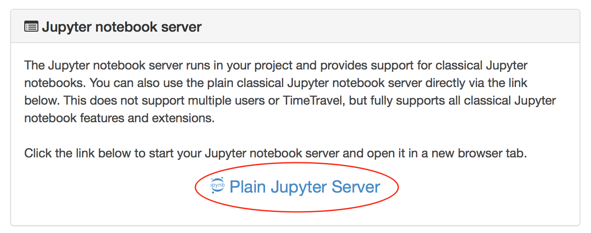

.. index:: Jupyter Notebook
.. _jupyter-notebook:

=================
Jupyter Notebooks
=================

CoCalc offers several options for hosting running `Jupyter Notebooks`_ online.

.. contents::
   :local:
   :depth: 2

What's a Jupyter Notebook?
==============================

They're a specific filetype with the ending ``.ipynb``, which records an interactive session with a **Kernel**.
It made up of *cells*, which can either store one or more lines of code or formatted text.
When you *run* a cell – which evaluates the piece of code in the cell via the active kernel session – you can see its output after the calculation is done.
This combination of communicating back and forth with a kernel and adding descriptive text makes this form of document very attractive.

There are many **Kernels** available, where you first have to choose which programming language you want to work with.
A quite popular choice is `Python3`_, but there is also [SageMath], and many others.

CoCalc Jupyter Notebook
==========================

The default editor for Jupyter Notebooks on CoCalc is specific to this platform and has a couple of tightly integrated features (read more in our `blogpost <http://blog.sagemath.com/jupyter/2017/05/05/jupyter-rewrite-for-smc.html>`_). The basic user interface looks like the following:

Above the main area is a menu bar and a button row:

* The **menu bar** contains all commands, and in particular the **Kernel** menu is for changing it if necessary.
* The **button row** gives you a one-click access to *Run* the current cell (otherwise press your Shift+Return keys), a way to restart the kernel (which clears the current session) and a Save button to make sure CoCalc has stored the file. The :doc:`time-travel` button allows you to see previous versions of that notebook, such that you can go back in time to recover from a bad change.

.. image:: img/jupyter/jupyter-notebook-cocalc-1.png
    :width: 100%

* **Active cell**: in the screenshot above, the blue bar on the left and a blue border around a cell indicates that this is the currently active one. Actions like *Run*, *Delete Cell*, etc. operate on the currently selected cell. It is also possible to select more than one cell.
* **Execution counter**: On the left of each cell, there is an execution counter ``In [ x ]``. The number ``x`` increases each time a cell is being run. After the kernel stopped and restarted, that counter starts again at *1*.
* The **output of code cells** is below the input cell. For example, ``Out [7]:`` is the output of cell ``In [7]:``. In the right hand corner of the input cell is some information about how long it took to calculate the result.
* **Text cells** are slightly different. Select "Markdown" in the ``[ Code ]`` dropdown menu in the button bar to change a code cell to such a markdown text cell. There, you can use `Markdown`_ to format the text. Similar to code-cells, either *Run* these text cells to see the processed Markdown code or press Shift+Return. To edit a text cell, either double click it or press your Return key.
* **Saving**: more general, the nice things about Jupyter Notebooks is that they save all your intput and output in one single file. This means you can download or publish the notebook as it is, and everyone else sees it in exactly the same way.

.. :index: Jupyter Classical vs. CoCalc
.. _jupyter-classical-vs-cocalc:

Classical versus CoCalc
=========================

If you are having trouble with the `CoCalc Jupyter Notebook`_, you can switch to the Classical Jupyter Notebook.
You can always switch back to CoCalc Jupyter easily later (and please let us know what is missing so we can add it!).

To switch:

 - From within an existing classical Jupyter notebook: click the button "CoCalc Jupyter Notebook", or
 - from within a CoCalc Jupyter notebook: select "File" → "Switch to Classical Notebook" in the menu, or
 - Click the checkbox labeled "Jupyter classic" in your :doc:`Editor settings in Account <account-settings>`.

As of October 2017, the main reasons to use the classical notebook are:
  - interactive widget support
  - reading interactive input at least 3 times
  - need certain extensions (:ref:`Howto setup Jupyter Extensions <jupyter-extensions>`).

See our `list of Jupyter related issues <https://github.com/sagemathinc/cocalc/issues?q=is%3Aissue+is%3Aopen+label%3AA-jupyter>`_ for more details.

Don't mix CoCalc and Classical!
---------------------------------

.. warning::

    Multiple people simultaneously editing the same notebook,
    with some using classical and some using the new mode, will NOT work!
    Switching back and forth **will** cause problems (you may need to use TimeTravel to recover).
    *Please avoid using classical notebook mode if you possibly can!*

Alternatives: Plain Jupyter Server and JupyterLab Server
-----------------------------------------------------------

You can also just easily run the full classical Jupyter notebook server from a project.
In your project's settings, click the link labeled "Plain Jupyter Server".

Using this option has an advantage: it does not affect your "Jupyter classic" Editor setting, allowing you to keep CoCalc Jupyter notebook as the default for opening .ipynb files in the CoCalc main interface.

You can also run a JupyterLab server by clicking on the "JupyterLab Server" link in your project.

Tips and Tricks
=====================

Preserving Memory
-------------------

Each running Jupyter Notebook spawns a session in your project.
This **uses up memory**, which could cause troubles running all your processes in your project.

You can either *restart* the kernel to clean up its current memory (i.e. all variables are deleted), or if you've finished working on that notebook, click the ``[ Halt ]`` button to stop the kernel and close the notebook.

.. _Cocalc Jupyter Notebook: http://blog.sagemath.com/jupyter/2017/05/05/jupyter-rewrite-for-smc.html
.. _Jupyter Notebooks: https://www.jupyter.org
.. _Python3: https://docs.python.org/3/
.. _Markdown: https://www.markdownguide.org/basic-syntax

