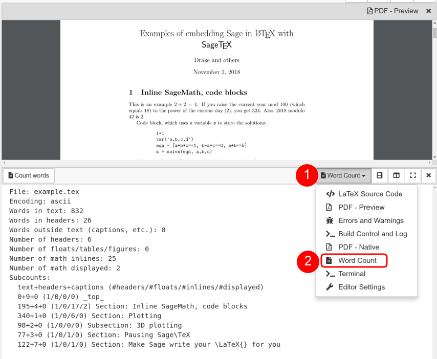

.. index:: LaTeX Editor; features
.. _latex-features:

LaTeX editor features
======================

.. _latex-forward-inverse:

Forward & Inverse Search
------------------------------

Forward and inverse search are extremely helpful for navigating in a larger document.

**Forward**: place your cursor at a specific location in the editor on the left-hand side.
Click the "Forward" button or the ``[ALT] + [Return]`` keyboard shortcut to jump to the corresponding
location in the PDF preview.
(In rare cases where full positional information is not available, this feature may not be active.)

**Inverse**: Double-click on an area of interest in the **PDF Preview** area.
The cursor in the text editor will jump to the paragraph in the source-code.

.. _latex-spellcheck:

Spellcheck
------------------

Spell checking during LaTeX editing is available for several languages. You can enable/disable Spellcheck and change the language *for a particular file* by opening the ``Settings`` frame as shown:

.. image:: img/latex-spellcheck123.jpg
    :width: 50%
    :align: center

Note that the Spellcheck feature is also available in Markdown and HTML editors.

.. _latex-word-count:

Word count
------------------

CoCalc can show you current word count statistics generated by texcount_.
In order to see them, change one of the frames or created a new one in the :doc:`Frame editor <frame-editor>`.
Select **"Word Count"** as shown below:

.. _texcount: http://app.uio.no/ifi/texcount/whatitdoes.html

LaTeX Engines
----------------------

* **latexmk** + **PDFlatex**: the default configuration, works in most cases
* **latexmk** + **XeLaTeX**: this is useful for foreign languages with many special characters.
* **latexmk** + **LuaTex**: uses the `LuaLaTeX`_ engine.

.. _LuaLaTeX: http://www.luatex.org

Encoding
------------------------

**UTF8**: the build process runs in a Linux environment.
All edited documents are assumed to be encoded as UTF-8.
Therefore, depending if you compile via PDFLaTeX or XeLaTeX, the following encoding defintions are the preferred choices:

* PDFLaTeX::

   \usepackage[T1]{fontenc}
   \usepackage[utf8]{inputenc}
   \usepackage{lmodern}

* XeLaTeX or LuaTeX::

   \usepackage{fontspec}

The default template already selects the correct configuration for you.
