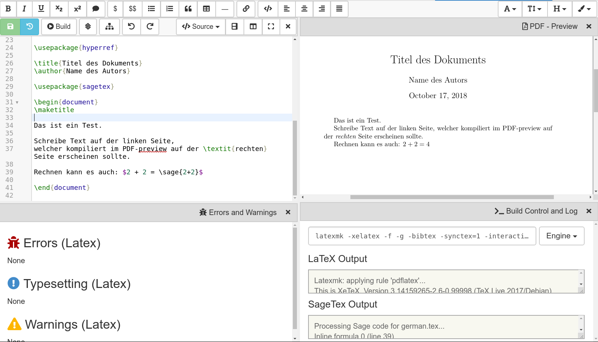

======================
LaTeX Editor
======================

[LaTeX]_ is a sophisticated markup language and processor for typesetting documents.
For a general introduction, read this `LaTeX wiki book`_ or any other resource.

.. contents:: Table of Contents
   :depth: 2

Getting started
===============

To use the LaTeX editor, open or create a file whose name ends in ``.tex``. By default, you should see an editor similar to the one in the screenshot below:

**Building** In general, you edit source code and compile it to a PDF document. Click the "Build" button (or hit shift+enter or alt+t) to build the tex file and produce a PDF.  You can also check "Build on save: build LaTex file whenever it is saved to disk" in account preferences, and a build will be triggered whenever your file is saved to disk.

**Interface** In the initial screen layout, the source is on the left and a preview of the compiled PDF is on the right.  Also, there are frames showing issues, warnings, errors, and the build log.  You can close any of these panels by clicking the x in the upper right of the panel.  You can also split them as much as you want, and change what is displayed in any panel.  If you close all the panels, the default layout is restored.

* The **PDF Preview** shows the PDF document.

  * You can easily position the preview by using the mouse to drag the preview around.
  * There are buttons  for zooming, and expanding to the vertical and horizontal height.
  * There are also buttons for printing and downloading the PDF.

* **Errors and Warnings**

  * The **Errors and Warnings** frame lists all compilation errors and warnings, and other issues.
    Click on the line number link to jump to the corresponding line in the input code on the left and the preview on the right.
    **LaTeX may fail to compile** (or only partially or in a wrong way) **if there are many errors**.

* The **PDF - Native** view (not shown by default) shows you an embedded view of the compiled PDF file, using   your browsers native PDF view. This might be broken if your browser has problems rendering the file inline – use the "PDF Preview" view instead.  Also, you can't double click on the Native view to move back to jump   to the corresponding tex.

* The **Build Control** view gives you more control over how the compilation process works:

  * You can click in the build command line and edit it however you want, or select a different engine from the dropdown menu.
    By default, we compile using `LatexMK`_, which manages temporary files and BibTeX.

  * Click **Clean** to delete autogenerated temporary files.

LaTeX 101
===============

It is very easy to start with LaTeX.
CoCalc guides your first document with a small default template.
You start working between the ``\begin{document} ... \end{document}`` instructions.
Everything before ``\begin{document}`` is called the "preamble" and contains the configuration for the document.

For example, remove the ``\maketitle`` instruction and replace it by

> ``Hello \textbf{CoCalc}! This is a formula: $\frac{1}{1+x^2}$.``

After saving (``[CTRL]`` + ``[s]`` or click the green ``Save`` button at upper left), the file will build, and
you should see an updated PDF preview.

* **New paragraphs**: Single returns for new lines do not have any effect.
  Use them to keep new sentences in paragraphs at the beginning of a line for better overview.
  Two or more returns introduce a new paragraph.
* **Formulas**: They're either between ``$`` or ``$$``, or in ``\begin{equation}...\end{equation}`` environments.

You can also **import your existing documents** by
`uploading in "Files"`_ or `importing from ShareLatex/Overleaf`_.

.. _uploading in "Files": https://github.com/sagemathinc/cocalc/wiki/upload
.. _importing from ShareLatex/Overleaf: https://github.com/sagemathinc/cocalc/wiki/Importing-Files-from-ShareLaTeX

Features
===============

.. _latex-forward-inverse:

Forward & Inverse Search
------------------------------

Forward and inverse search are extremely helpful for navigating in a larger document.

**Forward**: place your cursor at a specific location in the editor on the left-hand side.
Click the "Forward" button or the ``[ALT] + [Return]`` keyboard shortcut to jump to the corresponding
location in the PDF preview.
(In rare cases where full positional information is not available, this feature may not be active.)

**Inverse**: Double-click on an area of interest in the **PDF Preview** area.
The cursor in the text editor will jump to the paragraph in the source-code.

.. _latex-spellcheck:

Spellcheck
------------------

Spell checking during LaTeX editing is available for several languages. You can enable/disable Spellcheck and change the language *for a particular file* by opening the ``Settings`` frame as shown:

.. image:: img/latex-spellcheck123.jpg
     :width: 50%

Note that the Spellcheck feature is also available in Markdown and HTML editors.

.. _latex-word-count:

Word count
------------------

CoCalc can show you current word count statistics generated by texcount_.
In order to see them, change one of the frames or created a new one in the :doc:`Frame editor <frame-editor>`.
Select **"Word Count"** as shown below:

.. image:: img/latex-word-count.png
    :width: 50%

.. _texcount: http://app.uio.no/ifi/texcount/whatitdoes.html

LaTeX Engines
================

* **latexmk** + **PDFlatex**: the default configuration, works in most cases
* **latexmk** + **XeLaTeX**: this is useful for foreign languages with many special characters.
* **latexmk** + **LuaTex**: uses the `LuaLaTeX`_ engine.

.. _LuaLaTeX: http://www.luatex.org

Encoding
==========

**UTF8**: the build process runs in a Linux environment.
All edited documents are assumed to be encoded as UTF-8.
Therefore, depending if you compile via PDFLaTeX or XeLaTeX, the following encoding defintions are the preferred choices:

* PDFLaTeX::

   \usepackage[T1]{fontenc}
   \usepackage[utf8]{inputenc}
   \usepackage{lmodern}

* XeLaTeX or LuaTeX::

   \usepackage{fontspec}

The default template already selects the correct configuration for you.

FAQ
======

How to insert an image?
-----------------------------------------

1. Upload a PNG or PDF file via CoCalc's "Files" interface.
   The uploaded image should be in the same directory as the ``.tex`` file
   Otherwise, use relative paths like ``./images/filename.png`` if it is in a subdirectory ``images``.
2. Follow  `these instructions`_  about how to insert a graphic in a figure environment.
   Do not forget ``\usepackage{graphicx}`` in the preamble declaration.

.. _these instructions: https://en.wikibooks.org/wiki/LaTeX/Floats,_Figures_and_Captions

How to insert a backslash or dollar sign?
--------------------------------------------

The ``\`` character has a special meaning.
It signals a LaTeX command or is used as an escape character.
To enter a backslash, escape its meaning by entering it twice: ``\\``.

A dollar sign is entered as ``\$``, which escapes the meaning of "formula-start".

What to do if the preview does not update
-----------------------------------------

Possible reasons:

1. Are there any errors in the "Issues" tab? LaTeX only compiles well if there are zero reported errors.
2. Long documents could take an extended period of time to complete. In the "Preview" tab, disable the preview and only enable it once to avoid piling up too much work on the back-end.
3. Similarly, computational-heavy "SageTeX" computations could lead to excessive compilation times.
   You can pre-compute results or split the document into smaller parts.

How to deal with large documents across multiple source files?
----------------------------------------------------------------------------------

The best way is to use the `subfiles`_ package as
`described here`_.
There is an extended example demonstrating how this works in the CoCalc Library. Click (+)New and look for Library in the middle of the page, then under ``LaTeX templates`` select ``Multiple source files in CoCalc``. The same example is also available at
`cloud-examples/latex/multiple-files`.

.. _described here: https://en.wikibooks.org/wiki/LaTeX/Modular_Documents#Subfiles
.. _cloud-examples/latex/multiple-files: https://github.com/sagemath/cloud-examples/tree/master/latex/multiple-files

How to use PSTricks macros?
-----------------------------------------

`PSTricks`_ is a set of macros for including PostScript drawings in a TeX document. The website has an extensive `gallery of examples`_.
The main thing to remember when using PSTricks is to set ``Engine`` in the CoCalc Build panel to ``XeLaTeX`` as in this small demo `.tex file`_ and `resulting .pdf`_.

.. _gallery of examples: http://tug.org/PSTricks/main.cgi?file=examples
.. _.tex file: https://cocalc.com/share/db982efa-e439-4e2d-933b-7c7011c6b21a/Public/pstricks-demo.tex?viewer=share
.. _resulting .pdf: https://cocalc.com/share/db982efa-e439-4e2d-933b-7c7011c6b21a/Public/pstricks-demo.pdf?viewer=share

.. image:: img/latex-pstricks-demo3.png
    :width: 40%

.. image:: img/latex-pstricks-demo4.png
    :width: 40%

Setup ``texmf`` in a project?
-----------------------------------------

A CoCalc project is equivalent to a linux user account.
Therefore, the texmf discovery mechanism works the same as on a local machine.
By default, you should be able to put your own packages and styles into ``~/texmf``.
Afterwards, you might have to run run ``texhash ~/texmf`` in a terminal or the little "Terminal command" textbox in "Files".

Note: the ``~`` stands for the ``HOME`` directory, which is the root directory you see in the "Files"-listing.
You can click the home icon to jump into the home directory.
``texmf`` is a subdirectory right there.

Is there a way to turn off automatic build and PDF preview while I'm working on sub documents?
-----------------------------------------------------------------------------------------------

If you're working on a main LaTeX document that has included tex files, you may want to turn off compilation of the individual subfiles. Here are some steps you can take:

* By default, building latex documents on saving is enabled. You can disable it under ``Account`` → ``Preferences`` → ``Editor settings`` by removing the check mark for ``Build on save: build LaTex file whenever it is saved to disk``.

* You can also disable the build process by opening the "Build" dialog and entering ``echo`` in the line where the command is. That just does nothing when it tries to build.

* If you like, you could also structure your LaTeX in such a way that subdocuments also build via the `CTAN subfiles`_ package.
  You can find an example in the CoCalc Library. In a project, click on ``+ New``, and in the middle you will find the Library. Look under ``LaTeX templates`` → ``Multiple source files in CoCalc``.

In general, multifile LaTeX editing is on our radar, but we haven't got to that yet: `CoCalc issue #904`_.

.. _CoCalc issue #904: https://github.com/sagemathinc/cocalc/issues/904

An error says that the PDF cannot be built. How can I find the problem?
-----------------------------------------------------------------------------------

* Use :doc:`TimeTravel <time-travel>` to go back to a working version. In the TimeTravel view, you can use ``Changes`` to see exactly what changed between revisions.
* Another tip is to click the format button, since sometimes formatting properly can give you a good sense of what you might have messed up.
* More general, you can also use revision control like [Git]_ to track your changes. Just create a :doc:`Terminal <terminal>` file or :doc:`frame in the latex editor <frame-editor>` and go ahead and work on the command-line as usual.
* If you need more detailed help, make sure to open the ``.tex`` file and make a support request by clicking the ``Help`` button at the top right.

.. _LaTeX wiki book: https://en.wikibooks.org/wiki/LaTeX
.. _LatexMK: https://www.ctan.org/pkg/latexmk/
.. _subfiles: https://www.ctan.org/pkg/subfiles?lang=en
.. _CTAN subfiles: https://ctan.org/pkg/subfiles
.. _PSTricks: http://tug.org/PSTricks/main.cgi

