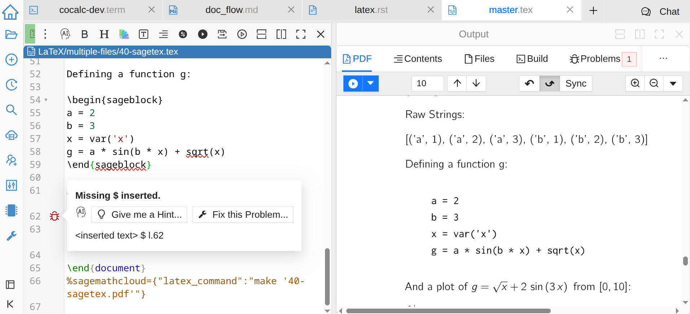
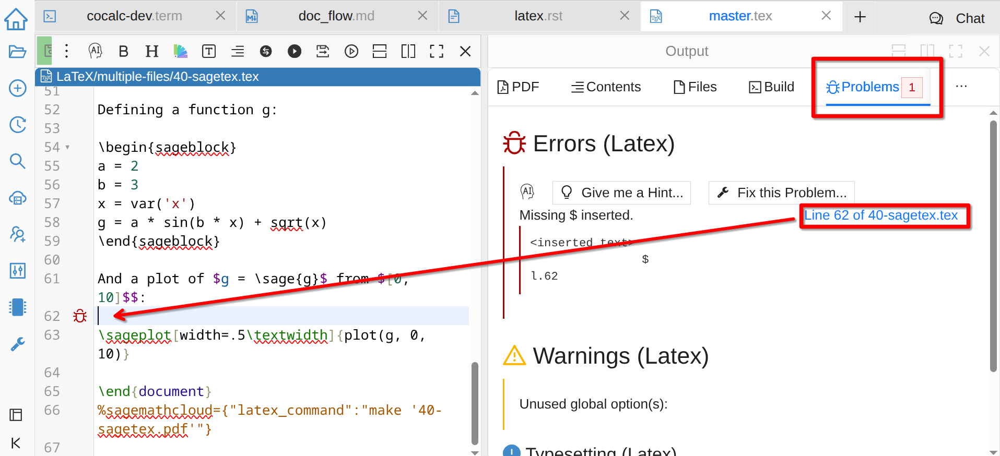
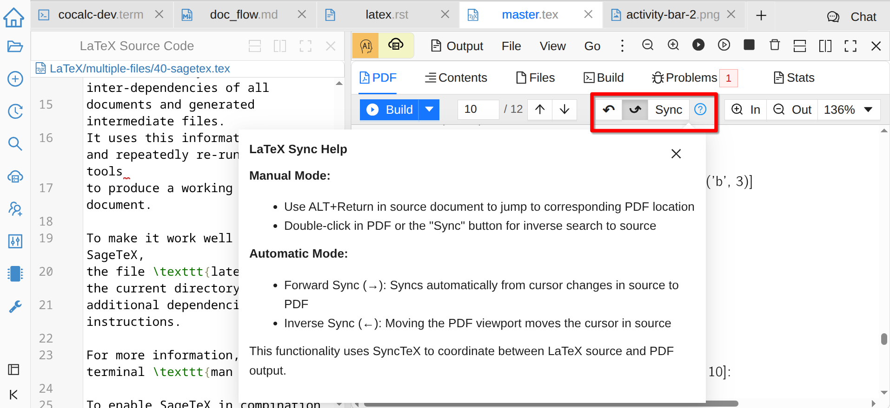
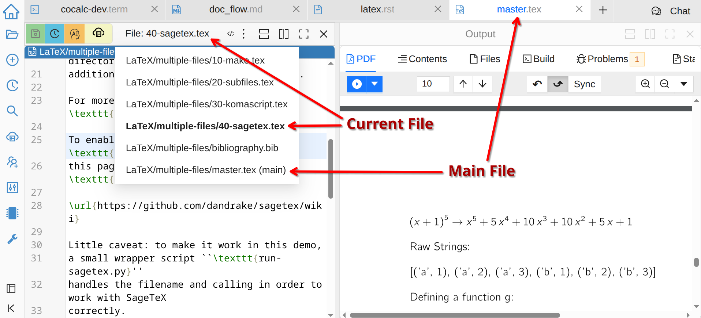

.. index:: LaTeX Editor
.. _latex-editor:

LaTeX Editor
============

.. contents::
     :local:
     :depth: 1
     
`LaTeX <https://www.latex-project.org/>`_ is a sophisticated markup language and processor for typesetting documents.
For a general introduction you may check `LaTeX wiki book <https://en.wikibooks.org/wiki/LaTeX>`_, or one of many other resources.

Open an existing ``.tex`` file, create a new LaTeX document starting with a simple template (`📺 video <https://youtu.be/QLokIb2I78U?feature=shared>`_), or :doc:`import your existing documents from Overleaf <howto/overleaf>`. By default you will see two frames:

  
  LaTeX Editor

On the left there is the source code and on the right LaTeX output. You can resize, close, split these and create new :doc:`frames <frame-editor>` as usual. In addition, the Output frame can be switched between several tabs:

- **PDF** Preview
- Table of **Contents**
- List of **Files**
- **Build** command and full log
- Errors, Warnings, and Typesetting **Problems**
- Text **Stats**

Building Your Document
----------------------

By default, your document is built whenever you save it or when it is saved automatically. Once the built is finished, the PDF preview will update. You can also use **Go > Build** menu or press **Shift + Enter** or **Alt + T**. If you do not like this behaviour, for example because your document takes a long time to build, you can disable it via **Go > Build on Save**.

**Build** tab of the output frame allows you to see the full log of the build process and control the :ref:`build command <latex-build-engine>`. You can edit it however you want, or select a different engine from the dropdown menu.
By default, we compile using `LatexMK <https://www.ctan.org/pkg/latexmk/>`_, which manages temporary files and BibTeX.

**Problems** tab lists all build errors, warnings, and other issues in a more convenient way than the raw log.
Click on the line number link to jump to the corresponding line in the source and the preview. You can also see error markers on the margin of the source code:

  
  LaTeX Problems

.. _latex-forward-inverse:

Forward and Inverse Search
--------------------------

Forward and inverse search or "sync" are extremely helpful for navigating in a larger document! CoCalc gives you an option to use manual sync whenever you want or turn on automatic sync in either direction:

  
  LaTeX Sync

PythonTeX, SageTeX, Knitr
-------------------------

If you are using CoCalc, chances are you are doing some computations in Python, Sage, or R. 
CoCalc supports embedding relevant code directly within a LaTeX document using :ref:`latex-pythontex`, :ref:`latex-sagetex`, or :ref:`latex-knitr` respectively.
Such code is automatically processed and evaluated during build
and any output appears as part of the PDF output itself.
You can insert small calculations and formulas, source code, plots, data tables, etc.
This is frequently used as part of `reproducible research <https://en.wikipedia.org/wiki/Reproducibility#Reproducible_research>`_.

.. index:: LaTeX Editor; Languages
.. _latex_languages:

Different Languages
-------------------

The best way to use a language other than English in LaTeX depends on the particular language, but in general you may need to:

* Use the `polyglossia <https://ctan.org/pkg/polyglossia?lang=en>`_ LaTeX package (installed in CoCalc), to allow using different languages in the same file.
* Use LaTeX `Noto fonts <https://www.google.com/get/noto/>`_ (installed in CoCalc).
* Change the :ref:`LaTeX build engine <latex-build-engine>` to XeLaTeX.

For example, to combine Hebrew and English you can use these commands in the preamble of your document::

    \usepackage{polyglossia}
    \setmainlanguage{hebrew}
    \newfontfamily{\hebrewfont}{Noto Serif Hebrew}
    \setmainfont{Noto Serif Hebrew}
    \setmainlanguage{english}
    \setmainfont{Times New Roman}

.. index:: LaTeX Editor; multi-file
.. _multi-file-support:

Multi-File Support
------------------

CoCalc supports LaTeX documents split into several files:

* The user interface is initially identical to the single-file case.
* If you explicitly input other files and build, there is a new menu on the top of a text editor that lets you select from any of the subfiles.
* Inverse search for the PDF part generated by a subfile automatically opens that file.
* Errors and warnings have links that open appropriate subfiles as well.
* Saving a subfile saves all files and starts a build, if **Go > Build on Save** is enabled.

See the section `LaTeX/Modular Documents <https://en.wikibooks.org/wiki/LaTeX/Modular_Documents>`_ in the WikiBooks LaTeX book for a helpful introduction to working with multiple files in LaTeX.

  
  Multiple Files for LaTeX

.. index:: LaTeX Editor; debug PDF build
.. index:: LaTeX Editor; preview update

PDF Preview Troubleshooting
---------------------------

- Check if there are any build errors - if yes, LaTeX may fail to build the PDF, or do it only partially, or in a wrong way.
- If your document used to build well, but now it does not and you don't understand the errors, you can use :doc:`time-travel` to go back to a working version. In the TimeTravel view you can use **Changes** to see exactly what changed between revisions. Of course, you can also use ``git`` in a :doc:`terminal` to track your changes.
- Use **Format > Format Source Code** menu to reformat your file according to command structure. Sometimes such formatting can give you a good sense of what you might have messed up.
- Long documents could take an extended period of time to complete and automatic build on save may become inconvenient for you. Try to turn off **Go > Build on Save** and start build only manually.
- Similarly, computational-heavy SageTeX computations could lead to excessive compilation times. You can pre-compute results or split the document into smaller parts.
- If you need help, open your ``.tex`` file and make a support request by clicking the ``Help`` button at the top right.

Future Plans
------------

**Annotations**: One of the most requested features that we hope to implement soon is being able to add comments to LaTeX (and other) documents that do not become a part of the source code. Meanwhile, you have to rely on other CoCalc tools for collaboration, including :doc:`time-travel` and :ref:`side-chat`.

**Nicely formatted diffs**: While you can see prior versions of your document and the difference between any two of them, there is room for improvement in making it clear what has changed and where, perhaps with LaTeX rendering.