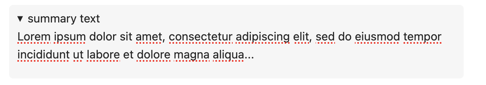

.. index:: markdown

========================
Markdown
========================

.. contents::
     :local:
     :depth: 2

########################
Introduction
########################

Wikipedia defines Markdown as "a lightweight markup language for creating formatted text using a plain-text editor" (`<https://en.wikipedia.org/wiki/Markdown>`_).

Markdown makes it easy to add basic structure, such as headings and lists, to a plaintext document. Use of Markdown is ubiquitous in CoCalc (see :ref:`below <where-markdown-used>`). When you start making notes into a text file, it is often most convenient to open the file as a Markdown document, i.e. a file with name ending in ".md". It is easy to produce pdf and html files from markdown.

There is a brief tutorial on Markdown in the :doc:`project-library`. To copy the introduction into a project of yours, open the project and follow the four steps below:

.. image:: img/markdown-library-numbers.png
    :width: 100%
    :alt: fetching Markdown intro from the project library

The Library intro has three sample files, in format markdown (".md"), Jupyter notebook (".ipynb"), and Sage worksheet (".sagews"). Here's a view from the .md file:

.. image:: img/markdown-sample.png
    :width: 100%
    :alt: source and editable views of a .md file

You can find additional information about variations of markdown relevant to CoCalc at the following links:

* `Original markdown definition  <https://daringfireball.net/projects/markdown/>`_ by John Gruber. The basic features.

* `GitHub Flavored Markdown Spec <https://github.github.com/gfm/>`_. The customary format for README.md files, issues, and pull requests on GitHub.

* `Markdown Cells in Jupyter notebooks <https://jupyter-notebook.readthedocs.io/en/stable/examples/Notebook/Working%20With%20Markdown%20Cells.html#Markdown-Cells>`_. Note that the CoCalc implementation of Jupyter notebooks is mostly compatible with this spec, with enhancements discussed below.

* `R Markdown <https://rmarkdown.rstudio.com/>`_. Geared toward data science, supports interleaving of executable code ("code chunks") in several programming languages, and documentation.

.. _where-markdown-used:

####################################
Where Markdown can be used in CoCalc
####################################

* Editing a ".md" file with the :ref:`frame editor <frame-editor-markdown>`
* :doc:`Chat rooms <chat>` (".sage-chat" files)
* :ref:`Side chat <side-chat>` panel available with any file being edited
* :ref:`Text cells in Jupyter notebooks <cocalc-jupyter-features>`
* Markdown mode ("%md") in :ref:`Sage worksheets <what-is-sagews>`
* :ref:`R Markdown <edit-rmd>` (".Rmd" and ".rmd" files)
* :doc:`tasks` (".tasks" files, also known as "Todo lists")
* :doc:`whiteboard` (text, sticky notes, Jupyter cells)

.. _cocalc-markdown-features:

####################################
Enhanced features in CoCalc Markdown
####################################

***********************************
@-mentions
***********************************

See :ref:`@Mention collaborators in chat <at-mention-chat>`.

***********************************
Checkboxes
***********************************

Type " [ ] " to create an unchecked checkbox. Note the single space between the square brackets. Type " [x] " to create a checked box. In both unchecked and checked boxes, there is a space before the first bracket and a space after the closed bracket.

***********************************
Collaborative editing
***********************************

Multiple users can edit CoCalc Markdown at the same time. In fact, one user can have several browser windows open to the same Markdown content and edit from them all simultaneously (we sometimes use this feature to test collaboration while developing CoCalc).

*********************
Details element
*********************

CoCalc markdown editing supports `The Details disclosure element <https://developer.mozilla.org/en-US/docs/Web/HTML/Element/details>`_. Here is how a `details` element is entered::

    

        
summary text

        Lorem ipsum dolor sit amet, consectetur adipiscing elit, sed do eiusmod tempor incididunt ut labore et dolore magna aliqua...
    

You can put text that you want hidden inside the `details` element. When not expanded, only the summary text is displayed. To expand the content and show the hidden content, click anywhere in the summary. To hide the content, click the summary again.

    details element with content hidden

    details element with content expanded

***********************************
Embedded LaTeX
***********************************

You can write `LaTeX formulas <https://en.wikibooks.org/wiki/LaTeX/Mathematics>`_ between ``$`` signs, e.g. ``$\frac{1}{1+x^2}$``.

***********************************
Emojis
***********************************

View the list of supported emojis in the `markdown-it-emojis GitHub repository <https://github.com/markdown-it/markdown-it-emoji/blob/master/lib/data/full.json>`_.

***********************************
Export to HTML
***********************************
* To create html from a markdown file, open a :doc:`Linux terminal <terminal>`. If your file is "filename.md", run the command::

    pandoc filename.md -o filename.html

***********************************
Export to PDF
***********************************
* To export a markdown (".md") file as pdf, open the file, select "Locked" from the view pulldown menu and click the "Print" button.

.. _markdown-hashtags:

***********************************
Hashtags
***********************************

Precede a word with a hash sign ("#") and it is formatted to stand out as a hashtag.

***********************************
Inverse search
***********************************

The markdown editor supports **inverse search** when source and rendered views are both visible (this is the default display for markdown files). If you double-click on markdown in the rendered view, the source view will scroll to display the corresponding line.

If you are using a split view with Markdown Code in one pane and Editable Text in the other, you can use the sync button: |sync| at the top from either pane to synchronize the cursor in the other pane.

***********************************
Rich Text Editing
***********************************

See :doc:`rich-text`.

.. _cocalc-markdown-impl:

###########################################
About the CoCalc Implementation of Markdown
###########################################

CoCalc uses `markdown-it <https://github.com/markdown-it/markdown-it>`_, with plug-ins and some customizations. Details are in the CoCalc source code at GitHub in file `src/packages/frontend/markdown/index.ts <https://github.com/sagemathinc/cocalc/blob/master/src/packages/frontend/markdown/index.ts>`_.

CoCalc markdown is parsed using `markdown-it` with the linkify and html options set to true, so that patterns that look like URL's are clickable and html blocks and fragments are parsed as html, according to the commonmark spec (which can be weird, subtle, and surprising). CoCalc's markdown is also parsed with the following five plugins enabled. Except for the emoji plugin, these are all forks of upstreams plugins:

* math - `math code <https://cocalc.com/github/sagemathinc/cocalc/blob/master/src/packages/frontend/markdown/math-plugin.ts>`_; this is a proper markdown-it plugin with rules designed to be as close to Jupyter classic's math formula parsing as I could write. By default math is rendered using katex by default, then mathjax if that fails. There are also some hacks to extend katex support.
* emoji - `emoji docs <https://github.com/markdown-it/markdown-it-emoji/blob/master/README.md>`_; configured with the defaults, so all github supported emojis. 😊
* checkbox - `checkbox code <https://cocalc.com/github/sagemathinc/cocalc/blob/master/src/packages/frontend/markdown/checkbox-plugin.ts>`_; create checkbox anywhere via [ ] and checked box via [x]. Also supports github task lists.
* hashtag - `hashtag code <https://cocalc.com/github/sagemathinc/cocalc/blob/master/src/packages/frontend/markdown/hashtag-plugin.ts>`_; create #hashtags anywhere that look like #hashtags. In some parts of cocalc, click on these to search for matches.
* mentions - `mentions code <https://cocalc.com/github/sagemathinc/cocalc/blob/master/src/packages/frontend/markdown/mentions-plugin.ts>`_; type @ then select the name of one of your collaborators. They will receive an email pointing to your mention of them. For chat, the rest of the line is included as context in the @mention.

CoCalc's markdown is only parsed using markdown-it. It is rendered using a custom React-based renderer that is built around slatejs, which we also use for direct rich text editing of markdown. Thus rendering is much more rigid and structured than most markdown renderers, which simply export an html string and let the browser interpret it. For example, rendering of code blocks (triple back ticks) is accomplished using CodeMirror's parser and react to provide syntax highlighting for any mode we support. The html blocks are rendered using `html-react-parser`, so they will only work if they are valid complete html; moreover, in context like the share server or untrusted notebooks, where the HTML shouldn't be trusted, our markdown renderer sanitizes the html using the `xss` module.

.. |sync|
     image:: img/antd-icons/sync-icon.png
     :width: 24px
     :alt: sync icon
