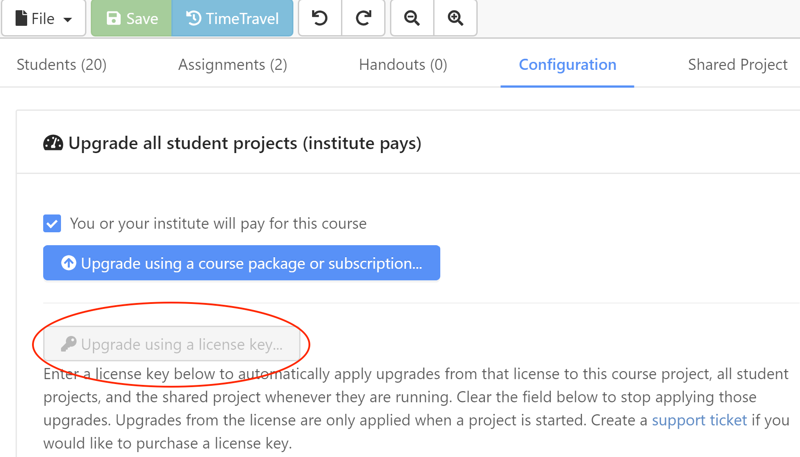

.. _platform-news:

==========================
News
==========================

.. _new-2020-01-13:
.. index:: Site licenses

2020-01-13: Site licenses
===============================

Instead of using cocalc's upgrade system, you enter a license key in the course configuration, and all projects associated to that course are automatically upgraded when they start up. If this is something you might be interested in, contact us at `help@cocalc.com <mailto:help@cocalc.com">`_.

     enter license key in course file Configuration tab

.. _new-2019-12-16:
.. index:: Anonymous accounts

2019-12-16: Anonymous accounts
===============================

New uses do not have to sign up on CoCalc any more.
An "anonymous" account is created and you can start exporing CoCalc immediately.
It is possible to convert this account into a regular CoCalc account any time.

Beyond that, :ref:`publicly shared files <sharing-files>` can be the seed for a new project.
This makes it easy to experiment with published content.
