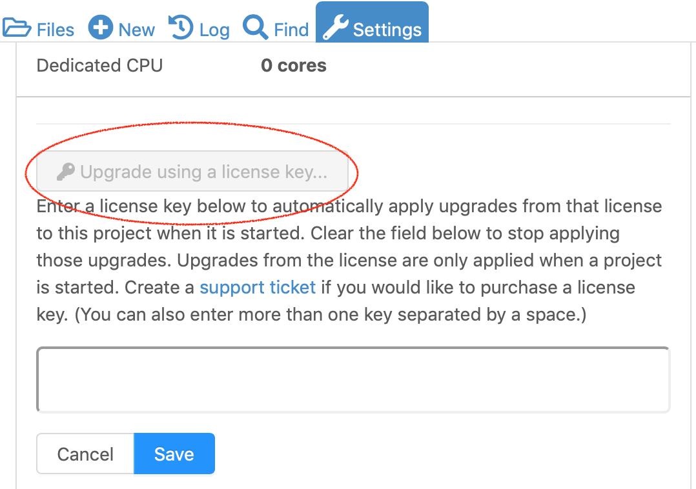

.. _platform-news:

==========================
News
==========================
.. _new-2020-01-16:

.. index:: Account Settings; dark mode
.. index:: Dark mode
.. _overall-dark-mode:

2020-01-16: dark mode
=====================================================

Added: an option to enable overall dark mode in "Account" /  "Preferences".
Checking this gives you a uniformly dark background across the whole page:

.. figure:: img/dark-mode-setting.png
     :width: 65%
     :align: center

     Check the box to enable dark mode.

.. figure:: img/dark-mode-example.png
     :width: 100%
     :align: center

     Screen capture of CoCalc with dark mode enabled.

.. index:: nbgrader; autograder
.. index:: Jupyter Notebooks; nbgrader

2020-01-16: nbgrader autograder for Jupyter notebooks
=====================================================

CoCalc now has integrated nbgrader/autograder for Jupyter notebooks. You can create an assignment with problems that are automatically graded, providing immediate feedback to students. Manual grades and instructor comments can be added after the assignment is collected.

It's all tightly integrated with the course management system. You don't have to configure anything -- you can just use it...

There's an extensive getting-started guide here: :doc:`nbgrader in CoCalc <teaching-nbgrader>`.

.. _new-2020-01-14:
.. index:: Export student file use
.. index:: Courses; Export student file use

2020-01-13: Export student file use
=====================================

This feature  provides 1-click export of extensive data about what students do in an assignment or handout. Getting information about what happens with anonymous users of shares is not implemented.

To get a report about all the times when students opened or edited any file in an assignment or handout, do the following:

#. Open a .course file.
#. Toggle to show the information about a handout or assignment, and scroll to the bottom.
#. There is a new button "Export file use times for this..."
#. Click that button.
#. A json file will open in a new tab. Hopefully the format is self explanatory. The times are all in milliseconds since the epoch, so in Javascript you can write new Date(time) to make this a date, and in Python do `this <https://stackoverflow.com/questions/3694487/in-python-how-do-you-convert-seconds-since-epoch-to-a-datetime-object>`_. You can also load json into python using the json module (import json).

The json files are created in the following path::

    course-exports/[name of course]/file-use-times/[handouts|assignments]/assignment_name.json

.. figure:: img/export-file-use-times.png
     :width: 75%
     :align: center

     Exporting file use times in course file Assignments tab.

.. _new-2020-01-13:
.. index:: Site licenses
.. _site-license-news:

2020-01-13: Site licenses
===============================

.. index:: Site licenses; for courses (news)

Site license for courses
-------------------------

Site licenses can be used to upgrade student projects in a CoCalc-managed course.
After the license key is entered in course configuration,
all student projects associated to that course are automatically upgraded the next time they start. There are detailed course setup instructions for a license :ref:`here <site-license-course-setup>`. If this is something you might be interested in, contact us at `help@cocalc.com <mailto:help@cocalc.com">`_.

.. index:: Site licenses; for projects (news)

Site license for individual projects
------------------------------------

A site license can be used for a project that is not part of a CoCalc course. Open project settings. Scroll down under "Project usage and quotas" and click the button marked "Upgrade using a license key...". Enter your license key in the box that opens and click Save. Upgrades provided by the license will be applied.

     Enter license key in project Settings.

.. _new-2019-12-16:
.. index:: Anonymous accounts

2019-12-16: Anonymous accounts
===============================

New users do not have to sign up on CoCalc any more.
An "anonymous" account is created and you can start exporing CoCalc immediately.
It is possible to convert this account into a regular CoCalc account any time.

Beyond that, :ref:`publicly shared files <sharing-files>` can be the seed for a new project.
This makes it easy to experiment with published content.
