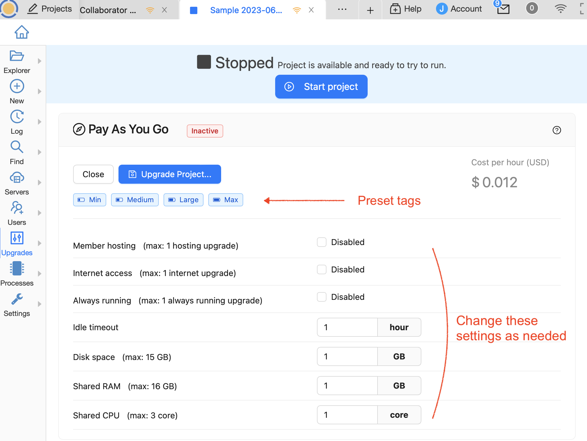
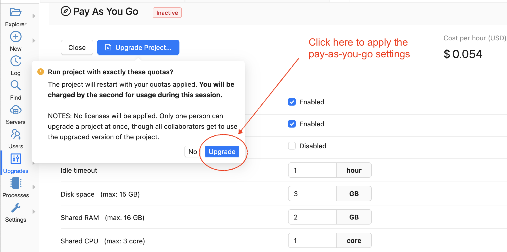

.. index:: Pay as You Go Service

======================
Pay-As-You-Go Purchase
======================

.. contents::
   :local:
   :depth: 2

CoCalc's Pay-As-You-Go feature lets you choose resources for a project and only pay for them while the project is running.

A related concept are :doc:`compute servers <compute_server>` that allow you to connect powerful remote computers to your CoCalc project.

You can choose different amounts of any resource the next time you run the project.

Resources are completely editable at any time, for both new purchases and existing licenses. Existing licenses are now editable at any time by the user who bought the license (but by nobody else).

Here's the CoCalc feature announcement and discussion: `ANN: CoCalc's New Purchasing System <https://github.com/sagemathinc/cocalc/discussions/6848>`_.

#######################################
How to Enable Pay-As-You-Go
#######################################

***********************************
1. Select Pay-As-You-Go
***********************************

Open the project you want to upgrade and click "Upgrades" in the :doc:`activity-bar`.

.. figure:: img/paygo02.png
    :width: 100%
    :align: center
    :alt: pay as you go part 1

    open the project and click Upgrades

***********************************
2. Choose Your Upgrades
***********************************

Choose which upgrades you want applied to the project during the current session.

    choose the desired resources

The preset tags at the top: "min" "medium" "large" "max", are good starting points for making your choices. Clicking one of the presets significantly reduces the effort of configuration

***********************************
3. Start the Project
***********************************

In the pop-up that appears, click "Upgrade".
Pay-as-you-go only happens when you explicitly use this panel. Just restarting the project or any other way of starting the project doesn't apply this pay as you go upgrade.

    starting the project with pay-as-you-go

Here is an example of a status you might see after you choose the upgrades you want for the current session and start the project.

.. figure:: img/paygo01.png
    :width: 100%
    :align: center
    :alt: pay as you go part 4

    sample pay-as-you-go summary after starting the project

#######################################
About Pay-As-You-Go
#######################################

**********************************
Add Capacity For a Short Time
**********************************

If you need a burst of additional capacity, say added RAM or disk space, simply increase the relevant configuration before the next time  the project is started.

******************************
Not used with Licenses
******************************

If you are running a project with resources provided by a Pay-As-You-Go purchase, any licenses applied to the project will not be applied. You can't combine the two methods of upgrading a project.

***************************************
Save Money If You Pay in Advance
***************************************

If your organization requires you to make your purchase in advance of using the needed resources, Pay-As-You-Go can save you money, because you get full credit for your unused balance toward future Pay-As-You-Go purchases.

******************************
Self-Imposed Spending Limits
******************************

In order to prevent accidental overspending, CoCalc lets you specify a monthly cap for your account on spending for different resources.

To view and change these settings, browse to Account / Purchases, or click this link to `purchases <https://cocalc.com/settings/purchases>`_.

.. figure:: img/paygo5.png
    :width: 100%
    :align: center
    :alt: pay as you go part 5

    monthly pay-as-you-go limits for your account under Account/Purchases

******************************
Unused Balance Carries Over
******************************

Here's an example. Suppose you have $30 that you budgeted to spend on exploring citizen science using CoCalc this month. Instead of buying a license for $30, you can add $30 credit to your account. You can then use small amounts of that $30 optimally whenever you're actively working on a project. Any money left at the end of the month rolls over.

