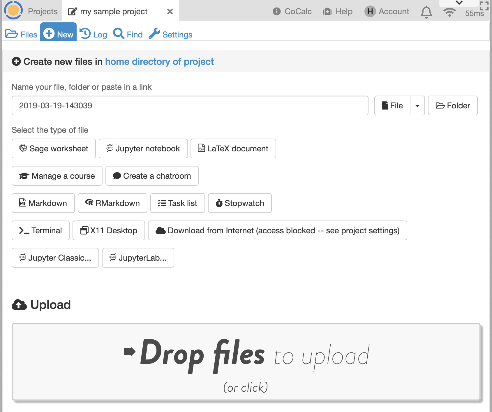

.. index:: Projects; Create files, (+) New
.. _plusnew:

*********************
(+) New
*********************

|plus-circle| Create new files

This tab gives you numerous options for file creation. There are also buttons to launch :ref:`Jupyter Classic and JupyterLab servers <jupyter-server-alternatives>` at the bottom of the tab.

     ..

.. index:: Projects; default contents for new files
.. index:: Files; default contents for new

.. _default-template:

.. index:: Templates; default contents for new files

*******************************
Default contents for new files
*******************************

For any file type, e.g. ``.md``, ``.tex``, ``ipynb``, you can create a template in a given project so that opening a new file of that type starts with a copy of the template. The templates all go in a folder in the project home directory called ``templates/linux`` and start with filename ``default``.

For example, to create a default Jupyter notebook, do this in a terminal:

.. code-block:: bash

    cd; mkdir -p templates/linux/; open templates/linux

then create a file ``default.ipynb``. In the case of Jupyter notebooks, you can cause all new notebooks to use your preferred kernel by setting the kernel
in the default file, as well as specifying initial content.

.. |plus-circle|
    image:: https://raw.githubusercontent.com/encharm/Font-Awesome-SVG-PNG/master/black/png/128/plus-circle.png
    :width: 16px