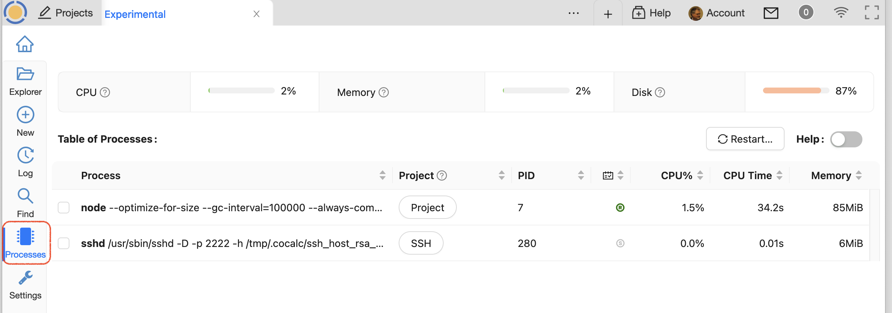

.. index:: Processes

=============================
Processes
=============================

.. _ft-info:

|microchip| Processes
=====================

The "Processes" panel offers a consolidated view of real-time activity within the current project. Use the Help toggle at right for details. You can view use of CPU, memory, and disk space. There is a list of running processes showing resource use by each and allowing you to terminate non-essential processes.

The "Memory" column in the Table of Processes can help you track down out-of-memory problems.

There are additional linux commands that provide further detail. See :doc:`howto/running-processes`.

.. |microchip|
     image:: https://github.com/encharm/Font-Awesome-SVG-PNG/raw/master/black/png/128/microchip.png
     :width: 16px
     :alt: processes microchip icon