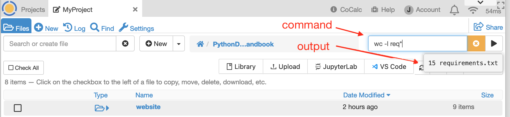
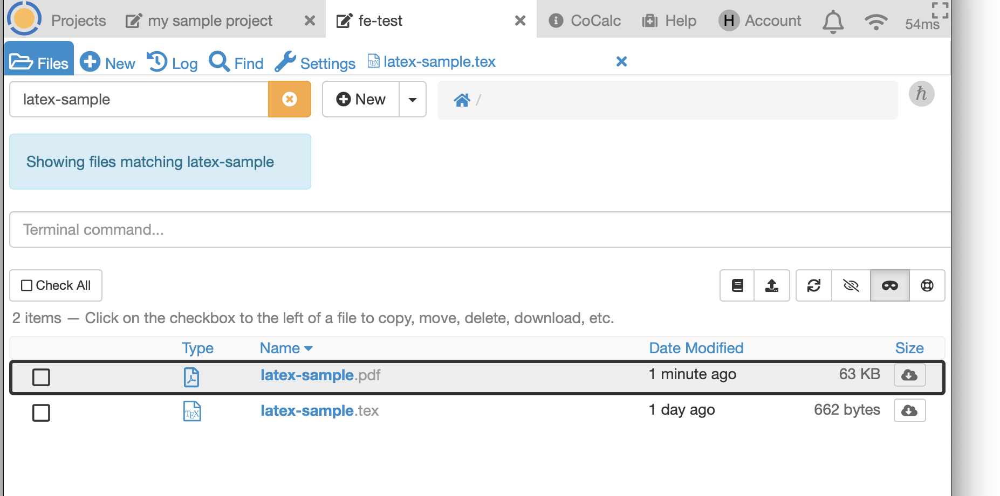

.. index:: Projects; Files list
.. index:: Files list
.. _project-files:

----------------------------------
Project Files
----------------------------------

The project **Files** list gives you an overview of your files in that project.

.. contents::
   :local:
   :depth: 1

.. figure:: img/project-files/files-list.png
     :width: 80%
     :align: center

     files list

.. index:: Files list; mini-terminal
.. _mini-terminal:

Mini-terminal
=====================

With the **mini-terminal**, you can enter a simple Linux command in the "Terminal command..." box at upper right. Current directory for the command will be whatever folder is open in the Files list. Output is limited to a few lines.

     running a command in the mini-terminal

.. index:: Files list; open a file
.. _file-list-open:

Opening a File
=====================

* Click in the line containing a file name to open that file. The project log records the timestamp and name of the user opening the file.

.. index:: Files list; file actions
.. _file-actions:

File Actions
=====================

* **Click the checkbox next to one file** and a menu of actions appears:

  .. figure:: img/project-files/file-actions.png
       :width: 80%
       :align: center

       actions available when one file is selected

  * **Download:** downloads one file to your local computer. The project log records the timestamp and the user who downloaded the file.

  * **Delete:** deletes the file. If the file is open in a browser tab anywhere, that tab will be closed and a brief notification will appear that the file has been deleted or moved. The project log records the timestamp and the user who deleted the file.

  * **Rename:** changes the name of the file. Do not change which directory contains it. If the file is open in a browser tab anywhere, that tab will be closed and a brief notification will appear that the file has been deleted or moved.

  * **Duplicate:** creates a copy of the selected file in the same directory as the original. A numeric suffix is added as a default. You can edit the name of the copy as needed. The project log records the timestamp and the user who copied the file.

  * **Move:** moves the file to a different directory in the same project. If the file is open in a browser tab anywhere, that tab will be closed and a brief notification will appear that the file has been deleted or moved. You can add a new directory to the list of possible destination directories by clicking on ``+ New directory`` and overriding the default name if desired. Click "Move 1 item" to move the file.
  
  .. figure:: img/project-files/file-action-move.png
     :width: 80%
     :align: center

     move file to a different directory in the same project

  * **Copy:** copies a file. To copy a file to a destination in the same project, simply choose the destination directory and click "Copy 1 item". To copy a file to a different project , first click inside "A Possibly Different Project" (first screenshot below). Then select the destination project, select the destination folder in that project, then click "Copy 1 item" (second screenshot below). You must be owner or collaborator on the destination project. The log of the project containing the original file records the timestamp, destination, and the user who copied the file.

  .. figure:: img/project-files/file-action-copy-1.png
     :width: 80%
     :align: center

     copy a file to a different project, step 1

  .. figure:: img/project-files/file-action-copy-2.png
     :width: 80%
     :align: center

     copy a file to a different project, step 2

  * **Public:** opens the :doc:`share dialog <share>` to make the file public or private.

* **Click checkboxes next to multiple files** causes a menu of multi-file actions to appear.

  .. figure:: img/project-files/file-actions-multiple.png
       :width: 80%
       :align: center

       actions available when one file is selected

  * **Download** creates a zip archive containing the selected files in the current directory and downloads the zip file to your local computer. The project log records the names of the files downloaded in the zip file, the user who downloaded the file, and the timestamp.

  * **Compress** creates a zip archive containing the selected files.

  * **Delete** deletes the selected files. If any of the deleted files is open in a browser tab anywhere, that tab will be closed and a brief notification will appear that the file has been deleted or moved. The project log records the names of the files deleted, the user who downloaded the file, and the timestamp.

  * **Move** as with the single-file action, this moves selected files to a different directory in the same project.

  * **Copy** as with the single-file action, this copies selected files to a destination directory in the current project or other project.

.. index:: Files list; refresh
.. _refresh-files:

Refresh Files List
=====================

The contents of the filesystem may change while you have the Files list open and the list might not be current. You can update the list by clicking refresh (|refresh|).

.. index:: Hidden Files; in Files list
.. index:: Files list; hidden files
.. _hidden-files:

Show Hidden Files
=====================

By convention, a file whose name begins with a dot is a hidden file. It will not show up in various file lists by default. Click the eye icon with a slash (|eye-slash|) to include hidden files in the list; the icon changes to an eye (|eye|)  without a slash. Click the |eye| icon to exclude hidden files.

.. figure:: img/project-files/files-with-hidden.png
     :width: 80%
     :align: center

     files list showing hidden files

.. index:: Masked files; hide temporary files
.. index:: Temporary files; hiding
.. index:: Files list; masked files

.. _masked-files:

Hide Temporary Files
=====================

Processing some programs, notably LaTeX source (e.g. ``.tex`` files) causes temporary files to be generated. These can clutter your file list. Click the mask icon (|mask|) to toggle display of hidden files on or off.

     files list filtered for "latex-sample", temporary files masked

.. figure:: img/project-files/files-filtered-nomask.png
     :width: 80%
     :align: center

     files list filtered for "latex-sample", showing temporary files

.. index:: Backups; in Files list
.. index:: Snapshots; in Files list
.. index:: Files list; snapshots

.. _project-snapshot:

Snapshot Backups
=====================

Click on the "|life-ring| Backup" button to switch to a directory containing consistent point-in-time backups of all your files.
Use this in case you have deleted a whole set of files, or just want to restore them from a while ago.

*Note:* Snapshots are in a read-only file system. If you want to modify a file that resides in a snapshot, you will need to copy it into a writable part of your project first.

.. |life-ring|
    image:: https://raw.githubusercontent.com/encharm/Font-Awesome-SVG-PNG/master/black/png/128/life-ring.png
    :width: 16px

.. |refresh|
    image:: https://raw.githubusercontent.com/encharm/Font-Awesome-SVG-PNG/master/black/png/128/refresh.png
    :width: 16px

.. |eye|
    image:: https://raw.githubusercontent.com/encharm/Font-Awesome-SVG-PNG/master/black/png/128/eye.png
    :width: 16px

.. |eye-slash|
    image:: https://raw.githubusercontent.com/encharm/Font-Awesome-SVG-PNG/master/black/png/128/eye-slash.png
    :width: 16px

