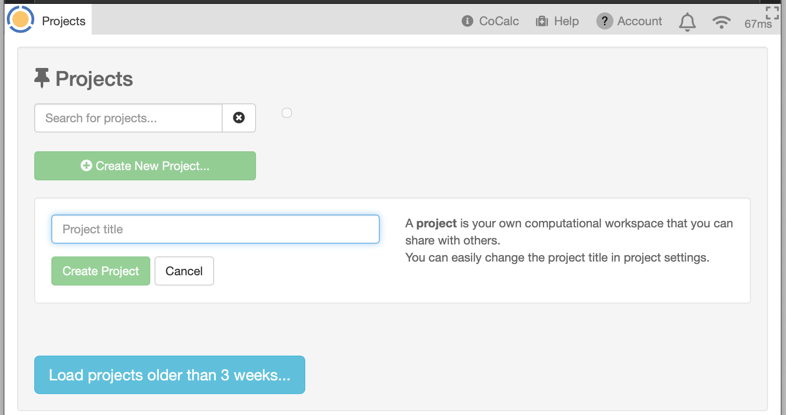

.. index:: Projects; list
.. _project_list:

==================================
Project List
==================================

The project **List** gives you an overview of projects in your account.

.. contents::
   :local:
   :depth: 1

Introducing the Project List
=============================

The first time you sign into CoCalc, you won't have any projects, unless some have already been created for you:

     *new account with no projects created yet*

After you have some projects, there's more to see:

.. figure:: img/project-list/proj-02a.png
     :width: 100% 
     :align: center

     ..

If you have a large number of projects, the initial display will be limited to 50 projects, and projects active within the past 2 months. The list can be expanded as needed using "Show projects not used in the last few months..." or "Load n More Matching Projects..." buttons at the bottom.

.. index:: Projects; search for
.. _project_search:

Filtering the Project List
===========================

As your project list grows, you can save time finding projects by entering text into the ``Search for projects...`` box. As you type, the list of projects displayed is narrowed to only the projects whose Title or Description contains the search string. If you enter several words separated by spaces, the list will be limited to projects in which all the words in the search text appear in the project title or description.

.. figure:: img/project-list/proj-03a.png
     :width: 100%
     :align: center

     *searching for projects with name or description containing "phy"*

.. index:: Projects; batch operations
.. _project_batch:

Batch Operations on Projects
=============================

Using the project filter also brings up a toolbar for **batch operations on projects** (see figure above). Each of the four buttons allows you to do one of the following on all projects shown, in a single operation:

* remove yourself as collaborator
* delete projects

  * marks projects as deleted for owner and all collaborators
  * removes upgrades added by you
  * does *not* remove upgrades added by others

* hide projects
* remove all *your* upgrades from projects (does not remove upgrades added by others)

Tagging Projects
=================

You can make it easy to find certain projects if you add a *hashtag*, i.e. text beginning with a pound sign (#), to the project title or description. Hashtag text may contain letters, digits, hyphens, and underscores. Hashtags appear as buttons to the right of project search text.

.. figure:: img/project-list/proj-04a.png
     :width: 100%
     :align: center

     *hashtag "#boxplots" in project description*

Hidden and/or Deleted Projects
================================

If any of your projects are hidden and/or deleted, you will see checkboxes at the right of the search text to allow you to view them. Learn more about hidden and deleted projects in :ref:`Project Settings <project_hidden_deleted>`.

