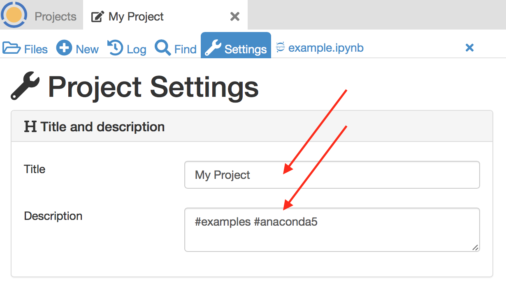
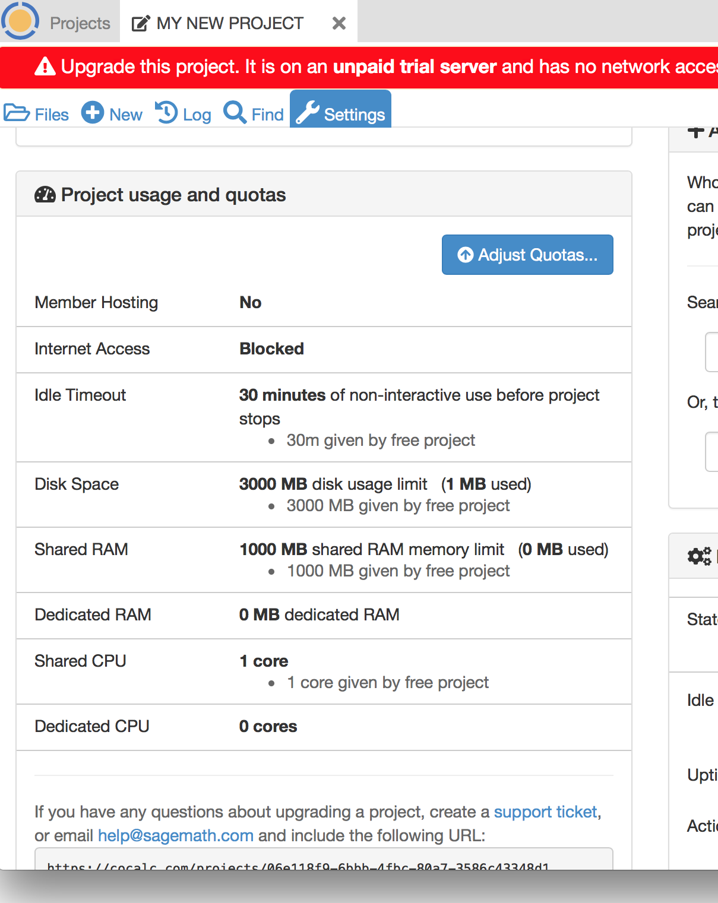
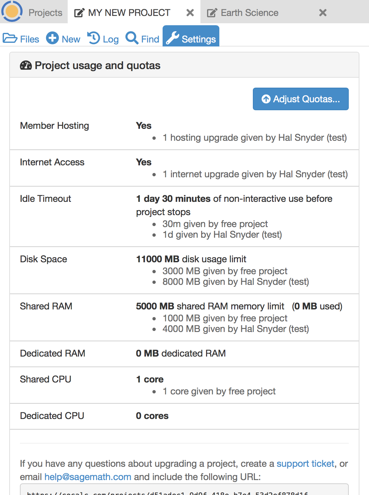

.. index:: Project Settings

================
Project Settings
================

All about the **Project Settings** tab.

.. contents::
   :local:
   :depth: 1

.. index:: Projects; title and description
.. _set-project-title:

######################
Title and description
######################

The text for **Title and description** for a project can be changed at any time.

Title and Description fields are both used when searching for matching text under **Projects**.
If you have several projects, it can help to add hashtags to your project descriptions
for topics you want to return to quickly.

.. figure:: img/project-settings/project-match.png
     :width: 60%
     :align: center

     *searching for "astro" in project title & description*

.. index:: Projects; upgrades
.. _project-upgrades:

########################
Project usage and quotas
########################

*****************
Why Add Upgrades?
*****************

There are many reasons that you might want to have an upgraded project.

* To give your project access to the internet. For example,
   * To download a software package from the internet.
   * To use Github/Bitbucket/Gitlab with your project.
   * To download datasets into your project.
   * To connect to your project with SSH.
* To get extra storage space (both RAM and disk space).
* To get more compute resources.
* To have a higher idle timeout threshold. (See :ref:`idle-timeout`.)

You can share upgrades with any project that you are a collaborator on. You must be a collaborator (or owner) to update a project.

.. note::

    For details on paid subscriptions, see `Subscription and Pricing Information <https://cocalc.com/policies/pricing.html>`_.
    Paid subscriptions start at \$14 per month.

**********************
View Current Resources
**********************

You can view upgrades for the current project and current resource use under `Project usage and quotas`.
Here's an example for a project with no upgrades added (note the warning banner that
appears if the project does not have Member Hosting or Internet Access):

.. _apply_project-upgrades:

*************
Adjust Quotas
*************

The "Adjust Quotas" dialog is where you add upgrades purchased under a Subscription or Course Package. If you have a license, see the section :ref:`Licenses <project-add-license>` below.

.. note::

    If you want to upgrade student projects for a CoCalc managed course, that is done in the .course file.* (See the :ref:`course-upgrading-students` section in the teaching guide.)

You can enter any values that do not exceed available upgrades. This example continues
by adding as much in the way of resources as possible to the current project.
You can remove upgrades at any time and apply them to other projects.

When you click `Adjust Quotas...`, a dialog like the following appears. The screenshot shows numbers
for a project that has not been upgraded.
Available upgrades show what the numbers would be if you just purchased a Standard Plan and
have not applied any upgrades yet:

.. figure:: img/project-settings/add-upgrades-standard.png
     :width: 60%
     :align: center

     *Adjust Quotas* dialog

Here are the two most important upgrades.
You will probably want to apply these to any project you are working on actively:

.. index:: pair: Member Hosting;Project Settings
.. _member-hosting:

Member Hosting
==============

Member hosting is added by checking the "Enable" box next to the upgrade.

There are two types of projects: "free projects" and "member projects".
Free projects run on heavily loaded `Google preemptible VM instances <https://cloud.google.com/compute/docs/instances/preemptible>`_.
These are randomly restarted by Google at least once every 24 hours.
Often, these computers will house over 150 simultaneously running projects.

Member-hosted projects run on machines which are much less loaded and are reserved for paying customers only.
On member-hosted projects, commands execute more quickly, and CPU, memory and I/O heavy operations run more quickly.

.. index:: pair: Internet Access;Project Settings
.. index:: Upgrades; Internet Access
.. _internet-access:

Internet Access
===============

Internet access is added by checking the "Enable" box next to the upgrade. This upgrade allows you to:

* Originate connections to external sites, for example to install packages from internet sites for Python and R, or to clone code from GitHub.

* Send email from a project, for example, to invite people without a CoCalc account to collaborate on a project via email, or to allow :ref:`@mentions <at-mention-chat>` in a project to send out emails.

****************
Max All Upgrades
****************

Clicking `Max All Upgrades` will add as much as possible from available upgrades:

.. image:: img/project-settings/apply-max.png
     :width: 60%
     :align: center

************
Save Changes
************
Then clicking `Save Changes` will apply the changes and restart the project if settings have changed:

.. _project-add-license:
.. index:: Projects; add license
.. index:: Licenses; add to project

########
Licenses
########

To add upgrades from a CoCalc license, click the button marked "Upgrade using a license key...".
Enter your license key in the box that opens and click Save. Upgrades provided by the license will be applied.

.. figure:: img/project-settings/proj-lic-before-add.png
     :width: 60%
     :align: center

     Before adding a license key.

.. figure:: img/project-settings/proj-lic-after-add.png
     :width: 60%
     :align: center

     After adding license key. You can add several keys.

.. _project-url:
.. index:: Projects; project URL

************
Project URL
************

Each CoCalc project has a unique URL. You can find the URL for the current project under the "Licenses" section of the project settings tab, as shown above.
This URL can useful when contacting support and in some configuration tasks.

.. index:: pair: Member Hosting;Project Settings
.. index:: Projects; hide and unhide
.. index:: Projects; delete and undelete
.. _project_hidden_deleted:

######################
Hide or delete project
######################

Next in the Project Settings window is the section for hidden and deleted projects,
which do not appear in the normal project list
(the list you get when you click `Projects` at upper left).

If the current project is neither hidden nor deleted, you will see this:

.. image:: img/project-settings/hide-or-delete.png
     :width: 60%
     :align: center

***************************
Hidden vs. Deleted projects
***************************

If you delete a project, then you delete it for everyone---for all your collaborators. The good news is that this can be undone. Deleting a project removes upgrades from any subscriptions or course packages.

Alternatively, if you hide a project, then you will not see it in your projects listing, but your collaborators will still see it in their listings.

****************
Hiding a project
****************

If you click `Hide Project`, the button changes:

.. image:: img/project-settings/hidden.png
     :width: 60%
     :align: center

And now if you click the `Projects` button at upper left, you will have a checkbox
that lets you view hidden projects. The checkbox only appears if there are hidden projects.

.. image:: img/project-settings/show-hidden.png
     :width: 60%
     :align: center

Clicking `Unhide Project` instantly makes the project visible in the normal project list again.

******************
Deleting a project
******************

**No files are actually deleted when a project is deleted.**
Only visibility of the project in the project list is changed.
If you need to permanently delete information that you
accidentally copied into a project, contact help@cocalc.com*

If you click `Delete Project`, the button changes:

.. image:: img/project-settings/delproj1.png
     :width: 60%
     :align: center

Click `Yes, please delete this project` to confirm, and the screen changes again:

.. image:: img/project-settings/delproj2.png
     :width: 60%
     :align: center

Note the warning banner that appears at the top.

The project will not appear in the normal project list for you and all collaborators on the project.

And now if you click the `Projects` button at upper left, you will have a checkbox
that lets you view deleted projects. The checkbox only appears if there are hidden projects.

.. image:: img/project-settings/show-deleted.png
     :width: 60%
     :align: center

Clicking `Undelete Project` instantly makes the project visible in the normal project list again
for you and all collaborators on the project.

***************************
Hidden and Deleted projects
***************************

A project can be both hidden and deleted. In that case, you will need to check both
`Deleted` and `Hidden` boxes in the `Projects` list to see the project.

.. image:: img/project-settings/deleted-and-hidden-a.png
     :width: 60%
     :align: center

.. index:: SSH Keys
.. _ssh-keys:

##############
Setup SSH Keys
##############

*********
Using SSH
*********

For addtional detail, see the blog posting `Using SSH with CoCalc <http://blog.sagemath.com/cocalc/2017/09/08/using-ssh-with-cocalc.html>`_.

You can connect to a CoCalc project from your local desktop using `SSH`_ (Secure Shell) and you can upload/download files between your computer and CoCalc using the SSH protocol, with ``scp`` and ``rsync`` command line tools. You must have owner or collaborator status on a project for SSH access to be permitted.

.. note::

    When logging into a project with ``ssh``, make sure the project is running. If the project is stopped, or is in the process of starting up, you may get a message of 'Permission denied' or be prompted for a password.

SSH authentication uses a pair of keys, a private key and a public key. Each key is stored in a separate file. For example, a private key might be in the file ``id_ed25519`` and the matching public key in ``id_ed25519.pub``. In general, private keys are not distributed, while public keys are uploaded to remote systems.

On OS X, and Linux, key pairs are stored in ``~/.ssh``, where ``~`` indicates your user's home directory. Use the ``ssh-keygen`` command to generate a key pair. (You can do ``man ssh-keygen`` from a terminal for details on the command.)

.. note::

   CoCalc does not support manual editing of the authorized_keys file for SSH authentication.*

To make sure you really connect to CoCalc, you can check the fingerprint of the :ref:`SSH Host Key <ssh-host-key>`.

*****************************************
Configuring SSH Keys for a Single Project
*****************************************

.. highlight:: none

This section assumes you have created an SSH key pair as described above.

#. Open the project Settings tab (wrench icon) for the project you want to access.
#. Look for the section "SSH Keys" at lower left.

   .. image:: img/project-settings/usernameathost.png
        :width: 50%
        :align: center

#. Click "Add an SSH Key".
#. Enter a title for the key in the Title field. Specify a title that is meaningful to you for the key pair you are using, for example "Sample Key for TESTPROJ".
#. Copy the public key into the Key field. To do this, open the file for your public key on your local computer. For example, if you are using macOS or Ubuntu, you could open a terminal and type something like the following, depending on the name of your public key file::

      cat ~/.ssh/id_ed25519.pub

   Use your mouse to select the contents of the key file, then copy and paste it into the Key area.
#. Click "Add SSH Key". Your key is now saved for that project.

   .. image:: img/project-settings/addingprojkey.png
        :width: 50%
        :align: center

#. The user for the SSH connection is the project id *without the hyphens*. (Why? Because the project id is not a valid Linux username.) The hostname is ``ssh.cocalc.com``. Look for "Use the following username@host:" in the "SSH Keys" section of project status for a string you can copy and paste. For example, if the Project id is::

      2507078b-6e5b-43da-809a-0073f1196181

   then the SSH username@host will be::

      2507078b6e5b43da809a0073f1196181@ssh.cocalc.com

#. To login from your local computer, use a command equivalent to the following::

      ssh 2507078b6e5b43da809a0073f1196181@ssh.cocalc.com

#. On macOS or Linux, you can specify a host alias in ``~/.ssh/config`` to avoid having to explicitly pass the project id as above. For example, the following lines in ``~/.ssh/config``::

      Host CCPROJ
          Hostname ssh.cocalc.com
          User 2507078b6e5b43da809a0073f1196181
          IdentityFile ~/.ssh/id_ed25519

   will allow you to log into the your project from your local computer with the command::

      ssh CCPROJ

   You can also specify a single SSH key pair under :doc:`account-settings` to use with all your projects.

.. index:: Projects; features and configuration
.. _project_feat_config:

###########################
Features and Configuration
###########################

This section displays the configuration of specific functionality for the compute image for the project. These settings are read-only. They cannot be altered for the present project.

If a feature or formatter is disabled, that means the compute image does not support them. It may be that you are using a custom or outdated image (see :ref:`Software Environment <software-environment>` below), or that you are using a :doc:`docker-image` that was built without that feature or formatter.

.. image:: img/project-settings/feat-config.png
    :width: 50%
    :align: center

*****************************************
Available features
*****************************************

This section displays the enabled/disabled state for various general project features.

*****************************************
Available formatter
*****************************************

This section displays the enabled/disabled state for formatters for specific file types in the CoCalc frame editor.

.. index:: Projects; collaborators
.. index:: Collaborators
.. _project-collaborators:
.. highlight:: default

###################
About collaborators
###################

Each CoCalc project has an owner and zero or more collaborators.
Owner and collaborators all appear in a project under the identity of "user" and home directory of ``/home/user``.
There is no difference in the Linux identity,
regardless of the CoCalc account that is signed in.
Owner and collaborators can read anything in the project, and write, delete, and modify anything except backups. They can add and remove other collaborators, but cannot remove the owner.

Although the owner and all collaborators appear in a project with the same
Linux user id, there are two ways to see *which CoCalc account* was used for certain actions in a project:

* The project activity log.
* Time travel for files edited using the CoCalc frame editor.

.. index:: Collaborators; removing
.. _remove-collaborators:

######################
Current collaborators
######################

The "Current collaborators" section of the *Project Settings* page shows the names of the owner and all collaborators. Here you can remove collaborators, including yourself. It does not allow you to remove the owner.

Current collaborators are also shown in the *Projects* list. You can use the latter to remove yourself as collaborator from several projects at once.

.. image:: img/project-settings/current-collabs.png
     :width: 70%
     :align: center

.. index:: Collaborators; adding
.. _add-collaborators:

######################
Add new collaborators
######################

At the **Add new collaborators** dialog, you can type in a person's name or email address. CoCalc will search its database of known users and show you possible matches.

#. After you select a name, don't forget to click "Invite User."
#. The user must accept the invitation to be added as a collaborator.

It is generally better to use an email address. The reason is that some CoCalc users have multiple accounts.

.. image:: img/project-settings/add-collabs.png
     :width: 70%
     :align: center

If there are no matches for an email address, then you can send an invitation for the user to start using CoCalc. You can modify the standard email. The default invitation has useful links to make it easier for the other person to start using CoCalc.

.. figure:: img/project-settings/email-invitation.png
     :width: 70%
     :align: center

     *customizing email invitation to new user*

Sometimes, you'd rather give someone read-only access. In CoCalc, this is called "sharing" with non-collaborators. See :ref:`share <ft-share>` for how to share a file.

Caution: if you are using CoCalc for course management with a .course file, add students under the **Students** tab of the .course file, and *NOT* as collaborators. That way, they get their own projects, separate from the instructor project. On the other hand, it is common practice to :ref:`add teaching assistants <teaching-add-ta>` as collaborators in the instructor project.

.. index:: Projects; control
.. _project-control:

###############
Project control
###############

Here is a screen capture of the Project control section. Along with project statistics, it has two buttons and a menu, discussed below.

    .. image:: img/project-settings/project-control.png
         :width: 70%
         :align: center

********************************
Restart Project and Stop Project
********************************

What happens when a project restarts?

* All computations will be stopped.
* **Good News:** You don't lose unsaved files.
* You do lose any information (state of variables/processes) in **RAM**.
* However, anything in files, as long as it's moved from the browser to the web servers (in most cases, at most a few seconds of information), is permanently saved to disk already in the database, and will not be lost.
* When the project starts back up, even if the files on disk are in an older state, the files you see yourself editing in your browser are new with nothing lost. Those files will then be updated on disc very shortly.
* On the other hand, project code, i.e. the CoCalc software environment, is updated.

To make all this happen, click "Restart Project...". Another button appears, to confirm the choice.

    .. image:: img/project-settings/project-restart-confirm.png
         :width: 70%
         :align: center

Click "Restart Project Server", and restart initiates.

    .. image:: img/project-settings/project-restarting.png
         :width: 70%
         :align: center

It normally takes about 30 seconds to restart a project. It may take another 10 seconds or so after the Files list is visible for terminal processes, etc. to be available.

You can also stop and restart a project in two separate steps. Why would you stop a project and then restart it, rather than simply restarting it in a single step?

* If you want CoCalc to move the project to another server, stopping it first and then restarting it allows CoCalc to select a different, possibly less-loaded server.
* If you don't want any of your project's processes to run until you explicitly restart the project, you have to stop the project.

Clicking "Stop Project..." causes the "Stop Project Server" button to appear, to confirm your choice:

    .. image:: img/project-settings/stop-project-confirm.png
         :width: 70%
         :align: center

.. index:: Software Environment
.. index:: Projects; software environment
.. _software-environment:

********************
Software Environment
********************

The CoCalc software environment is updated frequently. The collection of installed utilities, compilers, libraries, packages, etc. is called the *compute image*.

You can see a recent list of installed software at `Available Software  <https://cocalc.com/doc/software.html>`_ and in our `Help page <https://cocalc.com/help>`_ under "Software and Programming Libraries Details".

A running log of regular updates to the environment is the
:ref:`default software updates list<default-software-environment>`.

You may want to revert to an older environment, or try a new environment that is about to be released. To change the software environment to a different compute image, use the "Selected Image" menu.
The exact list of available images will change from time to time.

Once you have selected an image, click "Save and Restart".

.. image:: img/project-settings/selected-image-experimental.png
     :width: 70%
     :align: center

*Note: Don't forget to reset your image to "Default" after you are finished working with an alternate image.*

.. index:: Sage Worksheets; server
.. index:: Projects; sage worksheet server
.. _sage-worksheet-server:

#####################
Sage worksheet server
#####################

Any time you run a Sage worksheet (.sagews file) there are two processes involved in your project:

* the Sage worksheet server process - one of these is enough to serve any number of running worksheets
* the Sage worksheet client process - there will be one of these for each worksheet that is running in the project

It can be helpful to restart the Sage worksheet server if you have changed the default version of Sage, for example with ``sage_select``.
Note that restarting the Sage worksheet server will not affect worksheets that are already running.

Occasionally, it may be useful to restart the Sage worksheet server if worksheets are not executing properly, followed by restarting individual Sage worksheet(s). You might do this as a less drastic step than restarting the entire project.

.. image:: img/project-settings/restart-sagews-a.png
     :width: 70%
     :align: center

.. _alt-jupyter-server:

###################################
Alternate Jupyter Servers in CoCalc
###################################

CoCalc by default provides an interface to Jupyter notebooks that has been rewritten to support multiple users, TimeTravel, and other enhancements. For more information, see the CoCalc blog `article on the Jupyter rewrite <http://blog.sagemath.com/jupyter/2017/05/05/jupyter-rewrite-for-smc.html>`_. There may be occasions when you may want to run the Classical Jupyter server. The most common reason is to use interactive widgets, which are not supported in the CoCalc Jupyter notebook.

The "Project Settings" page offers two ways to run the Classical Jupyter server code, shown below.
For more information and some important caveats, see :doc:`Classical versus CoCalc <jupyter>`.

.. index:: Jupyter Server; Plain
.. index:: Plain Jupyter Server
.. index:: Projects; Jupyter classic server
.. _plain-jupyter-server:

********************
Plain Jupyter server
********************

Starting the Plain Jupyter server opens a new browser tab with usual files listing. Opening a notebook from the Jupyter server tab opens another browser tab.

.. image:: img/project-settings/jupyter-server-a.png
     :width: 70%
     :align: center

.. index:: Jupyter Server; JupyterLab
.. index:: Projects; JupyterLab server
.. _jupyterlab-server:

*****************
JupyterLab server
*****************

Starting the `JupyterLab server <https://jupyterlab.readthedocs.io/en/stable/>`_ opens a new browser tab with the JupyterLab GUI.

.. image:: img/project-settings/jupyterlab-server-a.png
     :width: 70%
     :align: center

.. |header|
    image:: https://github.com/encharm/Font-Awesome-SVG-PNG/raw/master/black/png/128/header.png
    :width: 16px

.. _ssh: https://help.ubuntu.com/community/SSH
